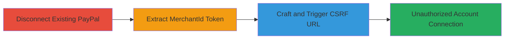

---
tags:
  - csrf
  - shopify
  - paypal
  - web
  - payment-hijack
type: attack_chain
tools: []
tactics:
  - '[[Initial Access]]'
verified: false
platforms:
  - Web
submitted: true
complexity: medium
created_at: '2024-01-01T00:00:00Z'
procedures:
  - '[[procedures/Disconnect-Existing-PayPal-Account]]'
  - '[[procedures/Extract-Store-Specific-MerchantId]]'
  - '[[procedures/Craft-Malicious-CSRF-URL-for-PayPal-Hijack]]'
step_count: 3
techniques:
  - '[[Drive-by Compromise]]'
  - '[[Exploit Public-Facing Application]]'
updated_at: '2025-12-14T17:27:57.907Z'
description: >-
  A multi-stage CSRF attack exploiting weak token protection in Shopify's PayPal
  Express Checkout activation, allowing an attacker to connect a victim's store
  to their own PayPal account without authorization.
skill_level: intermediate
impact_level: high
id: ee301618-f675-4990-91b8-78c098877202
validated: true
mitre_tactics:
  - '[[Initial Access]]'
mitre_techniques:
  - '[[Drive-by Compromise]]'
  - '[[Exploit Public-Facing Application]]'
---
# CSRF Bypass in Shopify PayPal Activation for Unauthorized Account Connection

Multi-stage attack chain demonstrating a complete CSRF workflow to hijack PayPal integration in a Shopify store.

## Chain Metrics Dashboard

| Metric | Value |
|--------|-------|
| Chain Status | Unverified |
| Total Steps | 3 |
| Execution Time | ~5 minutes |
| Skill Level | Intermediate |
| Complexity | Medium |
| Impact Level | High |

## Attack Flow Visualization

## Prerequisites & Requirements

### Required Tools

- Web browser (e.g., Chrome with developer tools)

### Target Environment

- Shopify admin panel access
- Active Shopify store with admin privileges
- PayPal account for attacker

### Initial Access Requirements

- Valid admin session in victim's Shopify store (e.g., via phishing or prior access)
- Knowledge of victim's store subdomain (e.g., YOURDOMAIN.myshopify.com)
- Attacker's PayPal merchant ID

## Detailed Attack Procedures

### Step 1: Disconnect Existing PayPal Account
procedure: [[procedures/Disconnect-Existing-PayPal-Account]]

**Objective**: Ensure no existing PayPal connection interferes with the activation process, clearing the path for the CSRF exploit.

**Instructions**: Log in to the Shopify admin panel as the victim and navigate to payments settings. If PayPal is connected, disconnect it to reset the state.

Visit `https://YOURDOMAIN.myshopify.com/admin/settings/payments` and click the disconnect button for PayPal if active.

**Expected Output**: Confirmation that PayPal is disconnected, with no active integration shown.

**Success Indicators**:
- PayPal status shows as disconnected in settings
- No error messages during disconnection

### Step 2: Extract Store-Specific MerchantId
procedure: [[procedures/Extract-Store-Specific-MerchantId]]

**Objective**: Obtain the static, store-specific merchantId token used as the CSRF protection, which is base64-encoded and can be leaked or guessed by former admins.

**Instructions**: In the Shopify admin, attempt to activate PayPal Express Checkout. Use browser developer tools to inspect the generated GET request and extract the merchantId parameter.

Click 'Activate PayPal Express Checkout' at `https://YOURDOMAIN.myshopify.com/admin/settings/payments`. In the Network tab, find the request to `/admin/payments/complete_paypal_incontext_oauth/...` and decode the base64 merchantId (e.g., `MTU4MzAzMDUwNDowMTBmMDZkYjg1NzM0YjQ4NWVkMDk1YzQ1YWYxY2ZlNw==` decodes to `1583030504:010f06db85734b485ed095c45af1cfe7`).

**Expected Output**: Decoded merchantId token unique to the store.

**Success Indicators**:
- Valid base64 string extracted and decoded without errors
- Token format matches expected pattern (timestamp:hex)

### Step 3: Craft Malicious CSRF URL for PayPal Hijack
procedure: [[procedures/Craft-Malicious-CSRF-URL-for-PayPal-Hijack]]

**Objective**: Construct a forged activation URL using the victim's merchantId and attacker's PayPal ID, tricking the victim into visiting it to connect their store to the attacker's account.

**Instructions**: Replace placeholders in the activation URL with the extracted victim merchantId and attacker's PayPal merchant ID. Host or send the URL to the victim via phishing/email.

Example URL: `https://YOURSUBDOMAIN.myshopify.com/admin/payments/complete_paypal_incontext_oauth/41?merchantId=1583030504:010f06db85734b485ed095c45af1cfe7&merchantIdInPayPal=5NS8DHQCFGT84&permissionsGranted=true&accountStatus=BUSINESS_ACCOUNT&consentStatus=true&productIntentID=addipmt&productIntentId=addipmt&isEmailConfirmed=true`. Victim visits while logged in, authorizing the connection.

**Expected Output**: Victim's store now linked to attacker's PayPal, visible in payments settings.

**Success Indicators**:
- Victim's PayPal integration shows attacker's account details
- Attacker receives confirmation of new store connection in PayPal dashboard

## Attack Chain Summary

### Key Achievements

1. Bypassed CSRF protection using static merchantId token
2. Forced unauthorized PayPal account connection without victim consent
3. Enabled potential redirection of store payments to attacker

## Technique & Tactic Coverage

### MITRE ATT&CK Techniques

- [[Drive-by Compromise]] Drive-by Compromise
- [[Exploit Public-Facing Application]] Exploit Public-Facing Application

### MITRE ATT&CK Tactics

- [[Initial Access]] Initial Access

---

*Last updated: 2024-01-01T00:00:00Z*
