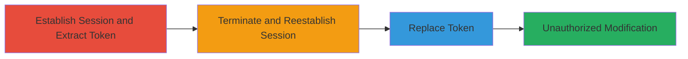

---
tags:
  - csrf
  - web
  - slack
  - token-reuse
  - account-modification
type: attack_chain
tools:
  - '[[tools/Browser-Developer-Tools]]'
tactics:
  - '[[Initial Access]]'
verified: false
platforms:
  - Web
submitted: true
complexity: low
created_at: '2023-10-01T00:00:00Z'
procedures:
  - '[[procedures/Establish-Slack-Session-and-Extract-CSRF-Token]]'
  - '[[procedures/Terminate-and-Reestablish-Slack-Session]]'
  - '[[procedures/Replace-CSRF-Token-in-New-Session]]'
  - '[[procedures/Perform-Unauthorized-Account-Modification]]'
step_count: 4
techniques:
  - '[[Exploit Public-Facing Application]]'
updated_at: '2025-12-14T17:27:15.699Z'
description: >-
  This attack chain exploits a CSRF protection flaw in Slack's account settings
  where the anti-CSRF crumb token does not expire upon logout, enabling reuse in
  a new session to perform unauthorized account modifications like username
  changes.
skill_level: intermediate
impact_level: high
id: 1124a8a3-79ea-4d07-81a3-04109d0230d4
validated: true
mitre_tactics:
  - '[[Initial Access]]'
mitre_techniques:
  - '[[Exploit Public-Facing Application]]'
---
# CSRF Bypass in Slack via Non-Expiring Crumb Token Reuse

Multi-stage attack chain demonstrating a complete attack workflow exploiting CSRF token reuse in Slack account settings.

## Chain Metrics Dashboard

| Metric | Value |
|--------|-------|
| Chain Status | Unverified |
| Total Steps | 4 |
| Execution Time | ~5 minutes |
| Skill Level | Intermediate |
| Complexity | Low |
| Impact Level | High |

## Attack Flow Visualization

## Prerequisites & Requirements

### Required Tools

- [[tools/Browser-Developer-Tools]]

### Target Environment

- Web platform (Slack.com or workspace subdomain like sehacure.slack.com)
- Required services/ports: HTTPS (443)
- Network access requirements: Internet access to Slack

### Initial Access Requirements

- Valid Slack account credentials
- Network position: Direct browser access
- Prior access needed: None, but assumes legitimate user session

## Detailed Attack Procedures

### Step 1: Establish Session and Extract Token
procedure: [[procedures/Establish-Slack-Session-and-Extract-CSRF-Token]]

**Objective**: Log in to Slack, navigate to account settings, and extract the anti-CSRF crumb token for later reuse.

**Instructions**: Open a web browser and navigate to your Slack workspace (e.g., https://app.slack.com). Enter credentials to log in, establishing a session. Then, go to the account settings page at https://sehacure.slack.com/account/settings. Use [[tools/Browser-Developer-Tools]] to inspect the page: right-click on the form, select Inspect, locate the hidden input field named 'crumb', and copy its value.

**Expected Output**: A valid crumb token string copied to clipboard.

**Success Indicators**:
- Successful login confirmed by dashboard access
- Crumb token extracted from form elements

### Step 2: Terminate and Reestablish Session
procedure: [[procedures/Terminate-and-Reestablish-Slack-Session]]

**Objective**: Log out to end the current session, then log back in to generate a new session with a fresh crumb token.

**Instructions**: From the account settings page, click the logout button (typically in the user menu) to terminate the session. Clear any browser cache if needed, then re-enter credentials at https://app.slack.com to log in again. Navigate back to https://sehacure.slack.com/account/settings, where a new crumb token will be generated.

**Expected Output**: New session established, new crumb token present in the form.

**Success Indicators**:
- Logout confirmed by redirect to login page
- Re-login successful with access to settings

### Step 3: Replace Token in New Session
procedure: [[procedures/Replace-CSRF-Token-in-New-Session]]

**Objective**: Modify the new session's crumb token to match the old one, bypassing CSRF validation.

**Instructions**: With the new settings page loaded, use [[tools/Browser-Developer-Tools]] to inspect the form again: locate the 'crumb' input field, edit its value attribute to paste the previously copied old token, and save the changes in the inspector.

**Expected Output**: Form now contains the reused old crumb token.

**Success Indicators**:
- Token value updated in browser inspector without errors
- Page remains functional

### Step 4: Perform Unauthorized Account Modification
procedure: [[procedures/Perform-Unauthorized-Account-Modification]]

**Objective**: Submit a form action, such as changing the username, using the reused token to confirm the bypass.

**Instructions**: In the account settings form with the modified token, enter a new username and submit the form. The server will accept the request without CSRF validation failure due to the non-expiring token.

**Expected Output**: Account settings updated successfully, e.g., username changed.

**Success Indicators**:
- Form submission succeeds without errors
- Changes reflected in account profile

## Attack Chain Summary

### Key Achievements

1. Successful extraction and reuse of non-expiring CSRF token
2. Bypassed CSRF protection in new session
3. Performed unauthorized account modification

## Technique & Tactic Coverage

### MITRE ATT&CK Techniques

- [[Exploit Public-Facing Application]]

### MITRE ATT&CK Tactics

- [[Initial Access]]

---
*Last updated: 2023-10-01T00:00:00Z*
