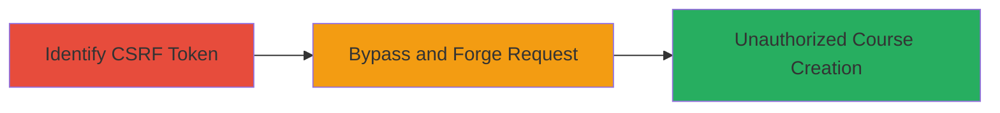

---
tags:
  - csrf
  - web-vulnerability
  - udemy
  - course-creation
type: attack_chain
tools: []
tactics:
  - '[[Initial Access]]'
verified: false
platforms:
  - Web
submitted: true
complexity: low
created_at: '2023-10-01T00:00:00Z'
procedures:
  - '[[procedures/Identify-CSRF-Token-in-Udemy-Course-Creation-Request]]'
  - '[[procedures/Bypass-CSRF-Protection-to-Create-Unauthorized-Udemy-Course]]'
step_count: 2
techniques:
  - '[[Exploit Public-Facing Application]]'
updated_at: '2025-12-14T17:27:15.425Z'
description: >-
  A multi-step attack exploiting missing CSRF token validation in Udemy's course
  creation endpoint, allowing unauthorized course creation on behalf of
  authenticated users.
skill_level: intermediate
impact_level: low
id: de794335-9f5c-488c-95c1-5436fbc617e9
validated: true
mitre_tactics:
  - '[[Initial Access]]'
mitre_techniques:
  - '[[Exploit Public-Facing Application]]'
---
# CSRF Bypass in Udemy Course Creation Leading to Unauthorized Courses

Multi-stage attack chain demonstrating a complete attack workflow exploiting a CSRF vulnerability in Udemy's course creation process.

## Chain Metrics Dashboard

| Metric | Value |
|--------|-------|
| Chain Status | Unverified |
| Total Steps | 2 |
| Execution Time | ~5 minutes |
| Skill Level | Intermediate |
| Complexity | Low |
| Impact Level | Low |

## Attack Flow Visualization



## Prerequisites & Requirements

### Required Tools

- Browser developer tools for inspecting requests
- Tool for forging HTTP requests (e.g., curl or Postman)

### Target Environment

- Udemy web application
- Access to an authenticated session (victim's browser)
- No special ports or services required beyond standard HTTPS (443)

### Initial Access Requirements

- Attacker must be able to deliver a malicious link or form to a victim (e.g., via phishing or social engineering)
- Victim must be authenticated to Udemy
- Network access to Udemy's domain

## Detailed Attack Procedures

### Step 1: Identify CSRF Token
procedure: [[procedures/Identify-CSRF-Token-in-Udemy-Course-Creation-Request]]

**Objective**: Inspect the course creation request to confirm the presence of a CSRF token that is not enforced by the server.

**Instructions**: Log in to Udemy as an authenticated user. Use browser developer tools (e.g., Chrome DevTools Network tab) to monitor the network traffic while attempting to create a course. Look for the POST request to the course creation endpoint and note the CSRF token in the request headers or body.

**Expected Output**: Request details showing a CSRF token (e.g., _csrf or similar) included in the form data or headers, but no server-side rejection when omitted.

**Success Indicators**:
- CSRF token observed in legitimate request
- Token value extracted for analysis

### Step 2: Bypass CSRF Protection
procedure: [[procedures/Bypass-CSRF-Protection-to-Create-Unauthorized-Udemy-Course]]

**Objective**: Forge a request to the course creation endpoint without the CSRF token to create a course without user consent.

**Instructions**: Craft a malicious HTML form or use a tool like curl to submit a POST request to the course creation endpoint (e.g., /api/courses/create/) omitting the CSRF token. Include necessary parameters like course title, description, and other required fields. Host the malicious form on an attacker-controlled site and trick the victim into submitting it while authenticated to Udemy.

For testing, use curl to simulate the forged request:

```bash
curl -X POST https://www.udemy.com/api/courses/create/ \
  -H "Cookie: sessionid=VICTIM_SESSION_ID" \
  -d "title=Unauthorized Course" \
  -d "description=Malicious content" \
  --insecure
```

Replace VICTIM_SESSION_ID with the victim's session cookie obtained via social engineering or prior compromise.

**Expected Output**: Server response indicating successful course creation (e.g., 200 OK with course ID), without requiring the CSRF token.

**Success Indicators**:
- Course created in victim's account without their direct interaction
- No error related to missing CSRF token

## Attack Chain Summary

### Key Achievements

1. Identified unenforced CSRF token in Udemy's course creation process
2. Successfully bypassed protection to forge course creation requests
3. Demonstrated potential for unauthorized actions on behalf of authenticated users, though impact is informative

## Technique & Tactic Coverage

### MITRE ATT&CK Techniques

- [[Exploit Public-Facing Application]]

### MITRE ATT&CK Tactics

- [[Initial Access]]

---
*Last updated: 2023-10-01T00:00:00Z*
