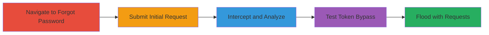

# CSRF Bypass in Vimeo Forgot Password to Flood Reset Emails

Multi-stage attack chain demonstrating a complete attack workflow exploiting a CSRF bypass in Vimeo's forgot password functionality. The vulnerability allows an attacker to omit or reuse the anti-CSRF token in POST requests to /forgot_password, enabling repeated submissions that flood the target's email with password reset notifications. Although rate limiting mitigates full DoS, it remains an informative finding for potential abuse.

## Chain Metrics Dashboard

| Metric | Value |
|--------|-------|
| Chain Status | Unverified |
| Total Steps | 5 |
| Execution Time | ~5 minutes |
| Skill Level | Intermediate |
| Complexity | Medium |
| Impact Level | Medium |

## Attack Flow Visualization



## Prerequisites & Requirements

### Required Tools

- [[tools/Burp-Suite]]

### Target Environment

- Web platform
- Access to Vimeo's forgot password page (https://vimeo.com/forgot_password)
- No authentication required

### Initial Access Requirements

- Public internet access
- Target email address (e.g., victim's email)
- No prior credentials needed

## Detailed Attack Procedures

### Step 1: Navigate to Forgot Password Page
procedure: [[procedures/Exploit-Vimeo-CSRF-Bypass-for-Email-Flooding]]

**Objective**: Access the target endpoint to initiate the forgot password flow.

**Instructions**: Open a browser and navigate to the forgot password page.

**Expected Output**: The forgot password form loads, displaying fields for email input and a submit button.

**Success Indicators**:
- Page loads successfully at https://vimeo.com/forgot_password
- Form elements are visible

### Step 2: Submit Initial Email
procedure: [[procedures/Exploit-Vimeo-CSRF-Bypass-for-Email-Flooding]]

**Objective**: Enter a target email and submit to generate a CSRF token for analysis.

**Instructions**: Input the target email (e.g., shubhamgupta109.1995@gmail.com) into the form and click the 'Help me' button to submit.

**Expected Output**: A password reset email is sent to the target, and the server responds with a success message.

**Success Indicators**:
- Email received by target
- No errors on form submission

### Step 3: Intercept the Request
procedure: [[procedures/Exploit-Vimeo-CSRF-Bypass-for-Email-Flooding]]

**Objective**: Capture the POST request to inspect the CSRF token.

**Instructions**: Configure [[tools/Burp-Suite]] with the browser proxy. Enable the Interceptor in Burp Suite to capture the POST request to /forgot_password during submission.

**Expected Output**: Intercepted request shows parameters like email=shubhamgupta109.1995%40gmail.com&token=e9b0179d3dd45669bd6d44a2484fb0f5.0.

**Success Indicators**:
- Request captured in Burp Suite
- Token parameter visible in request body

### Step 4: Test Token Validation
procedure: [[procedures/Exploit-Vimeo-CSRF-Bypass-for-Email-Flooding]]

**Objective**: Verify that the CSRF token is not validated by the server.

**Instructions**: In Burp Suite, modify the intercepted request by omitting the token parameter or reusing the same token, then forward it to the server. Use [[commands/vimeo-forgot-password-post]] to replicate:

```bash
curl -X POST https://vimeo.com/forgot_password -H "Content-Type: application/x-www-form-urlencoded" -d "email=shubhamgupta109.1995%40gmail.com"
```

**Expected Output**: Server accepts the request without the token and sends another reset email.

**Success Indicators**:
- Multiple emails received despite invalid/missing token
- No 403 or validation error from server

### Step 5: Exploit for Email Flooding
procedure: [[procedures/Exploit-Vimeo-CSRF-Bypass-for-Email-Flooding]]

**Objective**: Replay requests to spam the target's email with reset notifications.

**Instructions**: Use Burp Suite's Repeater or Intruder to send multiple POST requests without a valid token, targeting the same email. Alternatively, script with [[commands/vimeo-forgot-password-post]] in a loop:

```bash
for i in {1..10}; do curl -X POST https://vimeo.com/forgot_password -H "Content-Type: application/x-www-form-urlencoded" -d "email=shubhamgupta109.1995%40gmail.com"; done
```

**Expected Output**: Multiple password reset emails arrive at the target inbox, limited by rate limiting.

**Success Indicators**:
- Flood of emails observed
- Requests succeed without token validation

## Attack Chain Summary

### Key Achievements

1. Bypassed CSRF protection in forgot password endpoint
2. Demonstrated ability to send unauthorized reset requests
3. Highlighted potential for email-based DoS despite rate limits

## Technique & Tactic Coverage

### MITRE ATT&CK Techniques

- [[Exploit Public-Facing Application]]

### MITRE ATT&CK Tactics

- [[Initial Access]]
- [[Impact]]

---
*Last updated: 2023-10-01T00:00:00Z*
