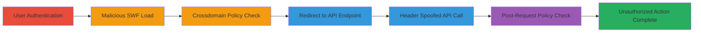

# CSRF Bypass on Vimeo API Using Flash Header Spoofing

Multi-stage attack chain demonstrating a complete attack workflow exploiting weak CSRF protection on Vimeo's developer API playground endpoint.

## Chain Metrics Dashboard

| Metric | Value |
|--------|-------|
| Chain Status | Unverified |
| Total Steps | 6 |
| Execution Time | ~5 minutes |
| Skill Level | Intermediate |
| Complexity | Medium |
| Impact Level | High |

## Attack Flow Visualization

## Prerequisites & Requirements

### Required Tools

- [[tools/Flash-SWF]]
- [[tools/xss-swf]]

### Target Environment

- Web browser: Safari (or compatible with Flash)
- Target service: Vimeo API at https://developer.vimeo.com/api/playground/me
- Attacker hosting: S3 bucket for SWF and own domain for PHP redirect script

### Initial Access Requirements

- Victim must be authenticated to Vimeo
- Victim must visit attacker's malicious SWF URL
- No special credentials needed beyond victim's session

## Detailed Attack Procedures

### Step 1: User Authentication

procedure: [[procedures/Exploit-CSFR-Via-Flash-Redirect]]

**Objective**: Establish an authenticated session with the target Vimeo API.

**Instructions**: Instruct or trick the victim to log in to Vimeo using Safari. This creates a session cookie that will be used for subsequent authenticated requests.

**Expected Output**: Successful login confirmation on Vimeo's site, with active session.

**Success Indicators**:
- User sees their Vimeo dashboard or profile.
- Browser cookies include Vimeo session tokens.

### Step 2: Load Malicious SWF

procedure: [[procedures/Exploit-CSFR-Via-Flash-Redirect]]

**Objective**: Initiate the Flash-based attack by loading the custom SWF file hosted on an attacker-controlled S3 bucket.

**Instructions**: Direct the victim to visit https://s3.amazonaws.com/avlidienbrunn/vimeo_pwn.swf in Safari. The SWF file is a custom Flash application designed to perform cross-domain requests.

**Expected Output**: SWF loads silently in the browser without user interaction.

**Success Indicators**:
- No errors in browser console related to Flash loading.
- SWF begins executing its request sequence.

### Step 3: Check Attacker's Crossdomain Policy

procedure: [[procedures/Exploit-CSFR-Via-Flash-Redirect]]

**Objective**: Verify permissions for cross-domain requests from the attacker's domain.

**Instructions**: The loaded SWF automatically requests https://avlidienbrunn.se/crossdomain.xml to confirm that Flash can make requests from the attacker's domain.

**Expected Output**: XML policy file returned, granting cross-domain access.

**Success Indicators**:
- 200 OK response for crossdomain.xml.
- Flash proceeds to next request without policy denial.

### Step 4: Trigger Redirect Endpoint

procedure: [[procedures/Exploit-CSFR-Via-Flash-Redirect]]

**Objective**: Use Flash to send a request to the attacker's redirect script, which will forward to the Vimeo endpoint.

**Instructions**: The SWF sends a request to https://avlidienbrunn.se/vimeo_pwn.php, a PHP script that issues an HTTP 307 redirect to https://developer.vimeo.com/api/playground/me.

**Expected Output**: Redirect initiated, Flash follows to the target URL.

**Success Indicators**:
- PHP script logs show request received.
- Flash handles the 307 without blocking.

### Step 5: Execute Spoofed API Request

procedure: [[procedures/Exploit-CSFR-Via-Flash-Redirect]]

**Objective**: Spoof the required CSRF header and perform the unauthorized API call before CORS checks.

**Instructions**: Flash follows the redirect and sends a POST request to https://developer.vimeo.com/api/playground/me with the spoofed 'X-Requested-With: XMLHttpRequest' header. Include payload to update profile, e.g., biography to 'avlidienbrunn+was+here'.

**Expected Output**: API call executes, modifying user data (e.g., profile bio updated).

**Success Indicators**:
- Victim's Vimeo profile shows the injected text.
- No response readable due to SOP, but action completes.

### Step 6: Post-Request Crossdomain Check

procedure: [[procedures/Exploit-CSFR-Via-Flash-Redirect]]

**Objective**: Attempt to read response, but the exploit succeeds regardless as the request is issued first.

**Instructions**: After the API call, Flash requests https://developer.vimeo.com/crossdomain.xml, but since the request already executed, the bypass is complete.

**Expected Output**: Crossdomain.xml request fails or returns policy, but no impact on prior action.

**Success Indicators**:
- Profile modification persists on victim's account.
- No alert or block from Vimeo.

## Attack Chain Summary

### Key Achievements

1. Bypassed CSRF protection relying on a spoofable header.
2. Forced unauthorized API actions like profile modification without user consent.
3. Demonstrated Flash's ability to evade modern web security controls via redirects.

## Technique & Tactic Coverage

### MITRE ATT&CK Techniques

- [[Exploit Public-Facing Application]] Exploit Public-Facing Application
- [[Drive-by Compromise]] Drive-by Compromise

### MITRE ATT&CK Tactics

- [[Initial Access]] Initial Access

---

*Last updated: 2023-10-01T00:00:00Z*
