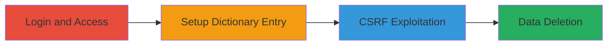

---
tags:
  - csrf
  - web
  - deletion
  - data-loss
  - weblate
type: attack_chain
tools: []
tactics:
  - '[[Initial Access]]'
verified: false
platforms:
  - Web
submitted: true
complexity: low
procedures:
  - '[[procedures/Login-to-Weblate-Demo-Site]]'
  - '[[procedures/Add-Dictionary-Entry-in-Weblate]]'
  - '[[procedures/Exploit-CSRF-to-Delete-Dictionary-Entry]]'
step_count: 4
techniques:
  - '[[Drive-by Compromise]]'
description: >-
  A multi-stage attack exploiting a CSRF vulnerability in the Weblate demo site
  to unauthorizedly delete user dictionary entries by tricking authenticated
  users into loading malicious resources.
skill_level: intermediate
impact_level: medium
id: 8bba7608-2d3a-4579-9e4a-f4ee205f7e94
created_at: '2025-12-14T17:27:22.515Z'
updated_at: '2025-12-14T17:27:22.515Z'
validated: true
mitre_tactics:
  - '[[Initial Access]]'
mitre_techniques:
  - '[[Drive-by Compromise]]'
---
# CSRF Bypass to Delete Dictionary Entries in Weblate

Multi-stage attack chain demonstrating a complete attack workflow exploiting missing CSRF protection in the Weblate demo site's dictionary deletion endpoint. An attacker crafts a malicious webpage that, when visited by an authenticated user, triggers unauthorized deletion of dictionary entries via cross-site requests, leading to data loss and workflow disruption.

## Chain Metrics Dashboard

| Metric | Value |
|--------|-------|
| Chain Status | Unverified |
| Total Steps | 4 |
| Execution Time | ~5 minutes |
| Skill Level | Intermediate |
| Complexity | Low |
| Impact Level | Medium |

## Attack Flow Visualization

## Prerequisites & Requirements

### Required Tools

- Web browser (e.g., Chrome, Firefox)
- Optional: Local web server to host malicious HTML (e.g., Python's http.server)

### Target Environment

- Web platform
- Weblate demo site at https://demo.weblate.org/
- No specific services/ports beyond standard HTTPS (443)

### Initial Access Requirements

- Attacker needs to lure authenticated victim to malicious site
- Victim must have valid Weblate account credentials
- No prior access to victim's session required beyond tricking them to load the resource

## Detailed Attack Procedures

### Step 1: Login to Weblate Demo Site
procedure: [[procedures/Login-to-Weblate-Demo-Site]]

**Objective**: Authenticate as a user to establish a valid session for subsequent actions.

**Instructions**: Open a web browser and navigate to the Weblate demo site. Enter valid credentials to log in, ensuring the session cookie is set for authenticated requests.

**Expected Output**: Successful login redirect to the dashboard, with user profile accessible.

**Success Indicators**:
- User dashboard loads without errors
- Session remains active (check via browser dev tools for auth cookies)

### Step 2: Navigate to Dictionaries Page
procedure: [[procedures/Login-to-Weblate-Demo-Site]]

**Objective**: Access the dictionary management interface to prepare for entry creation.

**Instructions**: After login, directly navigate to the dictionaries page for the target project and language, such as https://demo.weblate.org/dictionaries/hello/sl/.

**Expected Output**: Dictionaries page loads, displaying existing entries or empty list.

**Success Indicators**:
- Page renders without authentication errors
- Dictionary interface is interactive

### Step 3: Add New Word to the Dictionary
procedure: [[procedures/Add-Dictionary-Entry-in-Weblate]]

**Objective**: Create a test dictionary entry to serve as the target for deletion in the POC.

**Instructions**: On the dictionaries page, use the interface to add a new entry (e.g., source text and translation). Save the entry and note its ID (e.g., 5545 in the POC).

**Expected Output**: New entry appears in the list with a unique ID.

**Success Indicators**:
- Entry is successfully added and visible
- ID is retrievable from the page URL or list

### Step 4: Exploit CSRF to Delete the Dictionary Entry
procedure: [[procedures/Exploit-CSRF-to-Delete-Dictionary-Entry]]

**Objective**: Trick the authenticated user into loading a malicious resource that triggers the deletion endpoint without CSRF validation.

**Instructions**: Craft a malicious HTML page with an  or <iframe> tag pointing to the delete endpoint, e.g., . Host this page on an attacker-controlled site and lure the victim to visit it while authenticated to Weblate.

**Expected Output**: The victim's dictionary entry is deleted upon page load; verify by refreshing the dictionaries page.

**Success Indicators**:
- Entry no longer appears in the dictionary
- No CSRF error in browser console or server response

## Attack Chain Summary

### Key Achievements

1. Bypassed CSRF protection on state-changing delete operation
2. Demonstrated unauthorized data deletion via cross-site request
3. Highlighted workflow disruption potential for translation teams

## Technique & Tactic Coverage

### MITRE ATT&CK Techniques

- [[Drive-by Compromise]]

### MITRE ATT&CK Tactics

- [[Initial Access]]

---
*Last updated: 2023-10-01*
