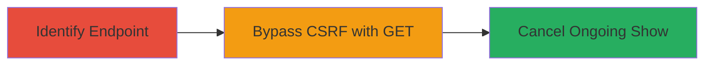

---
tags:
  - csrf
  - web
  - bypass
  - chaturbate
  - show-cancellation
type: attack_chain
tools: []
tactics:
  - '[[Initial Access]]'
  - '[[Impact]]'
verified: false
platforms:
  - Web
submitted: true
complexity: medium
created_at: '2023-10-01T00:00:00Z'
procedures:
  - '[[procedures/Identify-CSRF-Protected-Endpoint-in-Chaturbate]]'
  - '[[procedures/Bypass-CSRF-with-GET-Request-to-Cancel-Show]]'
step_count: 2
techniques:
  - '[[Exploit Public-Facing Application]]'
  - '[[Valid Accounts]]'
updated_at: '2025-12-14T17:27:29.619Z'
description: >-
  A multi-stage attack exploiting a CSRF vulnerability in Chaturbate's show
  cancellation endpoint, allowing unauthorized disruption of paid group or
  private shows by bypassing CSRF checks with GET requests.
skill_level: intermediate
impact_level: high
id: cbf41e29-300e-4ed7-8e76-70f56a524df3
validated: true
mitre_tactics:
  - '[[Initial Access]]'
  - '[[Impact]]'
mitre_techniques:
  - '[[Exploit Public-Facing Application]]'
  - '[[Valid Accounts]]'
---
# CSRF Bypass via GET Request to Cancel Chaturbate Group Shows

Multi-stage attack chain demonstrating a complete attack workflow exploiting CSRF in Chaturbate's chat room functionality.

## Chain Metrics Dashboard

| Metric | Value |
|--------|-------|
| Chain Status | Unverified |
| Total Steps | 2 |
| Execution Time | ~5 minutes |
| Skill Level | Intermediate |
| Complexity | Medium |
| Impact Level | High |

## Attack Flow Visualization



## Prerequisites & Requirements

### Required Tools

- Browser developer tools or [[tools/curl]]
- Access to host a malicious webpage

### Target Environment

- Chaturbate web platform
- Logged-in authenticated user session
- No specific ports or services beyond standard HTTPS (443)

### Initial Access Requirements

- Victim must be logged in to Chaturbate and participating in a group or private show
- Attacker needs to trick victim into visiting a malicious link (e.g., via phishing or social engineering)
- No prior credentials needed for attacker

## Detailed Attack Procedures

### Step 1: Identify the Show Cancellation Endpoint
procedure: [[procedures/Identify-CSRF-Protected-Endpoint-in-Chaturbate]]

**Objective**: Locate the endpoint used for canceling group shows and confirm CSRF protection on POST requests.

**Instructions**: Use browser developer tools or curl to inspect network requests during a simulated cancellation. Start a group show and attempt to cancel via the UI, observing the POST request to `/tipping/group_show_cancel/broadcaster's_username/`.

Test POST with CSRF token:

```bash
curl -X POST -H "Cookie: auth_token=your_session" -H "X-CSRFToken: valid_token" https://chaturbate.com/tipping/group_show_cancel/broadcaster_username/
```

**Expected Output**: Successful cancellation only if CSRF token is valid; 403 or similar if missing.

**Success Indicators**:
- Endpoint identified as `/tipping/group_show_cancel/{username}/`
- POST requests require CSRF header validation

### Step 2: Bypass CSRF and Cancel Show
procedure: [[procedures/Bypass-CSRF-with-GET-Request-to-Cancel-Show]]

**Objective**: Exploit the lack of CSRF checks on GET requests to the same endpoint, forcing cancellation without user consent.

**Instructions**: Craft a malicious HTML page with an auto-loading img or script tag that triggers a GET request to the endpoint while the victim is logged in. Host the page and send the link to the victim.

Example malicious page snippet:

```html

```

Simulate with curl (victim's session cookie required):

```bash
curl -X GET -H "Cookie: auth_token=victim_session" https://chaturbate.com/tipping/group_show_cancel/broadcaster_username/
```

**Expected Output**: The show is canceled without prompting, visible in the victim's chat room.

**Success Indicators**:
- Victim's ongoing show is terminated unexpectedly
- No CSRF error returned on GET request

## Attack Chain Summary

### Key Achievements

1. Identified CSRF-protected POST endpoint for show cancellation
2. Bypassed protection using unprotected GET method
3. Enabled unauthorized disruption of paid user interactions

## Technique & Tactic Coverage

### MITRE ATT&CK Techniques

- [[Exploit Public-Facing Application]] Exploit Public-Facing Application
- [[Valid Accounts]] Valid Accounts

### MITRE ATT&CK Tactics

- [[Initial Access]] Initial Access
- [[Impact]] Impact

---
*Last updated: 2023-10-01T00:00:00Z*
