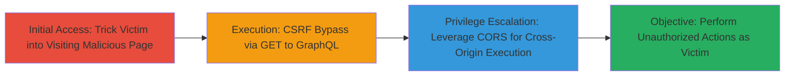

# CSRF Bypass via GET Requests to GraphQL Endpoint with Permissive CORS for Unauthorized User Actions

Multi-stage attack chain demonstrating a complete attack workflow exploiting vulnerabilities in the Enjin platform's GraphQL interface and CORS configuration to perform unauthorized actions as an authenticated user.

## Chain Metrics Dashboard

| Metric | Value |
|--------|-------|
| Chain Status | Unverified |
| Total Steps | 3 |
| Execution Time | ~5 minutes |
| Skill Level | Intermediate |
| Complexity | Medium |
| Impact Level | High |

## Attack Flow Visualization



## Prerequisites & Requirements

### Required Tools

- Browser developer tools for crafting requests
- [[tools/Burp-Suite]] (optional for interception and modification)

### Target Environment

- Web platform with GraphQL endpoint
- Services: GraphQL API (exposed via HTTP/HTTPS)
- Tech stack: GraphQL
- Required ports: 80/443 (standard web)

### Initial Access Requirements

- Victim must be authenticated (e.g., logged in with session cookies)
- Attacker needs to host a malicious webpage or send a phishing link
- Network access: Victim's browser must reach the target GraphQL endpoint

## Detailed Attack Procedures

### Step 1: Initial Access
procedure: [[procedures/Exploit-GraphQL-CSrf-Bypass-via-GET]]

**Objective**: Trick the victim into loading a malicious page that initiates a GET request to the vulnerable GraphQL endpoint, bypassing CSRF protections.

**Instructions**: Host a malicious HTML page on an attacker-controlled domain that embeds an img tag or script to trigger a GET request to the GraphQL endpoint with a malicious query. For example, use a simple script to send the request:

```javascript
// Malicious page script
fetch('https://target.com/graphql?query={mutation{unauthorizedAction}}', {method: 'GET', credentials: 'include'});
```

Send a phishing email or link to the victim to visit this page while they are authenticated on the target site.

**Expected Output**: The GET request executes the GraphQL mutation without a CSRF token, as the endpoint accepts GET.

**Success Indicators**:
- Network logs show GET request to /graphql from victim's browser
- No CSRF token validation error in response

### Step 2: Execution
procedure: [[procedures/Leverage-Permissive-CORS-for-Cross-Origin-Requests]]

**Objective**: Exploit overly permissive CORS rules to allow the cross-origin GET request to include authentication credentials and execute on behalf of the victim.

**Instructions**: Ensure the malicious request includes credentials (cookies) by setting `credentials: 'include'` in the fetch. The target's CORS policy (e.g., Access-Control-Allow-Origin: *) permits the request from the attacker's domain. Test with a curl command adapted for browser context:

```bash
curl -X GET "https://target.com/graphql?query={mutation{unauthorizedAction}}" -H "Cookie: session=victim_session" --verbose
```

Observe that the response includes Access-Control-Allow-Origin headers permitting the origin.

**Expected Output**: Successful GraphQL response with executed mutation data, no CORS blocking.

**Success Indicators**:
- Response headers show permissive CORS (e.g., Access-Control-Allow-Origin: *)
- Authentication cookies are sent and honored in the request

### Step 3: Privilege Escalation
procedure: [[procedures/Execute-Unauthorized-Actions-as-Victim]]

**Objective**: Perform sensitive actions, such as data modification or account takeover-like operations, using the bypassed protections.

**Instructions**: Chain the previous steps to execute a specific GraphQL mutation, e.g., changing user settings or transferring assets. Use the same fetch or img src trick to target a high-impact query:

```javascript
fetch('https://target.com/graphql?query={mutation{changeEmail(newEmail:"attacker@evil.com")}}', {method: 'GET', credentials: 'include'});
```

Verify the action by checking the victim's account post-execution.

**Expected Output**: GraphQL response confirming the mutation success (e.g., {"data":{"changeEmail":true}}).

**Success Indicators**:
- Victim's account shows unauthorized changes
- No authentication or CSRF errors in logs

## Attack Chain Summary

### Key Achievements

1. Bypassed CSRF protections by exploiting GET method acceptance in GraphQL.
2. Overcame cross-origin restrictions via permissive CORS, enabling credential inclusion.
3. Achieved unauthorized execution of user actions, leading to potential account compromise.

## Technique & Tactic Coverage

### MITRE ATT&CK Techniques

- [[Exploit Public-Facing Application]] Exploit Public-Facing Application
- [[Valid Accounts]] Valid Accounts

### MITRE ATT&CK Tactics

- [[Initial Access]] Initial Access
- [[Lateral Movement]] Lateral Movement

---
*Last updated: 2023-10-01T00:00:00Z*
