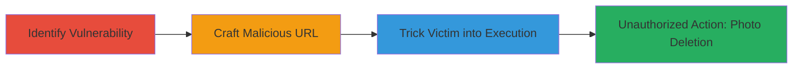

# CSRF Bypass via st.rtu Parameter in m.ok.ru to Perform Unauthorized Photo Deletion

Multi-stage attack chain demonstrating a CSRF protection bypass in the mobile version of ok.ru (m.ok.ru) by manipulating the 'st.rtu' parameter in AJAX requests. This allows attackers to craft malicious URLs that, when interacted with by an authenticated victim (e.g., clicking a 'cancel' button in a repost dialog), execute unauthorized actions such as deleting user photos without proper CSRF validation. The attack builds on prior bypass techniques using 'dlgId' and page links, targeting features like reposts, note editing, and group posts.

## Chain Metrics Dashboard

| Metric | Value |
|--------|-------|
| Chain Status | Unverified |
| Total Steps | 3 |
| Execution Time | ~5 minutes |
| Skill Level | Intermediate |
| Complexity | Medium |
| Impact Level | High |

## Attack Flow Visualization



## Prerequisites & Requirements

### Required Tools

- None (relies on URL crafting and social engineering)

### Target Environment

- Platform: Web (m.ok.ru mobile site)
- Required services/ports: HTTP/HTTPS on port 80/443
- Network access requirements: Internet access to m.ok.ru

### Initial Access Requirements

- Victim must be authenticated on m.ok.ru
- Attacker needs knowledge of victim's photo ID or other target identifiers
- No prior attacker credentials required; exploits victim's session

## Detailed Attack Procedures

### Step 1: Identify st.rtu Parameter Vulnerability
procedure: [[procedures/Identify-st-rtu-Vulnerability-in-AJAX-Requests]]

**Objective**: Analyze and confirm the CSRF bypass vulnerability in AJAX requests using the st.rtu parameter.

**Instructions**: Examine the m.ok.ru features like reposts, note editing, and group posts to observe how st.rtu carries encoded AJAX payloads with the X-XTKN token, bypassing CSRF checks.

**Expected Output**: Identification of manipulable endpoints such as /dk for actions like userPhoto and friendReshareTopic.

**Success Indicators**:
- Confirmed that st.rtu propagates requests without CSRF validation
- Noted similarities to prior dlgId and link-based bypasses

### Step 2: Craft Malicious URL Embedding Unauthorized Action
procedure: [[procedures/Craft-Malicious-URL-with-Embedded-Photo-Deletion]]

**Objective**: Create a URL that embeds the photo deletion action within a repost context to evade CSRF protections.

**Instructions**: Use the identified vulnerability to encode the deletion payload. Start with a repost command and nest the photo deletion in st.rtu. Execute [[commands/craft-csrf-bypass-url]] to generate the malicious link:

```bash
curl -G "http://m.ok.ru/dk" \
  --data-urlencode "st.cmd=friendReshareTopic" \
  --data-urlencode "st.topicId=64607766975788" \
  --data-urlencode "st.rtu=/dk?bk=ActionBus&st.cmd=actionBus&st.rtu=%2Fdk%3Fst.cmd%3DuserPhoto%26st.phoId%3D812501293868%26st.layer%3Dsoon%26_prevCmd%3DuserPhoto%26tkn%3D2696%26_prevCmd%3DuserPhoto%26tkn%3D6230%26st.actions%3D%7B%22photos.delete%22%3A%7B%22photoId%22%3A%22812501293868%22%2C%22groupId%22%3Anull%7D%7D%26_i_loc_rdr%3D1" \
  --data-urlencode "st.friendId=584798454828" \
  --data-urlencode "_prevCmd=friendMediaStatusComments" \
  --data-urlencode "tkn=7824"
```

**Expected Output**: A fully encoded malicious URL ready for distribution.

**Success Indicators**:
- URL contains nested st.actions JSON for photos.delete
- Payload includes specific photoId without triggering CSRF errors in testing

### Step 3: Trick User into Clicking the Link to Trigger Action
procedure: [[procedures/Trick-Victim-into-Clicking-Link-to-Trigger-Action]]

**Objective**: Socially engineer the victim to interact with the malicious URL, executing the embedded action.

**Instructions**: Share the crafted URL as a repost link via messaging or email. When the victim (authenticated on m.ok.ru) clicks it and interacts with the repost dialog (e.g., clicks 'cancel'), the st.rtu payload executes the photo deletion.

**Expected Output**: The victim's photo is deleted upon interaction.

**Success Indicators**:
- Victim opens the link and triggers the dialog
- Photo with specified ID is removed from the account

## Attack Chain Summary

### Key Achievements

1. Bypassed CSRF protections using st.rtu parameter manipulation
2. Executed unauthorized photo deletion via crafted AJAX payloads
3. Demonstrated applicability to other actions like note editing and group posts

## Technique & Tactic Coverage

### MITRE ATT&CK Techniques

- [[Exploit Public-Facing Application]]

### MITRE ATT&CK Tactics

- [[Initial Access]]

---
*Last updated: 2023-10-01T00:00:00Z*
