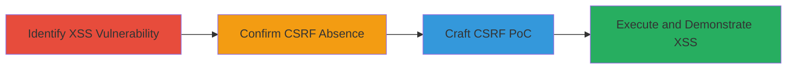

# CSRF-Chained Reflected XSS for Session Hijacking on DoD Subdomain

Multi-stage attack chain demonstrating a complete attack workflow exploiting reflected XSS in a POST form parameter combined with CSRF to execute JavaScript in an authenticated user's context on a DoD subdomain.

## Chain Metrics Dashboard

| Metric | Value |
|--------|-------|
| Chain Status | Unverified |
| Total Steps | 4 |
| Execution Time | ~10 minutes |
| Skill Level | Intermediate |
| Complexity | Medium |
| Impact Level | High |

## Attack Flow Visualization

## Prerequisites & Requirements

### Required Tools

- [[tools/Burp-Suite]]

### Target Environment

- Web application on a DoD subdomain (e.g., https://██████████)
- Access to an authenticated session for testing
- No specific ports required beyond standard HTTPS (443)

### Initial Access Requirements

- Network access to the target DoD subdomain
- Ability to intercept and modify HTTP requests
- Victim must be authenticated to the target site

## Detailed Attack Procedures

### Step 1: Identify XSS Vulnerability
procedure: [[procedures/Identify-Reflected-XSS-in-Form-Parameter]]

**Objective**: Discover the reflected XSS in the 'frm_email' parameter of the POST endpoint.

**Instructions**: Use Burp Suite to intercept and analyze form submissions to the target endpoint. Inject a test payload like '"&gt;&lt;svg/onload=alert(document.domain)&gt;' into the 'frm_email' parameter and submit the form.

**Expected Output**: The payload is reflected unescaped in the response, triggering a JavaScript alert with the document domain.

**Success Indicators**:
- Payload reflection without sanitization
- JavaScript execution confirmed via alert

### Step 2: Confirm CSRF Absence
procedure: [[procedures/Confirm-Absence-of-CSRF-Protection]]

**Objective**: Verify that the endpoint lacks CSRF protections, allowing cross-site submissions.

**Instructions**: Inspect the POST request in Burp Suite for the presence of CSRF tokens or origin checks. Attempt a cross-origin request from a different domain to the endpoint without any anti-CSRF measures.

**Expected Output**: The request succeeds without requiring a valid CSRF token, confirming vulnerability to cross-site forgery.

**Success Indicators**:
- No CSRF token required in the request
- Cross-origin POST accepted by the server

### Step 3: Craft CSRF PoC
procedure: [[procedures/Craft-CSRF-POC-for-XSS-Exploitation]]

**Objective**: Create a malicious HTML page that auto-submits a forged request embedding the XSS payload.

**Instructions**: Generate an HTML form in Burp Suite or manually, including hidden fields for action=F█████, token=████████, frm_email='nagli@wearehackerone.com"&gt;&lt;svg/onload=alert(document.domain)&gt;', frm_zip5=12121, and cmd_submit=Submit. Add a script to auto-submit the form and push state to avoid navigation issues.

**Expected Output**: A functional HTML PoC file that, when loaded, submits the forged request seamlessly.

**Success Indicators**:
- Form auto-submits without user interaction
- Payload is correctly embedded in the request

### Step 4: Execute Exploitation
procedure: [[procedures/Demonstrate-CSRF-Chained-XSS-Execution]]

**Objective**: Trick an authenticated victim into loading the PoC, resulting in XSS execution.

**Instructions**: Host or load the PoC HTML in a browser where the victim is authenticated to the target site. Click the submit button (or let it auto-submit) to trigger the CSRF request and observe the XSS alert.

**Expected Output**: An alert box pops up displaying the DoD subdomain's document domain, confirming JavaScript execution in the victim's context.

**Success Indicators**:
- CSRF request sent successfully
- XSS payload executes, showing alert
- Potential for session theft or further actions

## Attack Chain Summary

### Key Achievements

1. Identified reflected XSS in 'frm_email' parameter due to lack of sanitization.
2. Confirmed no CSRF protections, enabling cross-site exploitation.
3. Chained CSRF with XSS for stealthy payload delivery.
4. Demonstrated session hijacking potential on the DoD domain.

## Technique & Tactic Coverage

### MITRE ATT&CK Techniques

- [[JavaScript]]
- [[Steal Web Session Cookie]]

### MITRE ATT&CK Tactics

- [[Initial Access]]
- [[Execution]]

---

*Last updated: 2023-10-01T00:00:00Z*
