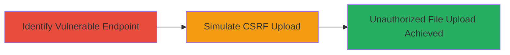

# CSRF Exploitation Enabling Unauthorized File Uploads to Udemy Staging S3 Bucket

Multi-stage attack chain demonstrating a complete attack workflow exploiting missing CSRF token validation on Udemy's staging S3 bucket upload endpoint.

## Chain Metrics Dashboard

| Metric | Value |
|--------|-------|
| Chain Status | Unverified |
| Total Steps | 2 |
| Execution Time | ~5 minutes |
| Skill Level | Intermediate |
| Complexity | Medium |
| Impact Level | Low |

## Attack Flow Visualization

## Prerequisites & Requirements

### Required Tools

- None (relies on browser and basic web development tools for crafting malicious HTML)

### Target Environment

- Web application with AWS S3 integration
- Staging environment accessible via public upload endpoint
- No specific ports required beyond standard HTTPS (443)

### Initial Access Requirements

- No credentials needed; attack exploits cross-origin requests
- Attacker must host a malicious webpage accessible to the victim
- Victim must be authenticated to Udemy (e.g., via active session)

## Detailed Attack Procedures

### Step 1: Identify Missing CSRF Protection on S3 Upload Endpoint
procedure: [[procedures/Identify-Missing-CSRF-Protection-on-S3-Upload-Endpoint]]

**Objective**: Discover the S3 upload endpoint and confirm the absence of CSRF token validation, enabling cross-origin file uploads.

**Instructions**: Inspect the Udemy web application's file upload functionality, typically found in course creation or asset management features. Use browser developer tools to monitor network requests during a legitimate upload and verify that no CSRF token is included in the form or headers. Test by attempting a cross-origin request from a different domain to confirm the vulnerability.

**Expected Output**: Confirmation that the endpoint accepts uploads without CSRF validation, such as a successful 200 response on a test POST request from an external site.

**Success Indicators**:
- Network inspection reveals no CSRF token in upload requests
- Cross-origin POST to the endpoint succeeds without errors

### Step 2: Demonstrate CSRF Attack via Malicious Webpage
procedure: [[procedures/Demonstrate-CSRF-Attack-via-Malicious-Webpage]]

**Objective**: Craft and host a malicious webpage that automatically submits a file upload form to the vulnerable S3 endpoint, tricking an authenticated user into uploading arbitrary files.

**Instructions**: Create an HTML page with an auto-submitting form targeting the S3 upload endpoint. Host this page on an attacker-controlled domain. When a victim (authenticated to Udemy) visits the page, the form submits, uploading a file to the staging S3 bucket without their knowledge.

**Expected Output**: The file appears in the S3 bucket, processed by Udemy's staging pipeline, confirming unauthorized access.

**Success Indicators**:
- Malicious form submission results in file upload to S3
- No user interaction required on the Udemy site beyond being logged in

## Attack Chain Summary

### Key Achievements

1. Identified CSRF vulnerability in staging S3 upload feature
2. Demonstrated practical exploitation via cross-site form submission
3. Highlighted potential for storage abuse, though limited to staging environment

## Technique & Tactic Coverage

### MITRE ATT&CK Techniques

- [[Exploit Public-Facing Application]]

### MITRE ATT&CK Tactics

- [[Initial Access]]

---
*Last updated: 2023-10-01T00:00:00Z*
