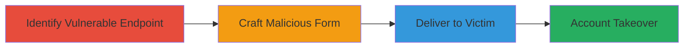

# CSRF Exploitation Leading to Account Takeover in Provider Management

Multi-stage attack chain demonstrating a complete CSRF workflow to hijack a patient's account by adding an unauthorized provider.

## Chain Metrics Dashboard

| Metric | Value |
|--------|-------|
| Chain Status | Unverified |
| Total Steps | 3 |
| Execution Time | ~10 minutes |
| Skill Level | Intermediate |
| Complexity | Medium |
| Impact Level | High |

## Attack Flow Visualization

## Prerequisites & Requirements

### Required Tools

- [[tools/Burp-Suite]]

### Target Environment

- Web platform (onpatient.com or similar Django-based application)
- Access to a victim's session (e.g., via phishing or social engineering for form delivery)
- No direct authentication required for the attacker, but victim must be logged in

### Initial Access Requirements

- Victim must be authenticated on the target site
- Attacker needs a way to deliver the malicious HTML (e.g., email, malicious website)
- Network access to the target's API endpoint

## Detailed Attack Procedures

### Step 1: Identify Vulnerable Endpoint

procedure: [[procedures/Identify-CSRF-Vulnerable-API-Endpoint]]

**Objective**: Discover the API endpoint that lacks proper CSRF protection and accepts provider addition requests.

**Instructions**: Use Burp Suite to intercept legitimate requests to the /api/v3/providers endpoint and analyze the parameters, such as patient ID, name, email, and specialty. Confirm that POST requests can be sent without validating the CSRF token.

**Expected Output**: Identification of the endpoint https://onpatient.com/api/v3/providers as vulnerable, with fields like patient ID (e.g., '213477'), name, email, etc.

**Success Indicators**:
- Endpoint accepts POST without CSRF enforcement
- Parameters for adding providers are mappable

### Step 2: Craft Malicious HTML Form

procedure: [[procedures/Craft-Malicious-HTML-Form-for-CSRF]]

**Objective**: Create a forged HTML form that simulates a legitimate provider addition request, including the attacker's details.

**Instructions**: Generate an HTML page using Burp Suite's CSRF PoC feature. Include a form posting to https://onpatient.com/api/v3/providers with hidden fields for csrfmiddlewaretoken (if present but unenforced), patient ID (e.g., value='213477'), and attacker inputs like name, email, phone, address. Set enctype='multipart/form-data' for compatibility.

**Expected Output**: A self-contained HTML file that, when loaded, submits the forged request.

**Success Indicators**:
- Form successfully crafts a POST request with all required fields
- Test submission adds a provider without errors (in a controlled environment)

### Step 3: Deliver and Trigger CSRF Payload

procedure: [[procedures/Deliver-and-Trigger-CSRF-Payload]]

**Objective**: Trick the victim into loading and submitting the malicious form while authenticated, adding the attacker's email as a provider.

**Instructions**: Host the HTML page on a controlled server or send it via email. The form auto-submits or includes a button to trigger the POST. Once submitted, the victim's session adds the attacker's details, enabling takeover via the providers list.

**Expected Output**: Attacker's email linked to the victim's account, allowing login or control.

**Success Indicators**:
- Provider added to victim's account
- Attacker gains access to patient data or account functions

## Attack Chain Summary

### Key Achievements

1. Identified CSRF vulnerability in provider API
2. Crafted and delivered a functional PoC for unauthorized provider addition
3. Demonstrated path to full account takeover

## Technique & Tactic Coverage

### MITRE ATT&CK Techniques

- [[Exploit Public-Facing Application]]
- [[Valid Accounts]]

### MITRE ATT&CK Tactics

- [[Initial Access]]
- [[Persistence]]

---
*Last updated: 2023-10-01T00:00:00Z*
