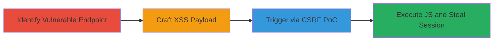

# CSRF Exploitation Leading to Reflected XSS for Session Token Theft

Multi-stage attack chain demonstrating a complete attack workflow exploiting a CSRF vulnerability in a POST endpoint to inject and trigger an XSS payload, enabling arbitrary JavaScript execution in the victim's browser context for stealing session tokens and impersonating users.

## Chain Metrics Dashboard

| Metric | Value |
|--------|-------|
| Chain Status | Unverified |
| Total Steps | 3 |
| Execution Time | ~15 minutes |
| Skill Level | Intermediate |
| Complexity | Medium |
| Impact Level | High |

## Attack Flow Visualization

## Prerequisites & Requirements

### Required Tools

- [[tools/Burp-Suite-Professional]]

### Target Environment

- Web application with POST endpoints handling user input
- No CSRF protection on sensitive actions
- Browser context for victim simulation

### Initial Access Requirements

- Network access to the target web application
- Ability to intercept and modify HTTP requests
- Victim must be authenticated to the target site

## Detailed Attack Procedures

### Step 1: Identify Vulnerable Endpoint
procedure: [[procedures/Identify-CSRF-Vulnerable-POST-Endpoint]]

**Objective**: Locate a POST endpoint that processes user input without CSRF tokens, setting the stage for forged requests.

**Instructions**: Use Burp Suite to intercept traffic and analyze requests to the target application. Look for POST requests with parameters like 'answer' that lack CSRF tokens in headers or forms.

**Expected Output**: Identification of a vulnerable endpoint, such as a redacted URL handling quiz or form submissions.

**Success Indicators**:
- POST request found without CSRF validation
- Parameter accepts arbitrary input

### Step 2: Craft XSS Payload
procedure: [[procedures/Craft-XSS-Payload-for-Answer-Parameter]]

**Objective**: Develop a payload that breaks out of the input context to inject executable JavaScript.

**Instructions**: In Burp Suite's Repeater, modify the 'answer' parameter with a payload like 'A">' and URL-encode it for the POST body as 'A%22%3E%3Cimg+src%3Dx+onerror%3Dalert%28document.domain%29%3E'. Send the request and observe if the payload executes on response rendering.

**Expected Output**: Alert box popping up with the document domain, confirming XSS.

**Success Indicators**:
- JavaScript executes in the response
- No sanitization of HTML/JS in output

### Step 3: Create CSRF PoC
procedure: [[procedures/Create-and-Test-CSRF-PoC-for-XSS-Trigger]]

**Objective**: Build a malicious page that forges the POST request to trigger the XSS without victim interaction.

**Instructions**: Generate an HTML page with a hidden form auto-submitting the POST to the vulnerable endpoint, including the encoded XSS payload in the 'answer' field. Use JavaScript like history.pushState to obscure the action. Host the PoC and lure the victim to visit it while authenticated.

**Expected Output**: Victim's browser executes the XSS payload, potentially stealing cookies or session tokens.

**Success Indicators**:
- Form submission succeeds from external site
- XSS alert triggers in victim's session

## Attack Chain Summary

### Key Achievements

1. Bypassed CSRF protections to forge requests
2. Injected and executed XSS for JS access
3. Enabled session theft and user impersonation

## Technique & Tactic Coverage

### MITRE ATT&CK Techniques

- [[Drive-by Compromise]]
- [[JavaScript]]

### MITRE ATT&CK Tactics

- [[Initial Access]]
- [[Execution]]

---
*Last updated: 2023-10-01T00:00:00Z*
