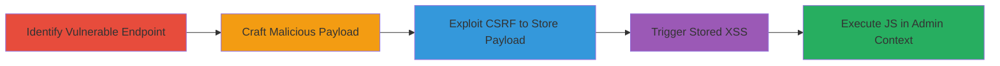

# CSRF Exploitation Leading to Stored XSS in Concrete CMS Community Points Actions

Multi-stage attack chain demonstrating exploitation of missing CSRF protection and input sanitization in Concrete CMS to inject stored XSS payloads via community points actions, targeting administrators for JavaScript execution in their browser context.

## Chain Metrics Dashboard

| Metric | Value |
|--------|-------|
| Chain Status | Unverified |
| Total Steps | 4 |
| Execution Time | ~5 minutes |
| Skill Level | Intermediate |
| Complexity | Medium |
| Impact Level | High |

## Attack Flow Visualization

## Prerequisites & Requirements

### Required Tools

- Web browser with developer tools (e.g., Chrome DevTools for inspecting requests)
- Proxy tool like Burp Suite for crafting and intercepting POST requests

### Target Environment

- Concrete CMS instance (version vulnerable to report #65808, e.g., pre-8.5.x patches)
- PHP-based web server
- Admin access or ability to steal admin session (e.g., via phishing or prior compromise)
- Required services/ports: HTTP/HTTPS on port 80/443
- Network access requirements: Ability to send requests to the admin dashboard

### Initial Access Requirements

- Valid admin session cookie or token to authenticate the POST request
- Network position: Internal or external access to the CMS dashboard
- Prior access needed: None, but CSRF assumes attacker can trick admin into loading a malicious form or use stolen session

## Detailed Attack Procedures

### Step 1: Identify Vulnerable Endpoint
procedure: [[procedures/Identify-Vulnerable-Endpoint-in-Concrete-CMS]]

**Objective**: Locate the unprotected endpoint for creating community points actions to confirm lack of CSRF tokens and input validation.

**Instructions**: Navigate to the Concrete CMS admin dashboard and inspect the network traffic or source code around user points management. Focus on the POST endpoint at `/index.php/dashboard/users/points/actions/save`, verifying no CSRF token is required and parameters like `upaName` and `upaHandle` accept arbitrary input without sanitization.

**Expected Output**: Confirmation of endpoint behavior via manual testing or code review, showing direct acceptance of POST data.

**Success Indicators**:
- Endpoint responds to POST without token validation
- Input parameters are reflected unsanitized in responses or database

### Step 2: Craft Malicious POST Request
procedure: [[procedures/Craft-XSS-Payload-for-Points-Action]]

**Objective**: Prepare a payload that injects JavaScript into the `upaName` and `upaHandle` fields to enable stored XSS upon rendering.

**Instructions**: Use a tool like Burp Suite to construct a POST request to `/index.php/dashboard/users/points/actions/save` with parameters: `upaID=''`, `upaIsActive=1`, `upaDefaultPoints=1000`, `gBadgeID=''`, `upaName='XSS the admin2'`, and `upaHandle='<sVg/OnLOaD=prompt(1)>'`. Test the payload in a local environment to ensure it evades any basic filters.

**Expected Output**: A crafted request body or HTML form that can be submitted, with the XSS payload encoded if necessary to bypass transport issues.

**Success Indicators**:
- Payload is accepted without immediate rejection
- JavaScript like `prompt(1)` is intact in the request

### Step 3: Submit the POST Request
procedure: [[procedures/Exploit-CSRF-to-Store-XSS-Payload]]

**Objective**: Use an admin's session to submit the malicious request, storing the XSS payload in the database without user interaction.

**Instructions**: Intercept or simulate an admin-authenticated session (e.g., via stolen cookie). Submit the POST request to the save endpoint, bypassing CSRF by omitting any token. Monitor the response for success (e.g., HTTP 200 or redirect to action saved page).

**Expected Output**: Server response indicating successful creation of the points action, with the payload stored in the backend.

**Success Indicators**:
- New points action created in the database
- No CSRF error returned

### Step 4: Trigger Stored XSS
procedure: [[procedures/Trigger-Stored-XSS-in-Admin-Panel]]

**Objective**: Cause the admin to view the injected data, executing the JavaScript payload in their browser for potential exploitation.

**Instructions**: Direct the admin (or self if testing) to access `/index.php/dashboard/users/points/actions/action_saved` or the points actions list. The unsanitized `upaHandle` or `upaName` will render the payload, triggering onload JavaScript like `prompt(1)`.

**Expected Output**: Browser alert or console execution of the JS payload, confirming XSS.

**Success Indicators**:
- JavaScript executes (e.g., alert box appears)
- Admin session context allows further actions like cookie theft

## Attack Chain Summary

### Key Achievements

1. Bypassed CSRF to inject arbitrary data into admin-only features
2. Stored persistent XSS payload targeting admin views
3. Achieved JavaScript execution in high-privilege context for potential session hijacking or keylogging
4. Demonstrated chained web vulnerabilities leading to control panel compromise

## Technique & Tactic Coverage

### MITRE ATT&CK Techniques

- [[Exploit Public-Facing Application]]
- [[JavaScript]]

### MITRE ATT&CK Tactics

- [[Initial Access]]
- [[Execution]]

---
*Last updated: 2023-10-01T00:00:00Z*
