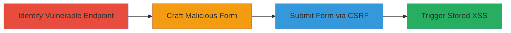

# CSRF Exploitation Leading to Stored XSS in Concrete CMS Community Points

Multi-stage attack chain demonstrating a complete attack workflow exploiting the lack of CSRF protection and input sanitization in Concrete CMS's community points actions feature. An attacker tricks an authenticated administrator into submitting a malicious form, creating a new action with an XSS payload that executes when the admin views the points page, potentially leading to session hijacking or further control panel compromise.

## Chain Metrics Dashboard

| Metric | Value |
|--------|-------|
| Chain Status | Unverified |
| Total Steps | 4 |
| Execution Time | ~5 minutes |
| Skill Level | Intermediate |
| Complexity | Medium |
| Impact Level | High |

## Attack Flow Visualization

## Prerequisites & Requirements

### Required Tools

- Browser developer tools for form inspection
- HTML editor or simple text editor for crafting the payload

### Target Environment

- Concrete CMS installation (tested on version 5.7.4.2)
- Web server with PHP
- Authenticated administrator session

### Initial Access Requirements

- Ability to deliver the malicious HTML form to the target admin (e.g., via phishing email or malicious website)
- No direct credentials needed; exploits active admin session
- Network access to the CMS dashboard

## Detailed Attack Procedures

### Step 1: Identify Vulnerable Endpoint
procedure: [[procedures/Identify-Vulnerable-Endpoint-for-Community-Points-Actions]]

**Objective**: Locate the POST endpoint for saving community points actions, confirming lack of CSRF tokens and input validation.

**Instructions**: Inspect the network traffic or source code of the Concrete CMS dashboard under Users > Points > Actions. Look for the form submission to `/index.php/dashboard/users/points/actions/save`. Verify no CSRF token is required and parameters like `upaName` and `upaHandle` accept arbitrary input without sanitization.

**Expected Output**: Confirmation of the endpoint URL and parameter structure.

**Success Indicators**:
- Endpoint identified without CSRF protection
- Parameters confirmed as unsanitized

### Step 2: Craft Malicious HTML Form
procedure: [[procedures/Craft-Malicious-HTML-Form-for-CSRF-and-XSS-Injection]]

**Objective**: Create an HTML form that submits XSS payloads to the vulnerable endpoint using the admin's session.

**Instructions**: Write an HTML file with a form targeting the save endpoint. Include hidden inputs for required parameters, embedding an XSS payload like `<sVg/OnLOaD=prompt(1)>` in `upaHandle` or `upaName`. Host this on a controllable server or deliver via email.

**Expected Output**: A self-submitting HTML form ready for delivery to the admin.

**Success Indicators**:
- Form validates against the endpoint structure
- Payload embedded without syntax errors

### Step 3: Submit Form to Exploit CSRF
procedure: [[procedures/Submit-Form-to-Exploit-CSRF-and-Inject-Stored-XSS]]

**Objective**: Trick the admin into loading the form, submitting it to create a malicious action using their session.

**Instructions**: Deliver the HTML form to the logged-in admin (e.g., link in email). When loaded, the form auto-submits via POST to the endpoint with parameters: `upaID=''`, `upaIsActive='1'`, `upaHandle='<sVg/OnLOaD=prompt(1)>'`, `upaName='XSS the admin2'`, `upaDefaultPoints='1000'`, `gBadgeID=''`.

**Expected Output**: Server response indicating successful action creation (e.g., HTTP 200).

**Success Indicators**:
- New action created in the database
- No authentication prompt during submission

### Step 4: Trigger Stored XSS
procedure: [[procedures/Trigger-Stored-XSS-on-Admin-Page]]

**Objective**: Have the admin view the points actions page to execute the injected XSS payload.

**Instructions**: Direct the admin to `/index.php/dashboard/users/points/actions/action_saved` or the main actions list. The unsanitized `upaHandle` or `upaName` will render the payload, executing JavaScript like `prompt(1)` in the browser context.

**Expected Output**: JavaScript alert or console execution confirming XSS trigger.

**Success Indicators**:
- Payload executes (e.g., alert box appears)
- Potential for further exploitation like cookie theft

## Attack Chain Summary

### Key Achievements

1. Bypassed CSRF to create unauthorized content using admin privileges
2. Injected and stored malicious XSS payload without direct access
3. Achieved JavaScript execution in the admin's high-privilege session
4. Enabled potential escalation to full control panel compromise

## Technique & Tactic Coverage

### MITRE ATT&CK Techniques

- [[Steal Web Session Cookie]] Steal Web Session Cookie (CSRF exploitation)
- [[JavaScript]] JavaScript (Stored XSS execution)

### MITRE ATT&CK Tactics

- [[Initial Access]] Initial Access (via CSRF using valid session)
- [[Execution]] Execution (XSS payload)

---
*Last updated: 2023-10-01T00:00:00Z*
