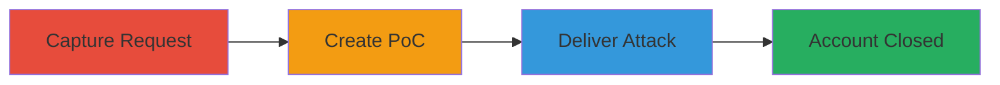

---
tags:
  - csrf
  - web-vulnerability
  - account-deletion
  - drive-by-compromise
type: attack_chain
tools:
  - '[[tools/Burp-Suite-Professional]]'
tactics:
  - '[[Initial Access]]'
  - '[[Impact]]'
verified: false
platforms:
  - Web
submitted: true
complexity: medium
created_at: '2023-10-01T00:00:00Z'
procedures:
  - '[[procedures/Capture-Legitimate-Account-Closure-Request]]'
  - '[[procedures/Create-CSRF-Proof-of-Concept-HTML]]'
  - '[[procedures/Deliver-and-Execute-CSRF-Attack]]'
step_count: 3
techniques:
  - '[[Drive-by Compromise]]'
  - '[[Account Access Removal]]'
updated_at: '2025-12-14T17:27:42.842Z'
description: >-
  Demonstrates a CSRF attack on a web application's account closure endpoint,
  allowing attackers to delete authenticated user accounts by tricking victims
  into visiting a malicious webpage.
skill_level: intermediate
impact_level: high
id: f3ec7d1b-7f23-4e1a-b8ee-b99e94ac7ae5
validated: true
mitre_tactics:
  - '[[Initial Access]]'
  - '[[Impact]]'
mitre_techniques:
  - '[[Drive-by Compromise]]'
  - '[[Account Access Removal]]'
---
# CSRF Exploitation Leading to Unauthorized Account Closure

Multi-stage attack chain demonstrating a complete CSRF workflow to unauthorizedly close user accounts in a web application.

## Chain Metrics Dashboard

| Metric | Value |
|--------|-------|
| Chain Status | Unverified |
| Total Steps | 3 |
| Execution Time | ~5 minutes |
| Skill Level | Intermediate |
| Complexity | Medium |
| Impact Level | High |

## Attack Flow Visualization

## Prerequisites & Requirements

### Required Tools

- [[tools/Burp-Suite-Professional]]

### Target Environment

- Web application with user authentication
- Services: User account management
- Network access: Attacker must host a malicious webpage accessible to the victim

### Initial Access Requirements

- Victim must be authenticated to the target application
- Attacker needs knowledge of the vulnerable endpoint (/services/user/closeAccount POST)
- No prior credentials required for attacker

## Detailed Attack Procedures

### Step 1: Capture Legitimate Request
procedure: [[procedures/Capture-Legitimate-Account-Closure-Request]]

**Objective**: Intercept and analyze the legitimate POST request to the account closure endpoint to understand its structure for forging.

**Instructions**: Use Burp Suite to proxy traffic while performing a legitimate account closure. Configure your browser to route through Burp, navigate to the account settings, and submit the close account form. Inspect the request in Burp Repeater to note headers, parameters, and payload.

**Expected Output**: Captured HTTP POST request details, including any form data like user ID or confirmation tokens (noting absence of CSRF token).

**Success Indicators**:
- Request intercepted successfully
- Endpoint confirmed as /services/user/closeAccount (POST)
- No CSRF token present in request

### Step 2: Create CSRF Proof-of-Concept
procedure: [[procedures/Create-CSRF-Proof-of-Concept-HTML]]

**Objective**: Generate a malicious HTML file that automatically submits a forged POST request to the vulnerable endpoint when loaded in the victim's browser.

**Instructions**: In Burp Suite, use the 'Generate CSRF PoC' feature or manually craft an HTML form based on the captured request. The form should auto-submit via JavaScript to /services/user/closeAccount with necessary parameters. Save as an HTML file and host it on an attacker-controlled server (e.g., via GitHub Pages or local server).

**Expected Output**: HTML file with embedded form, e.g., containing <form method="POST" action="https://target.com/services/user/closeAccount"> and auto-submit script.

**Success Indicators**:
- HTML file created and tested locally (account not closed if not authenticated)
- Form replicates the legitimate request structure

### Step 3: Deliver and Execute Attack
procedure: [[procedures/Deliver-and-Execute-CSRF-Attack]]

**Objective**: Trick the authenticated victim into loading the malicious HTML, triggering the forged request and closing their account.

**Instructions**: Distribute the malicious URL via phishing email, social engineering, or embedded link. When the victim (already logged in to the target site) visits the page, the form submits automatically, exploiting the lack of CSRF protection to close the account.

**Expected Output**: Victim's account deleted; confirmation from application or login failure on next access.

**Success Indicators**:
- Victim visits the page while authenticated
- Account closure request sent and processed
- Victim receives account termination notice or access revoked

## Attack Chain Summary

### Key Achievements

1. Identified missing CSRF protection in sensitive endpoint
2. Crafted undetectable forged request via HTML PoC
3. Achieved account deletion without direct credentials

## Technique & Tactic Coverage

### MITRE ATT&CK Techniques

- [[Drive-by Compromise]]
- [[Account Access Removal]]

### MITRE ATT&CK Tactics

- [[Initial Access]]
- [[Impact]]

---
*Last updated: 2023-10-01T00:00:00Z*
