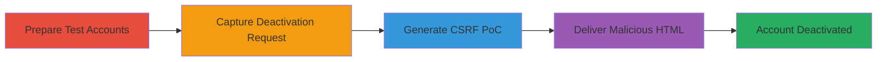

---
tags:
  - csrf
  - account-deactivation
  - evernote
  - web-vulnerability
type: attack_chain
tools:
  - '[[tools/Burp-Suite]]'
tactics:
  - '[[Initial Access]]'
  - '[[Execution]]'
verified: false
platforms:
  - Web
submitted: true
complexity: medium
created_at: '2024-10-01T00:00:00Z'
procedures:
  - '[[procedures/Create-Test-Accounts-on-Evernote]]'
  - '[[procedures/Navigate-to-Account-Deactivation-Page]]'
  - '[[procedures/Intercept-Deactivation-Request-with-Burp-Suite]]'
  - '[[procedures/Analyze-Captured-POST-Request]]'
  - '[[procedures/Generate-CSRF-Proof-of-Concept-with-Burp-Suite]]'
  - '[[procedures/Create-and-Save-CSRF-HTML-File]]'
  - '[[procedures/Deliver-CSRF-HTML-to-Victim]]'
  - '[[procedures/Execute-Account-Deactivation]]'
step_count: 8
techniques:
  - '[[Drive-by Compromise]]'
  - '[[Exploit Public-Facing Application]]'
updated_at: '2025-12-14T17:27:57.180Z'
description: >-
  A multi-step CSRF attack that tricks authenticated Evernote users into
  deactivating their accounts via a malicious HTML file, exploiting the lack of
  anti-CSRF tokens on the deactivation endpoint.
skill_level: intermediate
impact_level: high
id: 20f1224a-11eb-4f44-820f-af32cdf67724
validated: true
mitre_tactics:
  - '[[Initial Access]]'
  - '[[Execution]]'
mitre_techniques:
  - '[[Drive-by Compromise]]'
  - '[[Exploit Public-Facing Application]]'
---
# CSRF Exploitation Leading to Unauthorized Evernote Account Deactivation

Multi-stage attack chain demonstrating a complete CSRF workflow against Evernote's account deactivation endpoint, allowing an attacker to force victim account deactivation without authentication.

## Chain Metrics Dashboard

| Metric | Value |
|--------|-------|
| Chain Status | Unverified |
| Total Steps | 8 |
| Execution Time | ~15 minutes |
| Skill Level | Intermediate |
| Complexity | Medium |
| Impact Level | High |

## Attack Flow Visualization

## Prerequisites & Requirements

### Required Tools

- [[tools/Burp-Suite]]

### Target Environment

- Web platform (Evernote web application)
- Required services/ports: HTTPS (443)
- Network access requirements: Internet access to evernote.com

### Initial Access Requirements

- No prior credentials needed for attacker setup, but victim must be authenticated to Evernote
- Attacker needs ability to create free Evernote accounts
- Victim interaction required (opening HTML file while logged in)

## Detailed Attack Procedures

### Step 1: Create Test Accounts
procedure: [[procedures/Create-Test-Accounts-on-Evernote]]

**Objective**: Simulate attacker and victim scenarios by registering accounts on Evernote.

**Instructions**: Register two new user accounts on the Evernote website to use one as the attacker and one as the victim for testing.

**Expected Output**: Two active Evernote accounts with login credentials.

**Success Indicators**:
- Successful account registration emails received
- Ability to log in to both accounts

### Step 2: Navigate to Deactivation Page
procedure: [[procedures/Navigate-to-Account-Deactivation-Page]]

**Objective**: Access the account deactivation endpoint to prepare for request capture.

**Instructions**: Log in to the attacker account and navigate to the secure deactivation page at https://www.evernote.com/secure/CloseAccount.action.

**Expected Output**: Deactivation page loaded in the browser.

**Success Indicators**:
- Page displays deactivation options and reason selection
- No errors in page loading

### Step 3: Intercept Deactivation Request
procedure: [[procedures/Intercept-Deactivation-Request-with-Burp-Suite]]

**Objective**: Use Burp Suite to capture the POST request triggered by the deactivation action.

**Instructions**: Configure Burp Suite proxy in the browser, enable intercept, then on the deactivation page, press 'Deactivate your Evernote account', acknowledge the popup, select a reason, and press 'Deactivate account' to capture the request.

**Expected Output**: Intercepted POST request visible in Burp Suite Proxy > Intercept tab.

**Success Indicators**:
- Request details including headers and form data captured
- No proxy errors or connection issues

### Step 4: Analyze Captured POST Request
procedure: [[procedures/Analyze-Captured-POST-Request]]

**Objective**: Examine the request structure to identify exploitable elements for CSRF.

**Instructions**: In Burp Suite, forward the intercepted request and review the POST to /secure/CloseAccount.action?accountAction=deactivateAccount&json=true, noting form data like empty password, oneTimeCode, captchaResponse, and reasons.

**Expected Output**: Detailed breakdown of request parameters and lack of CSRF token.

**Success Indicators**:
- Confirmation of no anti-CSRF protection
- Parameters match expected deactivation fields

### Step 5: Generate CSRF PoC
procedure: [[procedures/Generate-CSRF-Proof-of-Concept-with-Burp-Suite]]

**Objective**: Automatically create a malicious HTML file that replicates the deactivation request.

**Instructions**: In Burp Suite Repeater or Proxy history, right-click the captured request, select Engagement Tools > Generate CSRF PoC, and copy the generated HTML code.

**Expected Output**: HTML snippet with auto-submitting form to the deactivation endpoint.

**Success Indicators**:
- HTML file includes hidden form fields matching the original request
- Form action points to Evernote's endpoint

### Step 6: Create and Save HTML File
procedure: [[procedures/Create-and-Save-CSRF-HTML-File]]

**Objective**: Assemble the PoC into a deliverable file for the victim.

**Instructions**: Paste the copied HTML into a new file named Csrf.html and save it locally.

**Expected Output**: Standalone HTML file ready for distribution.

**Success Indicators**:
- File opens in browser without errors
- Form auto-submits when loaded (test in isolated environment)

### Step 7: Deliver to Victim
procedure: [[procedures/Deliver-CSRF-HTML-to-Victim]]

**Objective**: Trick the victim into opening the file while authenticated to Evernote.

**Instructions**: Send the Csrf.html file to the victim via email, phishing link, or direct share, instructing them to open it in their browser.

**Expected Output**: Victim loads the file, triggering the form submission using their session cookies.

**Success Indicators**:
- Victim confirms opening the file
- No immediate errors reported by victim

### Step 8: Account Deactivation
procedure: [[procedures/Execute-Account-Deactivation]]

**Objective**: Confirm the unauthorized deactivation of the victim's account.

**Instructions**: Monitor for the POST execution; the request deactivates the account without further checks.

**Expected Output**: JSON response from Evernote confirming deactivation; victim loses access to account.

**Success Indicators**:
- Victim's login fails post-execution
- Account status shows as deactivated on Evernote

## Attack Chain Summary

### Key Achievements

1. Successful capture and analysis of unprotected deactivation endpoint
2. Generation of functional CSRF PoC exploiting session hijacking
3. Forced account deactivation leading to data loss and premium feature forfeiture

## Technique & Tactic Coverage

### MITRE ATT&CK Techniques

- [[Drive-by Compromise]]
- [[Exploit Public-Facing Application]]

### MITRE ATT&CK Tactics

- [[Initial Access]]
- [[Execution]]

---

*Last updated: 2024-10-01T00:00:00Z*
