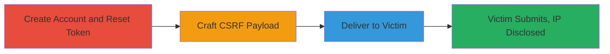

---
tags:
  - csrf
  - information-disclosure
  - ip-leak
  - bugzilla
  - mozilla
  - web
type: attack_chain
tools:
  - '[[tools/Burp-Suite]]'
tactics:
  - '[[Initial Access]]'
  - '[[Reconnaissance]]'
  - '[[Collection]]'
verified: false
platforms:
  - Web
submitted: true
complexity: medium
created_at: '2023-10-01T00:00:00Z'
procedures:
  - '[[procedures/Create-Account-and-Initiate-Password-Reset]]'
  - '[[procedures/Craft-CSRF-Payload-for-Reset-Cancellation]]'
  - '[[procedures/Deliver-CSRF-Link-to-Victim]]'
  - '[[procedures/Trigger-IP-Disclosure-via-Cancellation]]'
step_count: 4
techniques:
  - '[[Drive-by Compromise]]'
  - '[[Hardware]]'
updated_at: '2025-12-14T17:25:13.429Z'
description: >-
  A multi-stage attack using CSRF to force a password reset cancellation on
  Bugzilla.mozilla.org, resulting in the disclosure of the victim's IP address
  via email to the attacker.
skill_level: intermediate
impact_level: medium
id: 85452823-6a98-483f-a838-3f7d098afe1f
validated: true
mitre_tactics:
  - '[[Initial Access]]'
  - '[[Reconnaissance]]'
  - '[[Collection]]'
mitre_techniques:
  - '[[Drive-by Compromise]]'
  - '[[Hardware]]'
---
# CSRF Exploitation Leading to Victim IP Disclosure in Bugzilla Password Reset

Multi-stage attack chain demonstrating a CSRF vulnerability in the Bugzilla.mozilla.org password reset cancellation endpoint, combined with IP address disclosure in the notification email. The attacker forces the victim to cancel a password reset token, triggering an email to the attacker that reveals the victim's IP address for potential tracking or further attacks.

## Chain Metrics Dashboard

| Metric | Value |
|--------|-------|
| Chain Status | Unverified |
| Total Steps | 4 |
| Execution Time | ~5 minutes |
| Skill Level | Intermediate |
| Complexity | Medium |
| Impact Level | Medium |

## Attack Flow Visualization

## Prerequisites & Requirements

### Required Tools

- [[tools/Burp-Suite]]

### Target Environment

- Web platform: Bugzilla.mozilla.org
- Required services/ports: HTTPS (443)
- Network access requirements: Internet access to Bugzilla.mozilla.org

### Initial Access Requirements

- No prior credentials needed for attacker; victim must be a Bugzilla user or targeted via social engineering
- Attacker needs an email address to receive notifications
- Victim interaction required (clicking link)

## Detailed Attack Procedures

### Step 1: Create Account and Initiate Password Reset
procedure: [[procedures/Create-Account-and-Initiate-Password-Reset]]

**Objective**: Obtain a valid password reset token to use in the CSRF payload.

**Instructions**: Register a new account on Bugzilla.mozilla.org and request a password reset to generate a cancel token.

**Expected Output**: Email containing reset token like '1727251240-UxKc4U5ThgrHPhWNJ323-fahjy5Pn05h5ZYb7OqG-SI' with parameters t=3XOIDGIRtcwC3icniucOlm and a=cxlpw.

**Success Indicators**:
- Account created successfully
- Reset email received with token

### Step 2: Craft CSRF Payload for Reset Cancellation
procedure: [[procedures/Craft-CSRF-Payload-for-Reset-Cancellation]]

**Objective**: Generate a malicious HTML form that submits the cancellation request on the victim's behalf.

**Instructions**: Use Burp Suite to intercept the cancel link and create a CSRF PoC form posting to /token.cgi with hidden fields for the token, parameters, and cancel action.

**Expected Output**: HTML file with auto-submitting form targeting https://bugzilla.mozilla.org/token.cgi.

**Success Indicators**:
- Valid CSRF HTML payload generated
- Payload tests successfully in a controlled environment

### Step 3: Deliver CSRF Link to Victim
procedure: [[procedures/Deliver-CSRF-Link-to-Victim]]

**Objective**: Trick the victim into loading the CSRF payload via social engineering.

**Instructions**: Host the HTML page on a server or send via email/phishing, ensuring the victim clicks the link while logged into Bugzilla or in a context where the request originates from their IP.

**Expected Output**: Victim accesses the malicious page.

**Success Indicators**:
- Victim interacts with the link
- No direct confirmation; monitor for email in next step

### Step 4: Trigger IP Disclosure via Cancellation
procedure: [[procedures/Trigger-IP-Disclosure-via-Cancellation]]

**Objective**: Receive the cancellation email containing the victim's IP address.

**Instructions**: Once victim submits the form, the server processes the request from the victim's IP and sends a notification email to the attacker's account email with the IP included.

**Expected Output**: Email to attacker with victim's IP address in the cancellation notification.

**Success Indicators**:
- Email received with IP like 'Victim's IP: 192.0.2.1'
- Token confirmed canceled on Bugzilla

## Attack Chain Summary

### Key Achievements

1. Successful CSRF exploitation without victim authentication
2. Unauthorized IP address disclosure enabling geolocation or tracking
3. Demonstration of chained CSRF and information disclosure vulnerabilities

## Technique & Tactic Coverage

### MITRE ATT&CK Techniques

- [[Drive-by Compromise]] Drive-by Compromise (CSRF forcing action)
- [[Hardware]] Gather Victim Network Information: IP Addresses (disclosure via email)

### MITRE ATT&CK Tactics

- [[Initial Access]] Initial Access (via user interaction)
- [[Reconnaissance]] Reconnaissance (IP gathering)
- [[Collection]] Collection (exfiltrating IP data)

---
*Last updated: 2023-10-01T00:00:00Z*
