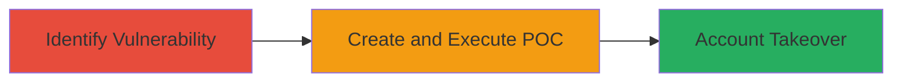

# CSRF Exploitation for Account Takeover in ownCloud Apps

Multi-stage attack chain demonstrating a complete attack workflow exploiting a CSRF vulnerability in the ownCloud apps marketplace to takeover user accounts.

## Chain Metrics Dashboard

| Metric | Value |
|--------|-------|
| Chain Status | Unverified |
| Total Steps | 2 |
| Execution Time | ~5 minutes |
| Skill Level | Intermediate |
| Complexity | Medium |
| Impact Level | High |

## Attack Flow Visualization

## Prerequisites & Requirements

### Required Tools

- Web browser for testing
- Text editor for creating HTML POC

### Target Environment

- Web platform
- Access to apps.owncloud.com as an authenticated user
- No specific ports or services beyond standard HTTPS (443)

### Initial Access Requirements

- Authenticated session on apps.owncloud.com (user must be logged in)
- Ability to host or deliver a malicious HTML page to the victim
- No prior network access beyond internet connectivity

## Detailed Attack Procedures

### Step 1: Identify CSRF Vulnerability
procedure: [[procedures/Identify-CSRF-Vulnerability-in-ownCloud-Apps]]

**Objective**: Analyze the ownCloud apps website to detect the absence of CSRF protection, enabling forged requests for state-changing actions.

**Instructions**: Inspect the website's forms and endpoints for missing CSRF tokens. Use browser developer tools to examine requests during normal operations like account modifications. Confirm that cross-origin requests can be submitted without validation.

**Expected Output**: Identification of unprotected endpoints that allow unauthorized actions on behalf of the user.

**Success Indicators**:
- No CSRF tokens observed in forms or headers
- Successful simulation of forged request without errors

### Step 2: Demonstrate Account Takeover via CSRF POC
procedure: [[procedures/Demonstrate-Account-Takeover-via-CSRF-POC]]

**Objective**: Craft and deploy a proof-of-concept malicious page that tricks the user into submitting a forged request, resulting in account takeover.

**Instructions**: Create an HTML file with an auto-submitting form targeting the vulnerable endpoint. Host the page or deliver it via phishing. Demonstrate the attack by visiting the page while authenticated to ownCloud, observing the unauthorized action.

**Expected Output**: The user's account is modified or taken over without direct interaction beyond visiting the page.

**Success Indicators**:
- Forged request executes successfully
- Account details changed as per the attacker's intent
- Video or log evidence of the takeover

## Attack Chain Summary

### Key Achievements

1. Detection of CSRF flaw in a public-facing web application
2. Development of a functional POC for account takeover
3. Illustration of high-impact unauthorized access via social engineering

## Technique & Tactic Coverage

### MITRE ATT&CK Techniques

- [[Exploit Public-Facing Application]]
- [[User Execution]]

### MITRE ATT&CK Tactics

- [[Initial Access]]
- [[Impact]]

---
*Last updated: 2023-10-01T00:00:00Z*
