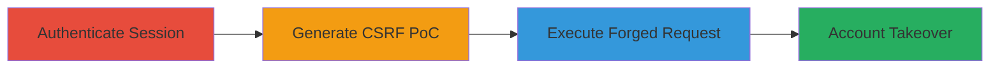

---
tags:
  - csrf
  - account-takeover
  - web-vulnerability
type: attack_chain
tools:
  - '[[tools/Burp-Suite]]'
tactics:
  - '[[Initial Access]]'
  - '[[Credential Access]]'
verified: false
platforms:
  - Web
submitted: true
complexity: medium
created_at: '2023-10-01T00:00:00Z'
procedures:
  - '[[procedures/Authenticate-to-Target-Web-Application]]'
  - '[[procedures/Generate-CSRF-Proof-of-Concept-with-Burp-Suite]]'
  - '[[procedures/Execute-CSRF-Attack-via-Malicious-HTML]]'
step_count: 3
techniques:
  - '[[Drive-by Compromise]]'
  - '[[Exploit Public-Facing Application]]'
updated_at: '2025-12-14T17:32:58.130Z'
description: >-
  Multi-stage attack exploiting CSRF in a DoD web application's user profile
  editing to enable unauthorized changes to username, email, and password,
  resulting in full account takeover.
skill_level: intermediate
impact_level: high
id: d3a4ac78-2703-47bd-83d8-10c744e7b809
validated: true
mitre_tactics:
  - '[[Initial Access]]'
  - '[[Credential Access]]'
mitre_techniques:
  - '[[Drive-by Compromise]]'
  - '[[Exploit Public-Facing Application]]'
---
# CSRF Exploitation for Account Takeover via Profile Modification

Multi-stage attack chain demonstrating a complete attack workflow exploiting a CSRF vulnerability in the U.S. Department of Defense web application's user profile editing functionality. The attack allows an unauthorized modification of sensitive user settings, such as username, email, and password, leading to full account takeover. The attacker tricks an authenticated victim into visiting a malicious HTML page that forges a POST request to the profile save endpoint without CSRF protection.

## Chain Metrics Dashboard

| Metric | Value |
|--------|-------|
| Chain Status | Unverified |
| Total Steps | 3 |
| Execution Time | ~5 minutes |
| Skill Level | Intermediate |
| Complexity | Medium |
| Impact Level | High |

## Attack Flow Visualization

## Prerequisites & Requirements

### Required Tools

- [[tools/Burp-Suite]]
- Web browser (e.g., Chrome or Firefox)

### Target Environment

- Web application with user profile editing functionality
- No CSRF tokens in state-changing POST requests
- Authenticated session required

### Initial Access Requirements

- Valid credentials for the target account (for testing; in real attack, victim must be authenticated)
- Ability to intercept traffic (local proxy setup)
- Network access to the target web app

## Detailed Attack Procedures

### Step 1: Authenticate to Target
procedure: [[procedures/Authenticate-to-Target-Web-Application]]

**Objective**: Establish an authenticated session to the target web application, enabling subsequent request interception and testing.

**Instructions**: Open a web browser and navigate to the login page of the target DoD web application. Enter valid credentials to log in and maintain the session cookie.

**Expected Output**: Successful login with access to the user profile section.

**Success Indicators**:
- Dashboard or profile page loads post-login
- Session cookie is present in browser developer tools

### Step 2: Generate CSRF Proof of Concept
procedure: [[procedures/Generate-CSRF-Proof-of-Concept-with-Burp-Suite]]

**Objective**: Intercept the legitimate profile update request and use Burp Suite to create a malicious HTML PoC that replicates the request for forgery.

**Instructions**: Configure your browser to proxy traffic through Burp Suite. Navigate to the profile edit section, modify a field (e.g., email), and submit the form. Intercept the POST request in Burp, then use the Engagement Tools to generate a CSRF HTML PoC with parameters like action=save_info, password[original], password[confirmed], and email[original]. Copy the generated HTML code.

**Expected Output**: An HTML file containing a form that posts to the profile endpoint with hidden inputs for sensitive changes.

**Success Indicators**:
- PoC HTML generated without errors
- Form in HTML targets the correct endpoint (e.g., https://█████)

### Step 3: Execute CSRF Attack
procedure: [[procedures/Execute-CSRF-Attack-via-Malicious-HTML]]

**Objective**: Deliver the CSRF PoC to the victim and trigger the forged request while they are authenticated, resulting in profile modification and account takeover.

**Instructions**: Save the PoC HTML to a file (e.g., csrf-poc.html) or host it on an attacker-controlled server. Trick the victim into visiting the page while authenticated to the target site (e.g., via phishing link). Upon loading, the form auto-submits or prompts submission, forging the POST request to update username, email, and password.

**Expected Output**: Target profile updated with attacker-controlled values; login with new credentials succeeds.

**Success Indicators**:
- Profile changes reflected in the application
- Attacker can log in with modified password

## Attack Chain Summary

### Key Achievements

1. Identified and exploited missing CSRF protection in profile editing
2. Generated functional PoC for request forgery using Burp Suite
3. Achieved account takeover with minimal victim interaction (page visit only)

## Technique & Tactic Coverage

### MITRE ATT&CK Techniques

- [[Drive-by Compromise]]
- [[Exploit Public-Facing Application]]

### MITRE ATT&CK Tactics

- [[Initial Access]]
- [[Credential Access]]

---

*Last updated: 2023-10-01T00:00:00Z*
