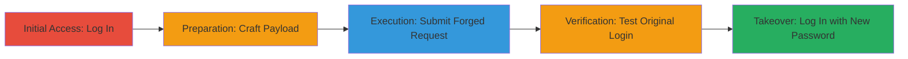

---
tags:
  - csrf
  - account-takeover
  - web-vulnerability
  - password-reset
type: attack_chain
tools: []
tactics:
  - '[[Initial Access]]'
  - '[[Lateral Movement]]'
verified: false
platforms:
  - Web
submitted: true
complexity: medium
created_at: '2023-10-01T00:00:00Z'
procedures:
  - '[[procedures/Log-In-to-Target-Application]]'
  - '[[procedures/Prepare-CSRF-Malicious-HTML-Payload]]'
  - '[[procedures/Execute-CSRF-Attack-for-Profile-Update]]'
  - '[[procedures/Verify-Failed-Login-with-Original-Credentials]]'
  - '[[procedures/Log-In-with-New-Password-for-Takeover]]'
step_count: 5
techniques:
  - '[[Exploit Public-Facing Application]]'
  - '[[Valid Accounts]]'
updated_at: '2025-12-14T17:33:24.329Z'
description: >-
  A multi-step attack leveraging a CSRF vulnerability in a web application's
  profile update endpoint to achieve complete account takeover by changing the
  victim's password without authentication.
skill_level: intermediate
impact_level: high
id: 973c5c60-3e37-42fe-b31a-1dd8267b576e
validated: true
mitre_tactics:
  - '[[Initial Access]]'
  - '[[Lateral Movement]]'
mitre_techniques:
  - '[[Exploit Public-Facing Application]]'
  - '[[Valid Accounts]]'
---
# CSRF Exploitation for Account Takeover via Unprotected Profile Update

Multi-stage attack chain demonstrating a complete workflow for exploiting a Cross-Site Request Forgery (CSRF) vulnerability in a web application's profile update endpoint, leading to unauthorized password changes and full account takeover.

## Chain Metrics Dashboard

| Metric | Value |
|--------|-------|
| Chain Status | Unverified |
| Total Steps | 5 |
| Execution Time | ~5 minutes |
| Skill Level | Intermediate |
| Complexity | Medium |
| Impact Level | High |

## Attack Flow Visualization

## Prerequisites & Requirements

### Required Tools

- Web browser (e.g., Chrome or Firefox for hosting and loading the malicious HTML)

### Target Environment

- Web application running on ASP/IIS stack
- Accessible profile update endpoint (e.g., myprofile.asp) without CSRF protection
- Victim must be logged in to the target site

### Initial Access Requirements

- Attacker needs a way to deliver the malicious HTML to the victim (e.g., via phishing email or malicious link)
- No direct credentials required for the victim; relies on session hijacking via CSRF
- Network access to the target's domain (e.g., http://██████████/████████/default.asp)

## Detailed Attack Procedures

### Step 1: Log In to the Application
procedure: [[procedures/Log-In-to-Target-Application]]

**Objective**: Establish a valid session on the target application to simulate the victim's authenticated state, which is necessary for the CSRF attack to succeed as it exploits the active session.

**Instructions**: Navigate to the login page and authenticate using valid credentials. This step ensures the browser maintains cookies and session state required for subsequent forged requests.

**Expected Output**: Successful redirection to the application's dashboard or home page, confirming an active session.

**Success Indicators**:
- Login successful without errors
- Session cookies set in the browser

### Step 2: Prepare the Malicious HTML Payload
procedure: [[procedures/Prepare-CSRF-Malicious-HTML-Payload]]

**Objective**: Create a self-submitting HTML form that mimics a legitimate POST request to the vulnerable profile update endpoint, embedding the attacker's desired profile changes including a new password.

**Instructions**: Craft an HTML file with a hidden form targeting the myprofile.asp endpoint. Include fields for profile data and set the password to a known value controlled by the attacker.

**Expected Output**: A local HTML file ready to be hosted or sent to the victim.

**Success Indicators**:
- HTML file validates without syntax errors
- Form fields match the target's expected POST parameters (e.g., txtPassword, txtVeriPW)

### Step 3: Submit the Malicious Request
procedure: [[procedures/Execute-CSRF-Attack-for-Profile-Update]]

**Objective**: Trick the victim into loading the malicious HTML while authenticated, causing an automatic form submission that updates their profile and changes the password without their knowledge.

**Instructions**: Host the HTML on an attacker-controlled site or deliver via email/link. When the victim opens it in a browser with an active session to the target, the form auto-submits the forged request.

**Expected Output**: The target's profile update succeeds silently, changing the password to the attacker's value (e.g., '████').

**Success Indicators**:
- No visible errors on the victim side
- Server responds with a success status (e.g., 200 OK) to the forged POST

### Step 4: Attempt Login with Original Credentials
procedure: [[procedures/Verify-Failed-Login-with-Original-Credentials]]

**Objective**: Confirm the password change by attempting to log in with the victim's original credentials, which should now fail due to the unauthorized update.

**Instructions**: Use the victim's known username and original password to attempt authentication on the login endpoint.

**Expected Output**: Login failure with an invalid credentials error message.

**Success Indicators**:
- Authentication denied
- Error message indicating wrong password

### Step 5: Log In with the New Password
procedure: [[procedures/Log-In-with-New-Password-for-Takeover]]

**Objective**: Demonstrate full account takeover by logging in with the newly set password, granting access to the victim's account.

**Instructions**: Enter the victim's username and the attacker-controlled new password (e.g., '████') on the login page.

**Expected Output**: Successful login and access to the victim's profile and resources.

**Success Indicators**:
- Access granted to restricted areas
- Profile reflects the updated information from the CSRF submission

## Attack Chain Summary

### Key Achievements

1. Identified and exploited missing CSRF protection on the profile update endpoint
2. Achieved unauthorized password reset leading to session hijacking
3. Demonstrated complete account takeover without direct credential theft

## Technique & Tactic Coverage

### MITRE ATT&CK Techniques

- [[Exploit Public-Facing Application]] Exploit Public-Facing Application
- [[Valid Accounts]] Valid Accounts

### MITRE ATT&CK Tactics

- [[Initial Access]] Initial Access
- [[Lateral Movement]] Lateral Movement

---
*Last updated: 2023-10-01T00:00:00Z*
