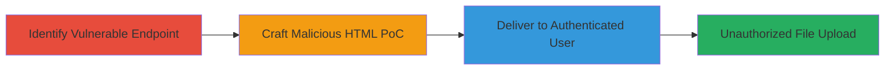

# CSRF Exploitation for Arbitrary File Upload on Topcoder Wiki

Multi-stage attack chain demonstrating a complete attack workflow exploiting a CSRF vulnerability in Topcoder's wiki application to perform unauthorized file attachments.

## Chain Metrics Dashboard

| Metric | Value |
|--------|-------|
| Chain Status | Unverified |
| Total Steps | 3 |
| Execution Time | ~5 minutes |
| Skill Level | Intermediate |
| Complexity | Medium |
| Impact Level | Medium |

## Attack Flow Visualization

## Prerequisites & Requirements

### Required Tools

- None (relies on browser and basic HTML editing)

### Target Environment

- Web platform
- Topcoder wiki application (or similar Confluence-based wiki)
- Authenticated user session

### Initial Access Requirements

- No prior credentials needed for reconnaissance
- Target must be an authenticated user of the wiki
- Network access to the wiki endpoint

## Detailed Attack Procedures

### Step 1: Identify Vulnerable Endpoint
procedure: [[procedures/Identify-CSRF-Vulnerable-Endpoint]]

**Objective**: Locate the file attachment endpoint lacking CSRF protection to confirm exploitability.

**Instructions**: Manually inspect the wiki's network requests during a legitimate file upload to identify the endpoint. Use browser developer tools to examine POST requests to https://apps.topcoder.com/wiki/pages/doattachfile.action?pageId= and verify the absence of CSRF tokens in the form or headers.

**Expected Output**: Confirmation that no anti-CSRF mechanisms (e.g., tokens, SameSite cookies, or origin checks) are enforced.

**Success Indicators**:
- Endpoint identified without token requirements
- Ability to simulate a cross-origin request

### Step 2: Craft Malicious HTML PoC
procedure: [[procedures/Craft-CSRF-Proof-of-Concept-for-File-Upload]]

**Objective**: Create an HTML file that automatically submits a file upload form to the vulnerable endpoint on page load.

**Instructions**: Use a text editor to build an HTML form with auto-submit JavaScript. Set the form action to the vulnerable endpoint, include parameters like pageId=165871793, and attach a sample file (e.g., csrf.txt). The form should use method="POST" and enctype="multipart/form-data" to mimic a legitimate upload.

**Expected Output**: A functional HTML file (e.g., csrf.html) that, when loaded, triggers the upload.

**Success Indicators**:
- HTML file parses without errors
- Local testing (if possible) shows form submission

### Step 3: Deliver and Execute CSRF Attack
procedure: [[procedures/Deliver-and-Execute-CSRF-Attack]]

**Objective**: Induce an authenticated user to load the malicious HTML, resulting in unauthorized file attachment to the wiki page.

**Instructions**: Host the HTML file on a controllable server or send it via email/phishing as an attachment. When the victim (authenticated to the wiki) opens it in their browser, the form auto-submits, uploading the file to the specified wiki page without further interaction.

**Expected Output**: File (e.g., csrf.txt) attached to the target wiki page (pageId=165871793) under the victim's account.

**Success Indicators**:
- File appears in wiki attachments
- No user consent prompted during upload

## Attack Chain Summary

### Key Achievements

1. Identified CSRF-vulnerable file upload endpoint in Topcoder wiki.
2. Crafted and delivered a PoC exploiting the flaw for silent file uploads.
3. Demonstrated impact on authenticated users via unauthorized attachments.

## Technique & Tactic Coverage

### MITRE ATT&CK Techniques

- [[Exploit Public-Facing Application]] Exploit Public-Facing Application
- [[Drive-by Compromise]] Drive-by Compromise

### MITRE ATT&CK Tactics

- [[Initial Access]] Initial Access
- [[Execution]] Execution

---
*Last updated: 2023-10-01T00:00:00Z*
