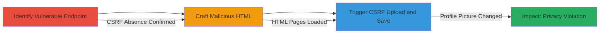

---
tags:
  - csrf
  - web
  - upload
  - profile-picture
  - topcoder
type: attack_chain
tools: []
tactics:
  - '[[Initial Access]]'
verified: false
platforms:
  - Web
submitted: true
complexity: medium
created_at: '[TIMESTAMP]'
procedures:
  - '[[procedures/Identify-CSRF-Vulnerable-Endpoint]]'
  - '[[procedures/Craft-CSRF-Proof-of-Concept-HTML]]'
  - '[[procedures/Execute-CSRF-Profile-Picture-Upload]]'
step_count: 3
techniques:
  - '[[Exploit Public-Facing Application]]'
updated_at: '2025-12-14T17:27:15.908Z'
description: >-
  A multi-stage attack chain exploiting CSRF vulnerability in TopCoder wiki's
  profile picture endpoints to force authenticated users to upload and set
  malicious images without consent.
skill_level: intermediate
impact_level: high
id: 0e35dd0f-2fc3-412d-94c4-9e605304e5e1
validated: true
mitre_tactics:
  - '[[Initial Access]]'
mitre_techniques:
  - '[[Exploit Public-Facing Application]]'
---
# CSRF Exploitation for Arbitrary Profile Picture Upload in TopCoder Wiki

Multi-stage attack chain demonstrating a complete attack workflow exploiting CSRF in the TopCoder wiki application to manipulate user profile pictures.

## Chain Metrics Dashboard

| Metric | Value |
|--------|-------|
| Chain Status | Unverified |
| Total Steps | 3 |
| Execution Time | ~5 minutes |
| Skill Level | Intermediate |
| Complexity | Medium |
| Impact Level | High |

## Attack Flow Visualization

## Prerequisites & Requirements

### Required Tools

- None (uses standard browser and HTML editing)

### Target Environment

- Web platform
- TopCoder wiki application (Java-based, likely Struts framework)
- No specific ports or services beyond standard HTTPS

### Initial Access Requirements

- Victim must be authenticated (logged-in session) to TopCoder
- Attacker needs to trick victim into visiting malicious HTML page (e.g., via phishing link)
- No prior access to target systems required

## Detailed Attack Procedures

### Step 1: Identify Vulnerable Endpoint
procedure: [[procedures/Identify-CSRF-Vulnerable-Endpoint]]

**Objective**: Locate and verify the CSRF-vulnerable profile picture endpoints in the TopCoder wiki.

**Instructions**: Access the endpoint https://apps.topcoder.com/wiki/users/editmyprofilepicture.action using a browser while inspecting network requests. Confirm the absence of CSRF tokens by checking form elements and response headers for anti-CSRF measures.

**Expected Output**: Endpoint details showing multipart/form-data acceptance without token validation.

**Success Indicators**:
- No CSRF token field in the form
- Endpoint responds to unauthenticated POSTs relying only on session cookies

### Step 2: Craft Malicious HTML
procedure: [[procedures/Craft-CSRF-Proof-of-Concept-HTML]]

**Objective**: Develop HTML files that exploit the CSRF vulnerability to upload and save a profile picture.

**Instructions**: Create two HTML files: one for uploading an image via POST to editmyprofilepicture.action, and another for saving it via doeditmyprofilepicture.action. Use <form> elements with enctype="multipart/form-data" targeting the endpoints, embedding a malicious image file.

**Expected Output**: Functional HTML pages that submit forms automatically on load.

**Success Indicators**:
- HTML pages load without errors
- Forms submit POST requests mimicking legitimate actions

### Step 3: Trigger Exploitation
procedure: [[procedures/Execute-CSRF-Profile-Picture-Upload]]

**Objective**: Force a logged-in victim to change their profile picture by loading the malicious pages.

**Instructions**: Host or serve the HTML files (e.g., locally or via a simple web server). Trick the victim into visiting the pages while logged into TopCoder. Observe the automatic form submissions that upload and save the image.

**Expected Output**: Victim's profile picture updated to the attacker's chosen image.

**Success Indicators**:
- Profile picture changes without user interaction
- Video or screenshot confirmation of the exploit

## Attack Chain Summary

### Key Achievements

1. Identified CSRF vulnerability in profile endpoints
2. Created exploitable HTML PoCs for upload and save actions
3. Demonstrated impact on user privacy through unauthorized profile manipulation

## Technique & Tactic Coverage

### MITRE ATT&CK Techniques

- [[Exploit Public-Facing Application]]

### MITRE ATT&CK Tactics

- [[Initial Access]]

---
*Last updated: [TIMESTAMP]*
