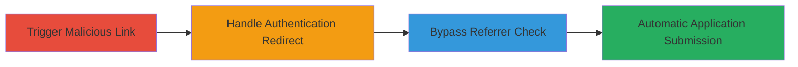

# CSRF Exploitation for Automatic Program Application Submission on HackerOne

Multi-stage attack chain demonstrating a complete CSRF workflow on HackerOne's program application feature, enabling attackers to spam applications by tricking victims into clicking malicious links without any user confirmation or CSRF protection.

## Chain Metrics Dashboard

| Metric | Value |
|--------|-------|
| Chain Status | Unverified |
| Total Steps | 3 |
| Execution Time | ~1 minute |
| Skill Level | Beginner |
| Complexity | Low |
| Impact Level | Medium |

## Attack Flow Visualization



## Prerequisites & Requirements

### Required Tools

- Browser or [[commands/curl-trigger-csrf]]

### Target Environment

- Web platform (HackerOne application pages)
- Required services: HTTPS access to hackerone.com
- Network access: Internet connectivity

### Initial Access Requirements

- Victim must be a logged-in or login-capable HackerOne user
- No special credentials for attacker; relies on social engineering (e.g., phishing link)
- Prior access: None, but victim needs account with tax confirmation or prior bounties for seamless application

## Detailed Attack Procedures

### Step 1: Trigger CSRF Application Submission
procedure: [[procedures/Trigger-CS RF-Application-Submission]]

**Objective**: Force the victim to submit a program application via a simple GET request without CSRF token validation.

**Instructions**: Craft a malicious link like `https://hackerone.com/{program-handle}?apply=true` (e.g., `https://hackerone.com/hackthedts?apply=true`) and trick the victim into opening it in their browser. Use [[commands/curl-trigger-csrf]] to test the endpoint manually:

```bash
curl -X GET "https://hackerone.com/hackthedts?apply=true" -H "Cookie: your-session-cookie"
```

**Expected Output**: HTTP 200 or redirect indicating successful application submission, such as a confirmation message or updated user profile.

**Success Indicators**:
- Application status changes to "applied" in victim's HackerOne dashboard
- No error or confirmation prompt appears

### Step 2: Handle Login Redirect for Unauthenticated Users
procedure: [[procedures/Handle-Login-Redirect-for-Unauthenticated-Users]]

**Objective**: Ensure the CSRF trigger works even for users not currently logged in, by leveraging automatic post-login submission.

**Instructions**: If the victim is not logged in, the link redirects to the login page. After login, the original ?apply=true parameter persists and triggers submission. Test with [[commands/curl-trigger-csrf]] including a follow-redirect flag:

```bash
curl -X GET "https://hackerone.com/hackthedts?apply=true" -L -H "User-Agent: Mozilla/5.0"
```

**Expected Output**: Redirect to login, then post-login HTTP response confirming application (e.g., JSON or HTML success).

**Success Indicators**:
- Victim logs in and application submits without additional interaction
- Profile shows new application for users with tax confirmation or prior bounties

### Step 3: Bypass Referrer Protection via Subdomain Redirect
procedure: [[procedures/Bypass-Referrer-Protection-via-Subdomain-Redirect]]

**Objective**: Evade partial referrer-based protections by using a subdomain to spoof the Referer header.

**Instructions**: Direct the victim to `https://www.hackerone.com/{program-handle}?apply=true`, which 404s and redirects to the canonical URL, setting Referer to the www subdomain. Verify with [[commands/curl-trigger-csrf]] simulating the redirect:

```bash
curl -X GET "https://www.hackerone.com/hackthedts?apply=true" -L -H "Referer: https://www.hackerone.com"
```

**Expected Output**: 404 on www, then successful GET on main domain with spoofed Referer, leading to application submission.

**Success Indicators**:
- Request succeeds despite referrer checks
- Application submits as in Step 1

## Attack Chain Summary

### Key Achievements

1. Automatic application submission without user confirmation or CSRF tokens
2. Seamless handling of unauthenticated users via login redirects
3. Effective bypass of referrer protections using subdomain tricks

## Technique & Tactic Coverage

### MITRE ATT&CK Techniques

- [[Exploit Public-Facing Application]]

### MITRE ATT&CK Tactics

- [[Initial Access]]

---

*Last updated: 2023-10-01T00:00:00Z*
