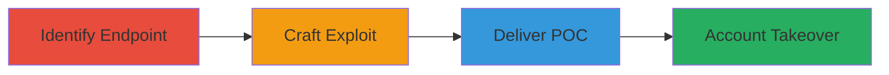

# CSRF Exploitation for NordVPN Account Takeover via Password Change

Multi-stage attack chain demonstrating a complete workflow for exploiting a CSRF vulnerability in NordVPN's profile password change endpoint, leading to unauthorized password modification and account takeover.

## Chain Metrics Dashboard

| Metric | Value |
|--------|-------|
| Chain Status | Unverified |
| Total Steps | 3 |
| Execution Time | ~5 minutes |
| Skill Level | Intermediate |
| Complexity | Medium |
| Impact Level | High |

## Attack Flow Visualization

## Prerequisites & Requirements

### Required Tools

- None (uses basic HTML crafting and browser)

### Target Environment

- Web platform
- NordVPN web application
- Authenticated user session

### Initial Access Requirements

- Victim must be authenticated to NordVPN
- Attacker needs to deliver a malicious HTML file or page to the victim
- No special credentials required beyond social engineering for delivery

## Detailed Attack Procedures

### Step 1: Identify Password Change Endpoint
procedure: [[procedures/Identify-Password-Change-Endpoint]]

**Objective**: Locate the vulnerable password change endpoint by observing legitimate requests.

**Instructions**: Monitor network traffic during a normal password change in the NordVPN profile settings to identify the POST endpoint and parameters.

**Expected Output**: Confirmation of the endpoint URL (https://nordvpn.com/profile/) and required parameters (tmpl=settings, password, password_confirmation).

**Success Indicators**:
- Endpoint URL and parameters captured
- Request format understood for replication

### Step 2: Craft Malicious HTML Form for CSRF
procedure: [[procedures/Craft-Malicious-HTML-Form-for-CSRF]]

**Objective**: Create a forged form that submits attacker-controlled data to the endpoint without CSRF protection.

**Instructions**: Develop an HTML page with a hidden form that auto-submits or prompts the victim to submit, using the identified endpoint and injecting a new password.

**Expected Output**: A functional HTML file that, when loaded, sends a POST request to change the password.

**Success Indicators**:
- Form auto-submits in browser tests
- Request matches legitimate format but with attacker values

### Step 3: Deliver and Execute the POC
procedure: [[procedures/Deliver-and-Execute-CSRF-POC]]

**Objective**: Trick the authenticated victim into executing the malicious form, resulting in password change and account takeover.

**Instructions**: Host the HTML file or send it via email/phishing, instructing the victim to open it while logged into NordVPN.

**Expected Output**: Victim's password changed to attacker's value, allowing login takeover.

**Success Indicators**:
- Password change confirmed via account access
- Victim locked out of original account

## Attack Chain Summary

### Key Achievements

1. Identified unprotected CSRF endpoint in NordVPN profile
2. Crafted and delivered a working exploit for password modification
3. Achieved full account takeover without direct authentication bypass

## Technique & Tactic Coverage

### MITRE ATT&CK Techniques

- [[Exploit Public-Facing Application]]
- [[User Execution]]

### MITRE ATT&CK Tactics

- [[Initial Access]]

---
*Last updated: 2023-10-01T00:00:00Z*
