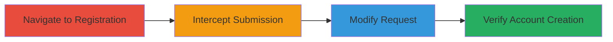

---
tags:
  - csrf
  - web
  - account-creation
  - denial-of-service
type: attack_chain
tools:
  - '[[tools/Burp-Suite]]'
tactics:
  - '[[Initial Access]]'
verified: false
platforms:
  - Web
submitted: true
complexity: medium
created_at: '2023-10-01T00:00:00Z'
procedures:
  - '[[procedures/Exploit-CSRF-in-IRCCloud-Registration]]'
step_count: 4
techniques:
  - '[[Exploit Public-Facing Application]]'
updated_at: '2025-12-14T17:27:03.455Z'
description: >-
  A multi-step attack exploiting CSRF in IRCCloud's registration form to create
  unauthorized accounts, enabling database flooding or denial-of-service.
skill_level: intermediate
impact_level: high
id: ed13aae0-565f-4d21-b614-be906f1155c3
validated: true
mitre_tactics:
  - '[[Initial Access]]'
mitre_techniques:
  - '[[Exploit Public-Facing Application]]'
---
# CSRF Exploitation for Unauthorized Account Creation in IRCCloud

Multi-stage attack chain demonstrating a complete attack workflow exploiting Cross-Site Request Forgery (CSRF) in IRCCloud's account registration to enable unauthorized account creation, potentially leading to database flooding or denial-of-service via resource exhaustion.

## Chain Metrics Dashboard

| Metric | Value |
|--------|-------|
| Chain Status | Unverified |
| Total Steps | 4 |
| Execution Time | ~5 minutes |
| Skill Level | Intermediate |
| Complexity | Medium |
| Impact Level | High |

## Attack Flow Visualization

## Prerequisites & Requirements

### Required Tools

- [[tools/Burp-Suite]]

### Target Environment

- Web platform
- Access to IRCCloud registration page at https://www.irccloud.com/
- No specific services or ports required beyond standard HTTPS (443)

### Initial Access Requirements

- No credentials needed
- Direct network access to the target website
- No prior access required

## Detailed Attack Procedures

### Step 1: Navigate to Registration Page
procedure: [[procedures/Exploit-CSRF-in-IRCCloud-Registration]]

**Objective**: Access the IRCCloud signup form to prepare for interception.

**Instructions**: Open a web browser and visit the IRCCloud homepage to locate and access the registration form.

**Expected Output**: The signup form loads at https://www.irccloud.com/.

**Success Indicators**:
- Registration page is accessible
- Form fields for account creation are visible

### Step 2: Intercept Registration Form Submission
procedure: [[procedures/Exploit-CSRF-in-IRCCloud-Registration]]

**Objective**: Capture the legitimate POST request during form submission using Burp Suite.

**Instructions**: Configure Burp Suite as a proxy in your browser. Fill out the registration form with test data and submit it while interception is active to capture the POST request to https://www.irccloud.com/chat/signup.

**Expected Output**: Burp Suite intercepts the request, showing parameters including 'token' and '_reqid' in the body (likely form-encoded).

**Success Indicators**:
- POST request captured
- Protective parameters visible in the intercepted request

### Step 3: Modify Intercepted Request
procedure: [[procedures/Exploit-CSRF-in-IRCCloud-Registration]]

**Objective**: Remove anti-CSRF protections to test for vulnerability.

**Instructions**: In Burp Suite's Repeater or Proxy, edit the captured POST request by removing the 'token' and '_reqid' parameters from the request body. Retain other form data like username, email, and password. Forward the modified request to the server.

**Expected Output**: The server accepts the request without validation and processes the account creation.

**Success Indicators**:
- Modified request forwarded successfully
- No error response from server regarding missing tokens

### Step 4: Verify Successful Account Creation
procedure: [[procedures/Exploit-CSRF-in-IRCCloud-Registration]]

**Objective**: Confirm the vulnerability by checking if the account was created without tokens.

**Instructions**: After forwarding the modified request, attempt to log in with the created credentials or check for any confirmation. Repeat with automation scripts if scaling to flooding.

**Expected Output**: Account is created and accessible, demonstrating successful bypass.

**Success Indicators**:
- New account exists in the system
- Login successful with test credentials

## Attack Chain Summary

### Key Achievements

1. Bypassed CSRF protections in registration form
2. Enabled unauthorized account creation via forged requests
3. Demonstrated potential for automated DoS through account flooding

## Technique & Tactic Coverage

### MITRE ATT&CK Techniques

- [[Exploit Public-Facing Application]]

### MITRE ATT&CK Tactics

- [[Initial Access]]

---
*Last updated: 2023-10-01T00:00:00Z*
