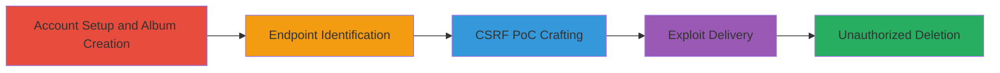

# CSRF Exploitation for Unauthorized Album Deletion in DoD Media Gallery

Multi-stage attack chain demonstrating a complete CSRF workflow against a DoD media gallery's album deletion feature. The vulnerability stems from using a GET request without CSRF token verification on the /mediagallery/delete/id/{album-id} endpoint, enabling attackers to forge requests and delete authenticated users' albums.

## Chain Metrics Dashboard

| Metric | Value |
|--------|-------|
| Chain Status | Unverified |
| Total Steps | 5 |
| Execution Time | ~10 minutes |
| Skill Level | Intermediate |
| Complexity | Medium |
| Impact Level | High |

## Attack Flow Visualization

## Prerequisites & Requirements

### Required Tools

- [[tools/Burp-Suite]]

### Target Environment

- Web platform with media gallery service
- Access to DoD media gallery at www.███████
- No specific ports required (standard HTTPS 443)

### Initial Access Requirements

- Attacker must create an account on the target site
- Victim must be authenticated to the site
- Network access to the target's domain

## Detailed Attack Procedures

### Step 1: Account Creation and Album Setup
procedure: [[procedures/Account-Creation-and-Album-Setup]]

**Objective**: Establish attacker presence and create a target album for testing or obtain victim's album ID.

**Instructions**: Register a new account on the target site and navigate to the search page to create an album. For exploitation, identify or obtain the victim's album ID through social engineering or prior access.

**Expected Output**: Successful account creation and album with a specific ID.

**Success Indicators**:
- Account registered at www.███████
- Album created via search page

### Step 2: Identify Delete Endpoint via Interception
procedure: [[procedures/Identify-Delete-Endpoint-via-Interception]]

**Objective**: Capture the vulnerable delete request to understand the endpoint structure.

**Instructions**: From the attacker's account, perform a delete action on an album while intercepting traffic with Burp Suite to note the GET request to /mediagallery/delete/id/{album-id}.

**Expected Output**: Intercepted request showing the unprotected GET endpoint.

**Success Indicators**:
- Request captured: GET /mediagallery/delete/id/{album-id}
- No CSRF token observed in the request

### Step 3: Craft and Deliver CSRF PoC
procedure: [[procedures/Craft-and-Deliver-CSRF-PoC]]

**Objective**: Generate an HTML-based exploit that auto-submits the delete request.

**Instructions**: Create an HTML form with JavaScript to auto-submit a GET request to the delete endpoint, replacing {album-id} with the victim's ID. Deliver via link or email.

**Expected Output**: Malicious HTML page ready for delivery.

**Success Indicators**:
- PoC HTML generated
- Delivery method (e.g., phishing link) prepared

### Step 4: Victim Execution of CSRF Exploit
procedure: [[procedures/Victim-Execution-of-CSRF-Exploit]]

**Objective**: Trick the victim into loading the PoC while authenticated, triggering album deletion.

**Instructions**: Send the exploit link to the victim. Upon loading, the JavaScript submits the forged request.

**Expected Output**: Victim's album deleted without direct interaction.

**Success Indicators**:
- Victim loads the page
- Album deletion confirmed on the target site

## Attack Chain Summary

### Key Achievements

1. Bypassed CSRF protections via GET method exploitation
2. Achieved unauthorized data destruction (album deletion)
3. Demonstrated impact on DoD media gallery users

## Technique & Tactic Coverage

### MITRE ATT&CK Techniques

- [[Exploit Public-Facing Application]] Exploit Public-Facing Application
- [[Drive-by Compromise]] Drive-by Compromise
- [[JavaScript]] JavaScript

### MITRE ATT&CK Tactics

- [[Initial Access]] Initial Access
- [[Execution]] Execution
- [[Impact]] Impact

---
*Last updated: 2023-10-01T00:00:00Z*
