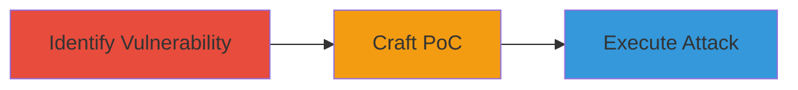

---
tags:
  - csrf
  - web-vulnerability
  - localize
  - group-creation
type: attack_chain
tools: []
tactics:
  - '[[Initial Access]]'
verified: false
platforms:
  - Web
submitted: true
complexity: low
created_at: '2023-10-01T00:00:00Z'
procedures:
  - '[[procedures/Identify-CSRF-Vulnerability-in-Group-Creation-Endpoint]]'
  - '[[procedures/Craft-Malicious-HTML-Form-for-CSRF-Attack]]'
  - '[[procedures/Execute-CSRF-Attack-on-Authenticated-User]]'
step_count: 3
techniques:
  - '[[Drive-by Compromise]]'
updated_at: '2025-12-14T17:27:03.849Z'
description: >-
  A multi-stage attack chain exploiting a CSRF vulnerability in the Localize
  platform's group creation feature, allowing unauthorized group creation on
  authenticated users' accounts via a malicious webpage.
skill_level: intermediate
impact_level: medium
id: 038d972e-05d2-427b-8b04-9f1c91cd5907
validated: true
mitre_tactics:
  - '[[Initial Access]]'
mitre_techniques:
  - '[[Drive-by Compromise]]'
---
# CSRF Exploitation for Unauthorized Group Creation in Localize

Multi-stage attack chain demonstrating a complete workflow to exploit a Cross-Site Request Forgery (CSRF) vulnerability in the Localize platform's group creation feature. The attack tricks an authenticated user into creating a group on their account without consent by luring them to a malicious webpage that auto-submits a forged POST request.

## Chain Metrics Dashboard

| Metric | Value |
|--------|-------|
| Chain Status | Unverified |
| Total Steps | 3 |
| Execution Time | ~5 minutes |
| Skill Level | Intermediate |
| Complexity | Low |
| Impact Level | Medium |

## Attack Flow Visualization



## Prerequisites & Requirements

### Required Tools

- None (uses standard web browser and text editor)

### Target Environment

- Web platform (Localize.io)
- Required services/ports: HTTP/HTTPS on port 80/443
- Network access requirements: Internet access to target endpoint

### Initial Access Requirements

- No prior credentials needed for identification and crafting
- Victim must be authenticated to Localize
- Attacker needs ability to host or send malicious HTML page

## Detailed Attack Procedures

### Step 1: Identify Lack of CSRF Validation

procedure: [[procedures/Identify-CSRF-Vulnerability-in-Group-Creation-Endpoint]]

**Objective**: Analyze the group creation endpoint to confirm the absence of server-side CSRF token validation, enabling forged requests.

**Instructions**: Use browser developer tools to inspect the group creation form on http://www.localize.io/pages/create_project/. Submit a test POST request to /pages/create_project/9k and observe that the CSRFToken parameter is included but not enforced on the server, allowing requests with empty or invalid tokens to succeed.

**Expected Output**: Successful group creation without a valid token, confirming the vulnerability.

**Success Indicators**:
- POST request accepted with empty CSRFToken
- Group created on account

### Step 2: Craft Malicious HTML Form for CSRF Attack

procedure: [[procedures/Craft-Malicious-HTML-Form-for-CSRF-Attack]]

**Objective**: Create a proof-of-concept HTML page that auto-submits a forged POST request to the vulnerable endpoint, simulating an attack from an external site.

**Instructions**: Write an HTML file with a hidden form targeting http://www.localize.io/pages/create_project/9k. Include parameters like addGroup[name]=test and an empty CSRFToken. Use JavaScript to auto-submit the form on page load.

Example HTML snippet:

```html
<!DOCTYPE html>
<html>
<body>
<form id="csrf-form" action="http://www.localize.io/pages/create_project/9k" method="POST">
    <input type="hidden" name="CSRFToken" value="">
    <input type="hidden" name="addGroup[name]" value="test">
</form>
<script>
    document.getElementById('csrf-form').submit();
</script>
</body>
</html>
```

Host this file on a web server or share via email/link.

**Expected Output**: Form auto-submits when loaded, sending the forged request.

**Success Indicators**:
- Page loads and immediately submits POST
- No user interaction required beyond visiting the page

### Step 3: Execute CSRF Attack on Authenticated User

procedure: [[procedures/Execute-CSRF-Attack-on-Authenticated-User]]

**Objective**: Trick an authenticated user into loading the malicious page, resulting in unauthorized group creation on their account.

**Instructions**: Lure the victim (who is logged into Localize) to visit the hosted malicious HTML page via phishing email, malicious link, or embedded iframe. Upon loading, the form submits automatically, creating a group named 'test' without the user's knowledge or additional consent.

**Expected Output**: A new group appears in the victim's Localize account dashboard.

**Success Indicators**:
- Victim's account shows unauthorized group
- No alerts or blocks from the server

## Attack Chain Summary

### Key Achievements

1. Confirmed CSRF vulnerability in group creation endpoint
2. Developed a functional PoC for remote exploitation
3. Demonstrated impact through unauthorized account modification

## Technique & Tactic Coverage

### MITRE ATT&CK Techniques

- [[Drive-by Compromise]]

### MITRE ATT&CK Tactics

- [[Initial Access]]

---
*Last updated: 2023-10-01T00:00:00Z*
