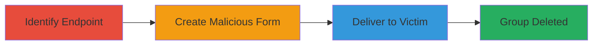

---
tags:
  - csrf
  - web-vulnerability
  - unauthorized-deletion
type: attack_chain
tools: []
tactics:
  - '[[Initial Access]]'
verified: false
platforms:
  - Web
submitted: true
complexity: medium
created_at: '2023-10-01T00:00:00Z'
procedures:
  - '[[procedures/Identify-Group-Deletion-Endpoint]]'
  - '[[procedures/Create-Malicious-CSRF-Form]]'
  - '[[procedures/Deliver-CSRF-Payload]]'
step_count: 3
techniques:
  - '[[Exploit Public-Facing Application]]'
updated_at: '2025-12-14T17:27:15.139Z'
description: >-
  A multi-stage CSRF attack exploiting missing token validation in Localize's
  group deletion endpoint to force authenticated users to delete groups without
  consent.
skill_level: intermediate
impact_level: high
id: ad841dda-d641-415a-adc9-042509622308
validated: true
mitre_tactics:
  - '[[Initial Access]]'
mitre_techniques:
  - '[[Exploit Public-Facing Application]]'
---
# CSRF Exploitation for Unauthorized Group Deletion in Localize

Multi-stage attack chain demonstrating a complete CSRF workflow against Localize's group management feature.

## Chain Metrics Dashboard

| Metric | Value |
|--------|-------|
| Chain Status | Unverified |
| Total Steps | 3 |
| Execution Time | ~5 minutes |
| Skill Level | Intermediate |
| Complexity | Medium |
| Impact Level | High |

## Attack Flow Visualization

## Prerequisites & Requirements

### Required Tools

- None (uses basic HTML and browser)

### Target Environment

- Web platform (Localize application at http://www.localize.io)
- Authenticated user session required for victim
- No specific ports or services beyond standard HTTP/HTTPS

### Initial Access Requirements

- Knowledge of target group ID
- Victim must be authenticated to Localize
- Attacker needs a way to deliver HTML (e.g., email, phishing site)

## Detailed Attack Procedures

### Step 1: Identify Group Deletion Endpoint
procedure: [[procedures/Identify-Group-Deletion-Endpoint]]

**Objective**: Locate the vulnerable endpoint and required parameters for group deletion.

**Instructions**: Inspect the Localize web application to find the group deletion form. Use browser developer tools to examine the POST request details, noting the endpoint URL and parameters like deleteGroup[id] and the optional CSRFToken.

**Expected Output**: Endpoint details: POST to http://www.localize.io/pages/create_project/9k with deleteGroup[id]=<group_id>.

**Success Indicators**:
- Endpoint URL and parameters identified
- Confirmation that CSRFToken is not validated (test with empty token)

### Step 2: Create Malicious CSRF Form
procedure: [[procedures/Create-Malicious-CSRF-Form]]

**Objective**: Build an HTML page that auto-submits a forged request to delete the target group.

**Instructions**: Write an HTML file with a hidden form targeting the deletion endpoint. Set the action to the identified URL, include the deleteGroup[id] parameter with the victim's group ID, and omit or empty the CSRFToken. Use JavaScript to auto-submit on page load.

**Expected Output**: A functional HTML file that, when loaded in a browser, sends the malicious POST request.

**Success Indicators**:
- Form auto-submits without user interaction
- Request mimics legitimate deletion but bypasses CSRF protection

### Step 3: Deliver CSRF Payload
procedure: [[procedures/Deliver-CSRF-Payload]]

**Objective**: Trick the authenticated victim into loading the malicious page, triggering the deletion.

**Instructions**: Host the HTML file on a server or send it via email/phishing link. Ensure the victim is logged into Localize when they visit the page, as the attack relies on their existing session cookies.

**Expected Output**: Victim's browser submits the request, resulting in group deletion on their account.

**Success Indicators**:
- Victim visits the page while authenticated
- Group is deleted from victim's Localize account without direct consent

## Attack Chain Summary

### Key Achievements

1. Bypassed CSRF protection by omitting token validation
2. Forced unauthorized group deletion via social engineering
3. Demonstrated impact of missing server-side checks in web forms

## Technique & Tactic Coverage

### MITRE ATT&CK Techniques

- [[Exploit Public-Facing Application]]

### MITRE ATT&CK Tactics

- [[Initial Access]]

---
*Last updated: 2023-10-01T00:00:00Z*
