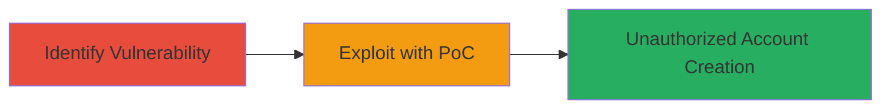

---
tags:
  - csrf
  - web
  - account-creation
  - unauthorized-access
type: attack_chain
tools: []
tactics:
  - '[[Initial Access]]'
commands: []
platforms:
  - Web
complexity: low
procedures:
  - '[[procedures/Identify-CSRF-Vulnerability-in-Signup-Endpoint]]'
  - '[[procedures/Craft-HTML-Form-PoC-for-CSRF-Exploitation]]'
step_count: 2
techniques:
  - '[[Exploit Public-Facing Application]]'
description: >-
  A multi-stage attack exploiting a CSRF vulnerability in IRCCloud's account
  signup process to create unauthorized user accounts without user consent.
skill_level: intermediate
impact_level: medium
id: 5434c3d2-4544-41fc-b0e5-7a9d2ba26cdc
created_at: '2025-12-14T17:27:15.754Z'
updated_at: '2025-12-14T17:27:15.754Z'
verified: false
validated: true
submitted: true
mitre_tactics:
  - '[[Initial Access]]'
mitre_techniques:
  - '[[Exploit Public-Facing Application]]'
---
# CSRF Exploitation for Unauthorized User Account Creation in IRCCloud

Multi-stage attack chain demonstrating a complete attack workflow exploiting a Cross-Site Request Forgery (CSRF) vulnerability in IRCCloud's user account creation process. An attacker can create accounts on behalf of authenticated or unauthenticated users without their consent by forging POST requests to the signup endpoint. This was discovered by analyzing the endpoint and crafting a proof-of-concept HTML form that auto-submits registration details. The impact includes unauthorized account creation, enabling spam, abuse, or further attacks by registering multiple accounts and accessing the home screen.

## Chain Metrics Dashboard

| Metric | Value |
|--------|-------|
| Chain Status | Unverified |
| Total Steps | 2 |
| Execution Time | ~5 minutes |
| Skill Level | Intermediate |
| Complexity | Low |
| Impact Level | Medium |

## Attack Flow Visualization

## Prerequisites & Requirements

### Required Tools

- Browser developer tools for endpoint analysis
- Text editor for crafting HTML PoC

### Target Environment

- Web platform
- Access to IRCCloud signup endpoint: https://www.irccloud.com/chat/signup
- No specific ports or services required beyond standard HTTPS (443)

### Initial Access Requirements

- No credentials needed for analysis
- Network access to the public IRCCloud website
- Victim must be authenticated in IRCCloud (for higher impact on their session)

## Detailed Attack Procedures

### Step 1: Identify CSRF Vulnerability
procedure: [[procedures/Identify-CSRF-Vulnerability-in-Signup-Endpoint]]

**Objective**: Analyze the signup endpoint to confirm lack of CSRF protection, allowing forged requests.

**Instructions**: Use browser developer tools to inspect the signup form and network requests. Submit a test registration and observe the POST parameters without any CSRF token validation.

**Expected Output**: Confirmation that the endpoint accepts POST requests with parameters like email, password, realname, invite, org_invite, and _reqid without token enforcement.

**Success Indicators**:
- No CSRF token observed in form or headers
- Endpoint responds to direct POST without authentication checks for forgery

### Step 2: Craft and Execute PoC
procedure: [[procedures/Craft-HTML-Form-PoC-for-CSRF-Exploitation]]

**Objective**: Create and deploy an HTML form that auto-submits forged registration data to exploit the CSRF vulnerability.

**Instructions**: Develop an HTML page with a form targeting the signup endpoint. Host it on an attacker-controlled site or send via phishing. Include hidden fields for victim details and auto-submit via JavaScript.

**Expected Output**: Successful account creation on IRCCloud, redirecting to the home screen for the new account.

**Success Indicators**:
- New account registered with provided details
- Victim's browser completes the request without interaction (if auto-submit enabled)

## Attack Chain Summary

### Key Achievements

1. Identified missing CSRF protections on a critical signup endpoint
2. Demonstrated exploitation via a simple HTML PoC for unauthorized account creation
3. Highlighted potential for spam and abuse through mass account registration

## Technique & Tactic Coverage

### MITRE ATT&CK Techniques

- [[Exploit Public-Facing Application]]

### MITRE ATT&CK Tactics

- [[Initial Access]]

---
*Last updated: [TIMESTAMP]*
