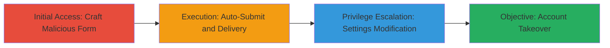

# CSRF Exploitation for Unauthorized User Settings Modification and Account Takeover in Localize.io

Multi-stage attack chain demonstrating a complete CSRF workflow against Localize.io's user settings page.

## Chain Metrics Dashboard

| Metric | Value |
|--------|-------|
| Chain Status | Unverified |
| Total Steps | 4 |
| Execution Time | ~5 minutes |
| Skill Level | Intermediate |
| Complexity | Medium |
| Impact Level | High |

## Attack Flow Visualization

## Prerequisites & Requirements

### Required Tools

- None (uses basic HTML and JavaScript)

### Target Environment

- Web platform
- Active user session on Localize.io
- Access to host or send malicious HTML (e.g., via email or phishing site)

### Initial Access Requirements

- Victim must be authenticated to Localize.io in their browser
- Attacker needs a way to trick victim into visiting the malicious page (e.g., phishing link)
- No prior credentials needed, but email interception capability for takeover

## Detailed Attack Procedures

### Step 1: Initial Access
procedure: [[procedures/Craft-Malicious-CSRF-Form]]

**Objective**: Create a basic HTML form that targets the vulnerable /pages/settings endpoint to forge a POST request for modifying user settings.

**Instructions**: Develop an HTML page with a form that posts data to http://www.localize.io/pages/settings. Include hidden inputs for settings like realName.

**Expected Output**: A static HTML file ready for enhancement.

**Success Indicators**:
- Form renders correctly in browser
- Manual submission alters settings when tested in authenticated session

### Step 2: Execution
procedure: [[procedures/Auto-Submit-CSRF-Form-with-JavaScript]]

**Objective**: Automate the form submission to execute the CSRF without user interaction upon page load.

**Instructions**: Add JavaScript to the HTML form to trigger submission on page load, ensuring the request uses the victim's session cookies.

**Expected Output**: Form auto-submits when the page is visited.

**Success Indicators**:
- JavaScript executes without errors
- POST request is sent cross-origin

### Step 3: Execution
procedure: [[procedures/Deliver-Malicious-Page-to-Victim]]

**Objective**: Lure the victim to the malicious page to trigger the CSRF attack using their active session.

**Instructions**: Host the HTML page on a server or embed in an email/phishing link. Send to victim.

**Expected Output**: Victim's browser loads the page and submits the forged request.

**Success Indicators**:
- Victim visits the page
- User settings (e.g., real name) are modified in the victim's account

### Step 4: Privilege Escalation
procedure: [[procedures/Exploit-CSRF-for-Email-Change-and-Account-Takeover]]

**Objective**: Extend the CSRF to change the victim's email, enabling full account takeover by intercepting the verification email.

**Instructions**: Modify the form inputs to target the email field, submit, and monitor the new email for verification link.

**Expected Output**: Email change request sent; verification email arrives at attacker's address.

**Success Indicators**:
- Email updated in victim's account
- Attacker completes verification and gains control

## Attack Chain Summary

### Key Achievements

1. Successful CSRF exploitation to modify user settings without authentication
2. Automated delivery via malicious HTML page
3. Achievement of account takeover through email change and interception

## Technique & Tactic Coverage

### MITRE ATT&CK Techniques

- [[Exploit Public-Facing Application]] Exploit Public-Facing Application
- [[Drive-by Compromise]] Drive-by Compromise

### MITRE ATT&CK Tactics

- [[Initial Access]] Initial Access

---
*Last updated: 2023-10-01T00:00:00Z*
