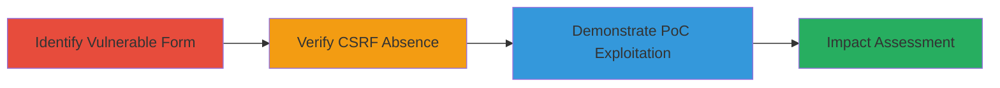

---
tags:
  - csrf
  - web-vulnerability
  - contact-form
type: attack_chain
tools:
  - '[[tools/Acunetix]]'
  - '[[tools/Burp-Suite-Professional]]'
tactics:
  - '[[Initial Access]]'
  - '[[Execution]]'
verified: false
platforms:
  - Web
submitted: true
complexity: low
created_at: '2023-10-01T00:00:00Z'
procedures:
  - '[[procedures/Identify-CSRF-Vulnerable-Contact-Form]]'
  - '[[procedures/Verify-Absence-of-CSRF-Protection]]'
  - '[[procedures/Demonstrate-CSRF-Proof-of-Concept]]'
step_count: 3
techniques:
  - '[[Drive-by Compromise]]'
  - '[[Exploit Public-Facing Application]]'
updated_at: '2025-12-14T17:27:22.906Z'
description: >-
  Demonstration of a CSRF vulnerability in the Automattic contact form, allowing
  unauthorized submissions via forged requests.
skill_level: beginner
impact_level: low
id: 53d6b8c3-67a9-4b22-b765-8b5240a523fd
validated: true
mitre_tactics:
  - '[[Initial Access]]'
  - '[[Execution]]'
mitre_techniques:
  - '[[Drive-by Compromise]]'
  - '[[Exploit Public-Facing Application]]'
---
# CSRF Exploitation in Automattic Contact Form

Multi-stage attack chain demonstrating the discovery and exploitation of a CSRF vulnerability in the Automattic contact form at http://automattic.com/contact/. The form lacks CSRF tokens, enabling attackers to forge requests and force authenticated users to submit unwanted messages. Discovered via automated scanning, the vulnerability is informative with limited impact due to the anonymous nature of the form, but it highlights risks in user-trusted sites.

## Chain Metrics Dashboard

| Metric | Value |
|--------|-------|
| Chain Status | Unverified |
| Total Steps | 3 |
| Execution Time | ~5 minutes |
| Skill Level | Beginner |
| Complexity | Low |
| Impact Level | Low |

## Attack Flow Visualization

## Prerequisites & Requirements

### Required Tools

- [[tools/Acunetix]]
- [[tools/Burp-Suite-Professional]]

### Target Environment

- Web platform
- Accessible contact form endpoint (e.g., http://automattic.com/contact/)
- No specific ports required beyond standard HTTP/HTTPS (80/443)

### Initial Access Requirements

- Public network access to the target site
- No credentials needed due to anonymous form
- Browser for PoC testing

## Detailed Attack Procedures

### Step 1: Identify the Contact Form Endpoint
procedure: [[procedures/Identify-CSRF-Vulnerable-Contact-Form]]

**Objective**: Locate and analyze the contact form to confirm its structure and submission method.

**Instructions**: Use [[tools/Acunetix]] to scan the target site and identify the form endpoint. Access the GET request to /contact/, which returns an HTML form with POST action to http://automattic.com/contact/ and fields: your_name, your_email, blog_url, subject, message, submit.

**Expected Output**: HTML form details including input fields and submission URL.

**Success Indicators**:
- Form endpoint confirmed
- Input fields enumerated

### Step 2: Verify Lack of CSRF Protection
procedure: [[procedures/Verify-Absence-of-CSRF-Protection]]

**Objective**: Inspect the form and server responses to confirm absence of CSRF tokens or validation.

**Instructions**: With [[tools/Acunetix]], examine HTTP headers and form elements. Look for missing CSRF tokens in the HTML and no server-side validation in responses. Note headers like Server: nginx and X-Pingback indicating WordPress backend.

**Expected Output**: Confirmation of no anti-CSRF measures; headers revealing tech stack.

**Success Indicators**:
- No CSRF token fields or headers present
- Server response lacks validation errors for forged requests

### Step 3: Create and Demonstrate CSRF PoC
procedure: [[procedures/Demonstrate-CSRF-Proof-of-Concept]]

**Objective**: Build a malicious HTML page to forge a POST request, simulating an attack on a victim's browser.

**Instructions**: Use [[tools/Burp-Suite-Professional]] to generate an HTML PoC with a hidden form auto-submitting to the target endpoint. Populate fields like your_name='test', your_email='test@example.com', blog_url='', subject='Spam', message='Unwanted message'. Host the PoC on a malicious site and trick a user into visiting it while logged in elsewhere.

**Expected Output**: Successful POST submission from the victim's browser without direct interaction.

**Success Indicators**:
- Form data submitted via forged request
- No errors indicating CSRF protection

## Attack Chain Summary

### Key Achievements

1. Identified vulnerable anonymous contact form lacking CSRF protection.
2. Verified absence of tokens using scanning tools.
3. Demonstrated exploitation via PoC, enabling spam submission on behalf of users.

## Technique & Tactic Coverage

### MITRE ATT&CK Techniques

- [[Drive-by Compromise]]
- [[Exploit Public-Facing Application]]

### MITRE ATT&CK Tactics

- [[Initial Access]]
- [[Execution]]

---
*Last updated: 2023-10-01T00:00:00Z*
