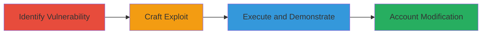

# CSRF Exploitation in Bumble Shop Address Management for Unauthorized Address Addition

Multi-stage attack chain demonstrating a complete attack workflow exploiting CSRF in Bumble's shop to add unauthorized addresses.

## Chain Metrics Dashboard

| Metric | Value |
|--------|-------|
| Chain Status | Unverified |
| Total Steps | 3 |
| Execution Time | ~5 minutes |
| Skill Level | Intermediate |
| Complexity | Medium |
| Impact Level | Medium |

## Attack Flow Visualization

## Prerequisites & Requirements

### Required Tools

- Web browser for testing
- Text editor for crafting HTML

### Target Environment

- Web platform
- Bumble shop application at https://shop.bumble.com
- Authenticated user session

### Initial Access Requirements

- Victim must be logged into Bumble
- Attacker needs to lure victim to malicious page (e.g., via phishing link)
- No special credentials beyond session cookie

## Detailed Attack Procedures

### Step 1: Identify CSRF Lack of Protection
procedure: [[procedures/Identify-CSRF-Lack-of-Protection-in-Address-Endpoint]]

**Objective**: Detect the absence of CSRF protection on the address addition endpoint to confirm exploitability.

**Instructions**: Inspect the POST request to https://shop.bumble.com/account/addresses using browser developer tools or a proxy. Verify that no CSRF token is required or validated in the request headers or form data.

**Expected Output**: Confirmation that the endpoint accepts cross-origin POST requests relying only on session cookies for authentication.

**Success Indicators**:
- No CSRF token field observed in legitimate requests
- Endpoint responds to forged requests without token validation

### Step 2: Craft CSRF Exploit HTML Page
procedure: [[procedures/Craft-CSRF-Exploit-HTML-Page]]

**Objective**: Create a malicious HTML page that automatically submits a forged form to add an arbitrary address.

**Instructions**: Use a text editor to build an HTML form with hidden inputs for address fields (e.g., first_name, last_name, address1, city, country, default=1). Set the form action to https://shop.bumble.com/account/addresses with method POST. Include an auto-submit script or button to trigger the request upon page load.

**Expected Output**: A self-contained HTML file ready for hosting or direct delivery to the victim.

**Success Indicators**:
- Form validates locally by simulating submission
- All required fields are populated with attacker-controlled data

### Step 3: Demonstrate Exploitation
procedure: [[procedures/Demonstrate-CSRF-Exploitation-via-Malicious-Page]]

**Objective**: Trick an authenticated user into loading the exploit page, resulting in unauthorized address addition.

**Instructions**: Host the crafted HTML on an attacker-controlled server or send it via email/phishing. When the victim (logged into Bumble) visits the page, the form auto-submits, adding the forged address (e.g., first_name: Rahamat, last_name: Shah, address1: 12/45, city: newyor, country: United States, default: 1).

**Expected Output**: The victim's Bumble account now has the new default address added without their interaction.

**Success Indicators**:
- Address appears in victim's account upon login
- Default address is set to the attacker's specified values

## Attack Chain Summary

### Key Achievements

1. Identified CSRF vulnerability in address management endpoint
2. Crafted a functional exploit page for cross-site request forgery
3. Demonstrated unauthorized account data modification

## Technique & Tactic Coverage

### MITRE ATT&CK Techniques

- [[Drive-by Compromise]]
- [[Exploit Public-Facing Application]]

### MITRE ATT&CK Tactics

- [[Initial Access]]

---
*Last updated: 2023-10-01T00:00:00Z*
