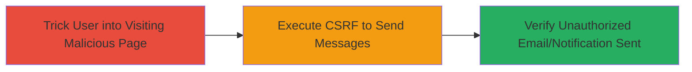

# CSRF Exploitation in Chaturbate Email and Notification Feature for Unauthorized Messaging

Multi-stage attack chain demonstrating a complete attack workflow exploiting a CSRF vulnerability to send unauthorized emails and notifications.

## Chain Metrics Dashboard

| Metric | Value |
|--------|-------|
| Chain Status | Unverified |
| Total Steps | 1 |
| Execution Time | ~5 minutes |
| Skill Level | Beginner |
| Complexity | Low |
| Impact Level | Medium |

## Attack Flow Visualization



## Prerequisites & Requirements

### Required Tools

- Web browser for testing
- Text editor for crafting HTML

### Target Environment

- Chaturbate web platform
- Authenticated user session
- No specific ports or services beyond standard HTTPS (443)

### Initial Access Requirements

- Attacker must lure authenticated Chaturbate user to visit a controlled malicious page
- No prior credentials needed; exploits existing user session
- Network access to Chaturbate domain

## Detailed Attack Procedures

### Step 1: Execute CSRF Exploitation
procedure: [[procedures/Exploit-CSRF-in-Chaturbate-Notification-Feature]]

**Objective**: Force an authenticated user to send unauthorized emails and browser notifications via a CSRF attack on the vulnerable GET endpoint.

**Instructions**: Craft a malicious HTML page that triggers the vulnerable GET request when loaded in the victim's browser. Host this page on an attacker-controlled server (e.g., via GitHub Pages or a simple web server). Lure the victim to visit the page while authenticated on Chaturbate, such as via a phishing link disguised as a promotional offer.

Example malicious HTML:

```html
<!DOCTYPE html>
<html>
<head><title>Loading...</title></head>
<body>
    
    <p>Redirecting...</p>
    <script>window.location.href = 'https://legitimate-site.com';</script>
</body>
</html>
```

Replace parameters like `target_user`, `message`, and `subject` with desired values to send the email/notification to the specified target on behalf of the victim.

**Expected Output**: The victim's browser automatically issues the GET request, sending the email and notification without user interaction.

**Success Indicators**:
- Email received by target user from victim's account
- Browser notification appears for target user
- No errors in browser console; request completes silently
