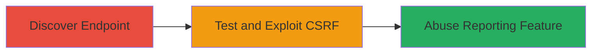

---
tags:
  - csrf
  - web-vulnerability
  - chaturbate
type: attack_chain
tools: []
tactics:
  - '[[Initial Access]]'
verified: false
platforms:
  - Web
submitted: true
complexity: low
created_at: '2024-10-01T00:00:00Z'
procedures:
  - '[[procedures/Discover-Emoticon-Reporting-Endpoint]]'
  - '[[procedures/Test-and-Exploit-CSRF-in-Emoticon-Reporting]]'
step_count: 2
techniques:
  - '[[Exploit Public-Facing Application]]'
  - '[[Drive-by Compromise]]'
updated_at: '2025-12-14T17:27:35.471Z'
description: >-
  A multi-step attack chain exploiting a CSRF vulnerability in Chaturbate's
  emoticon reporting feature to force authenticated users to submit abuse
  reports without consent.
skill_level: intermediate
impact_level: low
id: 0f21c047-9aa5-4c37-bebe-42b011fbdd52
validated: true
mitre_tactics:
  - '[[Initial Access]]'
mitre_techniques:
  - '[[Exploit Public-Facing Application]]'
  - '[[Drive-by Compromise]]'
---
# CSRF Exploitation in Chaturbate Emoticon Abuse Reporting

Multi-stage attack chain demonstrating a complete attack workflow exploiting CSRF in Chaturbate's emoticon reporting to abuse the feature by forging reports from authenticated users.

## Chain Metrics Dashboard

| Metric | Value |
|--------|-------|
| Chain Status | Unverified |
| Total Steps | 2 |
| Execution Time | ~5 minutes |
| Skill Level | Intermediate |
| Complexity | Low |
| Impact Level | Low |

## Attack Flow Visualization

## Prerequisites & Requirements

### Required Tools

- Browser with developer tools (e.g., Chrome DevTools)

### Target Environment

- Web platform
- Access to Chaturbate website
- Authenticated user session

### Initial Access Requirements

- Valid user account on Chaturbate
- Ability to host or simulate a malicious webpage
- No special network access beyond internet connectivity

## Detailed Attack Procedures

### Step 1: Discover Emoticon Reporting Endpoint
procedure: [[procedures/Discover-Emoticon-Reporting-Endpoint]]

**Objective**: Identify the API endpoint used for reporting emoticon abuse on Chaturbate.

**Instructions**: Log in to a Chaturbate account and navigate to a page where emoticons are displayed. Use browser developer tools to monitor network traffic while submitting a test report for an emoticon. Look for GET requests to endpoints matching the pattern `/emoticon_report_abuse/emoticon_name`.

**Expected Output**: Confirmation of the endpoint `https://chaturbate.com/emoticon_report_abuse/emoticon_name` being invoked via GET without POST or token validation.

**Success Indicators**:
- Network tab shows GET request to the reporting endpoint
- Request lacks CSRF token in headers or body

### Step 2: Test and Exploit CSRF in Emoticon Reporting
procedure: [[procedures/Test-and-Exploit-CSRF-in-Emoticon-Reporting]]

**Objective**: Verify the absence of CSRF protection and demonstrate exploitation by forging a report from an authenticated user's browser.

**Instructions**: Create a simple HTML page on a malicious site with an image tag or link that triggers the GET request to the vulnerable endpoint, e.g., ``. Trick or have the victim visit this page while authenticated on Chaturbate. Monitor Chaturbate for the unauthorized report submission.

**Expected Output**: The report is submitted without user interaction, confirming CSRF vulnerability.

**Success Indicators**:
- Emoticon flagged as abused on Chaturbate without direct user action
- No CSRF token validation errors in browser console

## Attack Chain Summary

### Key Achievements

1. Identified unprotected GET endpoint for emoticon reporting
2. Confirmed CSRF vulnerability allowing forged requests
3. Demonstrated potential for feature abuse via cross-site requests

## Technique & Tactic Coverage

### MITRE ATT&CK Techniques

- [[Exploit Public-Facing Application]]
- [[Drive-by Compromise]]

### MITRE ATT&CK Tactics

- [[Initial Access]]

---

*Last updated: 2024-10-01T00:00:00Z*
