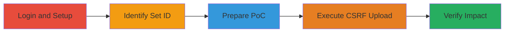

# CSRF Exploitation in Chaturbate Image Upload to Upload Unauthorized Images

Multi-stage attack chain demonstrating a complete attack workflow exploiting CSRF in Chaturbate's photo upload feature.

## Chain Metrics Dashboard

| Metric | Value |
|--------|-------|
| Chain Status | Unverified |
| Total Steps | 7 |
| Execution Time | ~5 minutes |
| Skill Level | Intermediate |
| Complexity | Medium |
| Impact Level | Medium |

## Attack Flow Visualization

## Prerequisites & Requirements

### Required Tools

- Web browser (e.g., Chrome or Firefox)
- Text editor for modifying HTML

### Target Environment

- Chaturbate web platform
- Authenticated user session
- Knowledge of victim's public photo set ID

### Initial Access Requirements

- Valid Chaturbate account credentials
- Direct access to the web application
- No prior network compromise needed

## Detailed Attack Procedures

### Step 1: Login to Chaturbate
procedure: [[procedures/Exploit-CSrf-in-Chaturbate-Image-Upload]]

**Objective**: Establish an authenticated session to interact with the platform.

**Instructions**: Open a web browser and navigate to chaturbate.com. Enter your credentials to log in as a user.

**Expected Output**: Successful login, redirect to user dashboard.

**Success Indicators**:
- User profile accessible
- Session cookies set

### Step 2: Browse to Profile and Upload Image
procedure: [[procedures/Exploit-CSrf-in-Chaturbate-Image-Upload]]

**Objective**: Create a photo set to obtain a public set ID for targeting.

**Instructions**: Navigate to your profile page. Use the built-in upload functionality to add an initial image to a new photo set.

**Expected Output**: Image uploaded, new photo set created.

**Success Indicators**:
- Photo set visible on profile
- Upload confirmation

### Step 3: Note the Set ID
procedure: [[procedures/Exploit-CSrf-in-Chaturbate-Image-Upload]]

**Objective**: Extract the public set ID for use in the CSRF payload.

**Instructions**: Visit the newly created photo set page. Observe the URL format: https://chaturbate.com/photo_videos/photoset/detail/[username]/[set_id]/ and copy the set_id value.

**Expected Output**: Set ID (e.g., 4771110) noted.

**Success Indicators**:
- Valid numeric set ID obtained
- URL parsed correctly

### Step 4: Download PoC HTML File
procedure: [[procedures/Exploit-CSrf-in-Chaturbate-Image-Upload]]

**Objective**: Obtain the proof-of-concept HTML for CSRF exploitation.

**Instructions**: Download the poc.html file from the vulnerability report, which includes a form submitting to the image upload endpoint.

**Expected Output**: Local HTML file saved.

**Success Indicators**:
- File downloaded without errors
- HTML contains form with upload action

### Step 5: Edit PoC HTML with Target Set ID
procedure: [[procedures/Exploit-CSrf-in-Chaturbate-Image-Upload]]

**Objective**: Customize the PoC to target the specific photo set.

**Instructions**: Open poc.html in a text editor. Replace the placeholder set ID (e.g., 4771110) in the form parameters with the noted set ID from Step 3.

**Expected Output**: Modified HTML file ready for execution.

**Success Indicators**:
- Set ID updated in form data
- No syntax errors in HTML

### Step 6: Execute CSRF Upload
procedure: [[procedures/Exploit-CSrf-in-Chaturbate-Image-Upload]]

**Objective**: Trigger the unauthorized image upload via CSRF.

**Instructions**: Ensure you are logged into Chaturbate in the browser. Open the modified poc.html file locally. Click the "Submit request" button to send the form submission to the upload endpoint.

**Expected Output**: Form submits without CSRF token validation, uploading a blank or malicious image.

**Success Indicators**:
- No errors on submission
- Network request to upload endpoint succeeds

### Step 7: Verify Unauthorized Upload
procedure: [[procedures/Exploit-CSrf-in-Chaturbate-Image-Upload]]

**Objective**: Confirm the impact by checking the photo set.

**Instructions**: Navigate back to the target photo set page on the Chaturbate profile.

**Expected Output**: New unauthorized image (e.g., blank white image) added to the set.

**Success Indicators**:
- Extra image present in set
- Profile integrity compromised

## Attack Chain Summary

### Key Achievements

1. Bypassed CSRF protection to upload images without user interaction
2. Demonstrated account tampering via public set IDs
3. Highlighted risks to user profile integrity on Chaturbate

## Technique & Tactic Coverage

### MITRE ATT&CK Techniques

- [[Exploit Public-Facing Application]]

### MITRE ATT&CK Tactics

- [[Initial Access]]

---
*Last updated: 2023-10-01T00:00:00Z*
