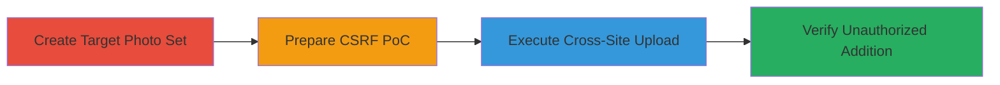

---
tags:
  - csrf
  - web-vulnerability
  - image-upload
  - account-compromise
type: attack_chain
tools: []
tactics:
  - '[[Initial Access]]'
  - '[[Impact]]'
verified: false
platforms:
  - Web
submitted: true
complexity: medium
created_at: '2023-10-01T00:00:00Z'
procedures:
  - '[[procedures/Create-Chaturbate-Photo-Set-and-Obtain-ID]]'
  - '[[procedures/Prepare-CSRF-Proof-of-Concept-HTML]]'
  - '[[procedures/Execute-CSRF-Image-Upload-Attack]]'
  - '[[procedures/Verify-Unauthorized-Image-Addition]]'
step_count: 4
techniques:
  - '[[Exploit Public-Facing Application]]'
updated_at: '2025-12-14T17:27:42.390Z'
description: >-
  A multi-step attack chain exploiting the lack of CSRF protection in
  Chaturbate's image upload endpoint to add unauthorized images to a victim's
  photo set, compromising account integrity.
skill_level: intermediate
impact_level: medium
id: 0545b16c-bb7e-4b3c-b2f6-5618f2612651
validated: true
mitre_tactics:
  - '[[Initial Access]]'
  - '[[Impact]]'
mitre_techniques:
  - '[[Exploit Public-Facing Application]]'
---
# CSRF Exploitation in Chaturbate Photo Set Upload for Unauthorized Image Addition

Multi-stage attack chain demonstrating a complete CSRF workflow on Chaturbate's photo upload feature, allowing attackers to inject unwanted images into a victim's public photo set without authentication or consent.

## Chain Metrics Dashboard

| Metric | Value |
|--------|-------|
| Chain Status | Unverified |
| Total Steps | 4 |
| Execution Time | ~5 minutes |
| Skill Level | Intermediate |
| Complexity | Medium |
| Impact Level | Medium |

## Attack Flow Visualization

## Prerequisites & Requirements

### Required Tools

- Web browser (e.g., Chrome or Firefox)
- Text editor for HTML modification

### Target Environment

- Chaturbate web platform
- Victim must be authenticated in the browser
- Attacker needs knowledge of the victim's public photo set ID

### Initial Access Requirements

- Attacker must trick victim into loading the malicious HTML while logged in (e.g., via phishing link)
- No direct network access beyond web connectivity
- Victim's photo set must be public or ID known

## Detailed Attack Procedures

### Step 1: Create Photo Set and Obtain ID
procedure: [[procedures/Create-Chaturbate-Photo-Set-and-Obtain-ID]]

**Objective**: Establish a target photo set on the victim's account and capture its unique ID for targeting the CSRF attack.

**Instructions**: Log in to the victim's Chaturbate account, navigate to the profile photo upload section, and upload a legitimate image to create a new photo set. Note the set ID from the resulting URL.

**Expected Output**: A new photo set URL in the format `https://chaturbate.com/photo_videos/photoset/detail/[username]/[set_id]/`, with the set ID (e.g., 4771110) recorded.

**Success Indicators**:
- Photo set created successfully
- Set ID extracted from URL

### Step 2: Prepare CSRF Proof-of-Concept HTML
procedure: [[procedures/Prepare-CSRF-Proof-of-Concept-HTML]]

**Objective**: Customize a malicious HTML file to target the specific photo set via a forged upload form that bypasses CSRF protections.

**Instructions**: Download the base PoC HTML file, then edit it in a text editor to replace the placeholder set ID with the actual ID from Step 1. The form should submit a POST request to the upload endpoint without CSRF tokens.

**Expected Output**: Modified `poc.html` file ready for execution, containing a form that uploads a blank white image to the targeted set.

**Success Indicators**:
- HTML file edited without syntax errors
- Form action points to correct Chaturbate upload endpoint with victim's set ID

### Step 3: Execute CSRF Image Upload Attack
procedure: [[procedures/Execute-CSRF-Image-Upload-Attack]]

**Objective**: Trick the victim into triggering the CSRF request while authenticated, resulting in unauthorized image upload.

**Instructions**: Have the victim open the modified `poc.html` file in their browser (while logged into Chaturbate) and click the "Submit request" button. This submits the form cross-site, exploiting the missing CSRF token validation.

**Expected Output**: The blank image is uploaded to the victim's photo set without additional prompts or errors.

**Success Indicators**:
- Form submission completes without browser errors
- No CSRF validation failure

### Step 4: Verify Unauthorized Image Addition
procedure: [[procedures/Verify-Unauthorized-Image-Addition]]

**Objective**: Confirm the attack success by inspecting the photo set for the injected image.

**Instructions**: Navigate to the photo set URL and refresh the page to view the contents, checking for the newly added blank white image.

**Expected Output**: The photo set now includes the unauthorized blank image alongside original content.

**Success Indicators**:
- Blank image visible in the set
- No alerts or account locks triggered

## Attack Chain Summary

### Key Achievements

1. Identified missing CSRF tokens in the photo set upload endpoint
2. Demonstrated unauthorized image injection via simple HTML PoC
3. Compromised account integrity by altering public photo sets without consent

## Technique & Tactic Coverage

### MITRE ATT&CK Techniques

- [[Exploit Public-Facing Application]]

### MITRE ATT&CK Tactics

- [[Initial Access]]
- [[Impact]]

---

*Last updated: 2023-10-01T00:00:00Z*
